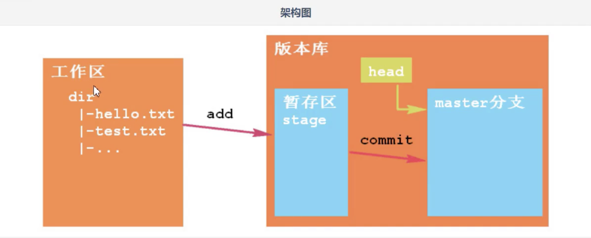
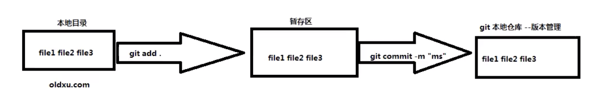
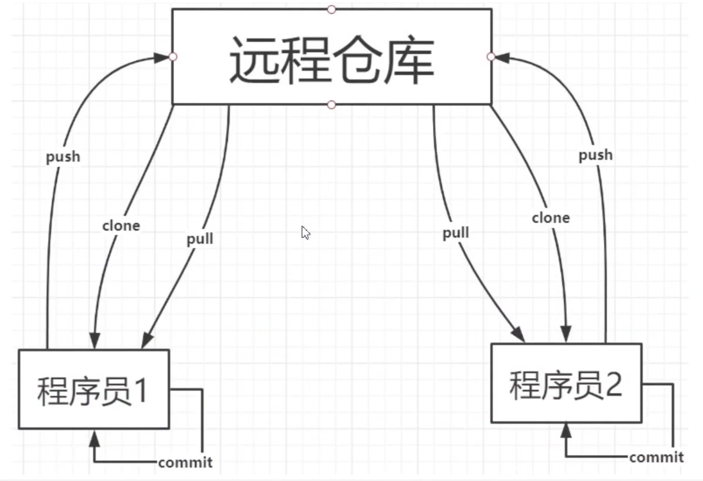
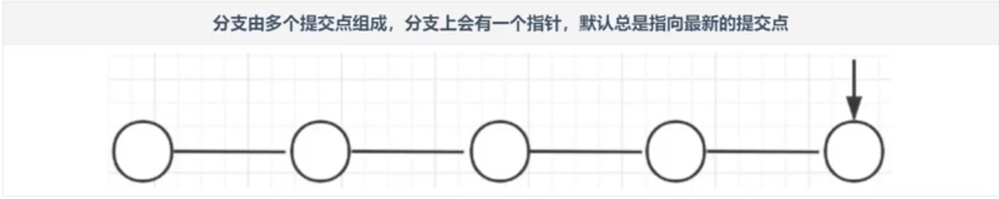
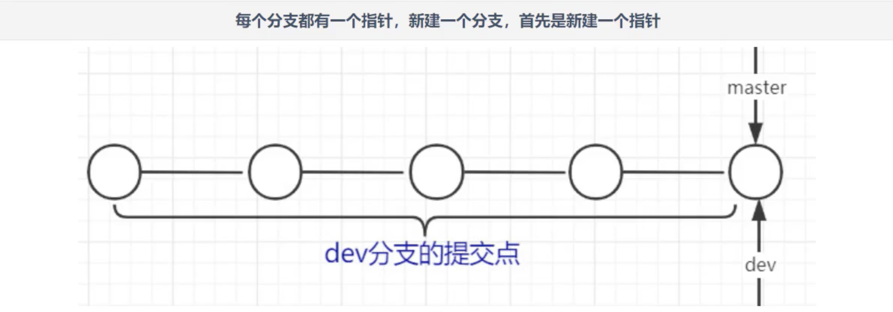
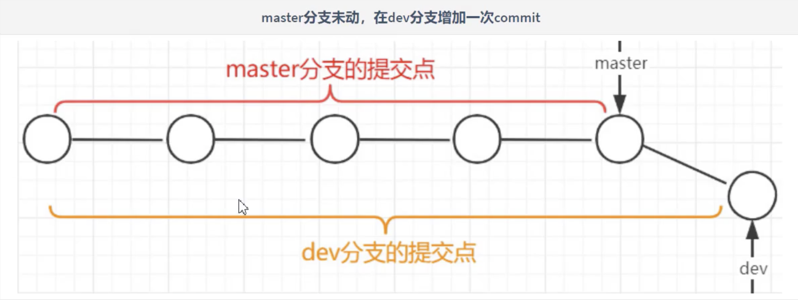
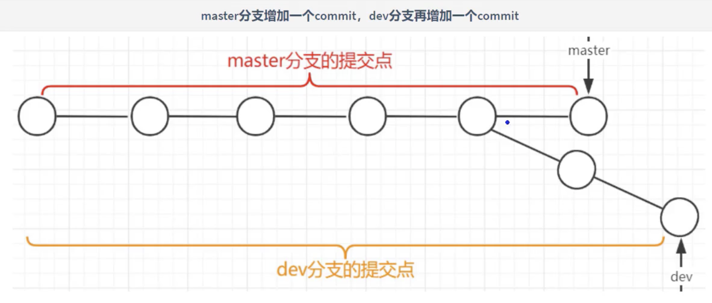
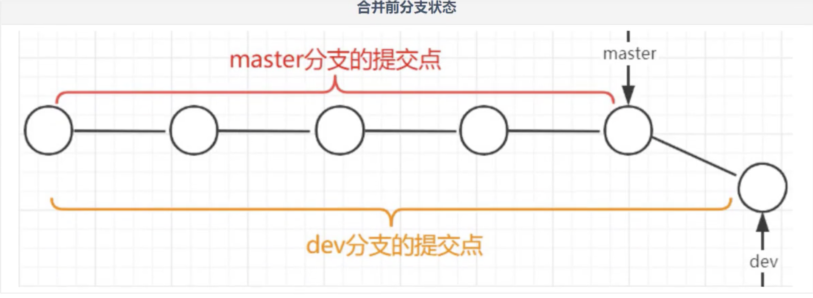
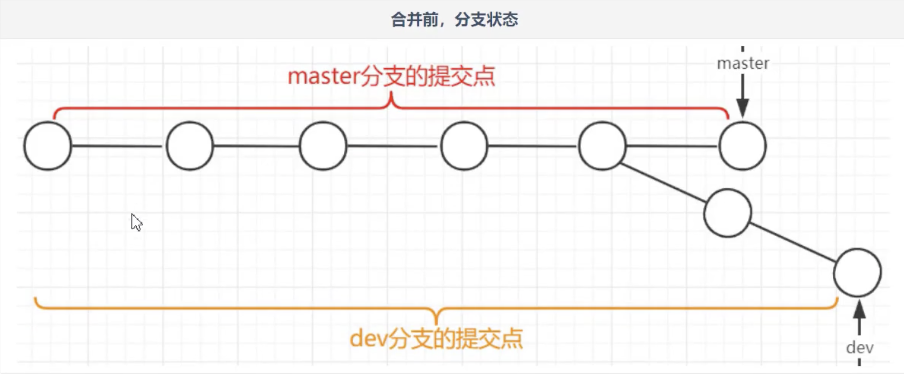
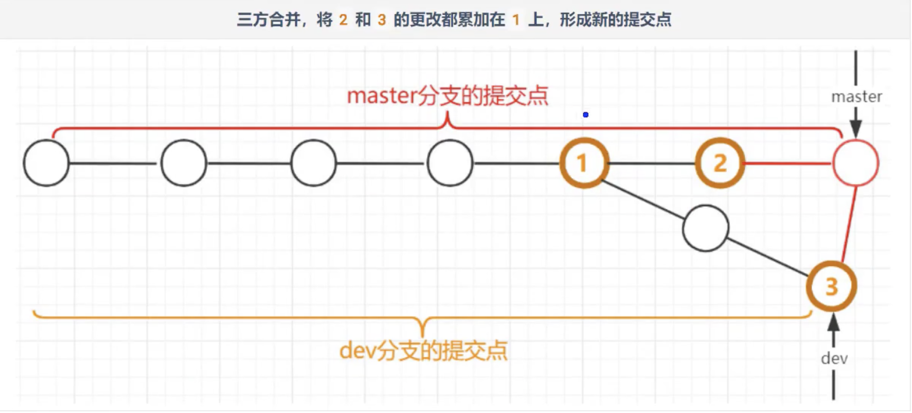

[TOC]

## 1. 安装

安装完成之后，打开终端，配置一下个人信息：

```shell
# 如下信息会在提交代码的时候用到，记录在你的每一次提交中。这样才能知道哪次提交是谁做的，“git log”可以查看
# 执行：
git config --global user.name "bearkchan"
git config --global user.email "bearkchan@gmail.com"
# 查看信息：
git config -l
#测试： 查看git版本
git version
```

## 2. 架构

> **版本库**：工作区有一个隐藏目录`.git`,这个目录不属于工作区，而是git的`版本库`，是git管理的所有内容
>
> **暂存区：**版本库中包含一个临时区域，保存下一步要提交的文件。
>
> **分支：**版本库中包含若干分支，提交的文件。

																			

## 3. 基本操作

```shell
# 查看仓库状态
git status

# 添加当前所有文件到暂存区
git add .

# 提交暂存区文件到分支
git commit -m "提交的信息"

```

### 3.1 删除某个已经add的文件

```shell
# 不删除物理文件，仅将该文件从缓存中删除
git rm --cached “文件路径” 
```

### 3.2 如何修改文件名称并提交

```shell
# 将file1改名为file2
git mv file1 file2
```

### 3.3 比较文件差异



```shell
# 查看本地文件与暂存区文件差异
git diff file1
# 查看暂存区与本地仓库文件差异
dit diff --cached file1
```

### 3.4 文件回退

```shell
# 用暂存区文件--->本地文件
# 使用提交到缓存区的内人覆盖到本地目录
git checkout file1

# 本地文件勿提交到暂存区
# 本地仓库---覆盖---暂存区---覆盖----本地目录
git reset HEAD file1
git checkout -- file1


# 多次提交回退
git log --oneline
git reset --hard "commitID"
# 查看所有的操作记录
git reflog
```


## 4. 远程仓库

> 当多人协同开发的时候，每个人都在自己的本地仓库维护版本。
>
> 但是当多人之间需要共享代码、合并代码，此时就需要一个`远程仓库`。


### 4.1 远程仓库工作模式



### 4.2 添加远程地址到本地仓库

```shell
# 添加远程地址  
# origin是一个别名，可以自己取的，这边设置好之后下面直接使用别名进行操作就可以了
git remote add origin git@157.0.1.250:haizhe.cheng/haifang360_2.git
```

### 4.3 查看远程地址

```shell
# 查看远程地址
git remote -v
origin	git@157.0.1.250:haizhe.cheng/haifang360_2.git (fetch)
origin	git@157.0.1.250:haizhe.cheng/haifang360_2.git (push)
```

### 4.4 推送文件到远程仓库

```shell
# 将本地仓库的master分支推送到远程仓库中
git push origin master
```

### 4.5 克隆远程仓库

```shell
git clone git@157.0.1.250:haizhe.cheng/haifang360_2.git
```

### 4.6 拉取远程仓库更新

```shell
# 将远程仓库的master分支拉取到本地仓库中
git pull origin master
```

## 5. 分支

> 分支，是一个个版本最终存储的位置。

> 分支，就是一条时间线，每次`git commit`形成一个个版本，一个个版本一次存储在分支的一个个提交点上。



### 5.1 查看分支

> 查看当前仓库分支:`git branch`
>
> 仓库中默认只有`master`分支
>
> 执行`git commit`时，默认是在master分支上保存版本

```shell
# 查看当前所有分支
git branch
* master
(END)


# 查看当前分支日志
git log
# 单行查看当前分支日志
git log --oneline
# 以图形化查看当前日志
git log --oneline --graph
```

### 5.2 创建分支

> 在商业项目开发过程中，我们不会轻易的在`master分支`上做操作。

> 我们会新建一个`开发用的分支`，在此分支上做版本的记录。

> 当代码确实没问题时，才会将开发分支上成熟代码版本添加到`master分支`上。

> 既保证开发过程中，可以及时记录版本，有保证master分支上每个提交点都是稳健版本。

```shell
# 创建分支dev
git branch dev
```

### 5.3 切换分支

> 默认情况下，当前使用的分支是master分支

> 可以切换到`dev分支`，则后续的`git commit`便会在`dev分支`上新建版本（提交点）

```shell
# 切换到dev分支
git checkout dev
```

### 5.4 新建分支细节

> 新建分支时，新分支，默认有哪些内容呢？分支中包含了哪些次提交？

#### 5.4.1 新分支初始内容

> 每个分支都有一个`指针`，新建一个分支，首先是新建一个指针。
>
> 而且新分支的指针会和当前分支指针指向`同一个提交点`。
>
> 新分支包含的提交点就是从第一个提交点到分支指针指向的提交点。



#### 5.4.2 多分支走向

> 在master分支和新分支，分别进行`git add`和`git commit`	
>
> 分支情况如下图：





#### 5.4.3 分支提交日志

> 查看分支的提交日志，进而看到分支中提交点的详细情况。

```shell
# 单行显示git日志情况
git log --oneline

88b4653 (HEAD -> master, origin/master, dev) Initial commit
(END)
```

### 5.5 分支的合并

> 两个分支内容的合并

> `git merge 分支a` 合并分支a到当前分支上

> 合并的两种方式：快速合并和三方合并。

#### 5.5.1 快速合并

> 如果分支A当前的修改，是完全基于分支B的修改而来，则B分支合并A分支，就是移动指针即可。




#### 5.5.2 三方合并

> 在不具备快速合并的条件下，会采用三方合并。





#### 5.5.3 合并冲突

> 两个分支进行合并，但它们含有对同一个文件的修改，则在合并时出现冲突，git无法决断该保留哪个分支的修改。

> 出现冲突后，如要由两个开发人员当面协商，该如何取舍，为冲突文件定义最终内容。
>
> 解决方案：
>
> 	1. 保留某一方的，删除另一方的
> 	2. 保留双方的
> 	3. 但无论如何，要记得删除 `<<<<  ==== >>>>`这些符合
> 	4. 本质是两个人协商为冲突的内容，定制出合理的内容。

## 6. 忽略文件

> 在仓库文件提交时，有些文件是不需要提交到仓库做版本控制的，这时候需要创建`.gitignore`文件进行配置

```shell
# 忽略.idea文件夹
.idea

# 忽略所有.iml后缀文件
*.iml
```


## 7. 标签Tag

### 7.1 创建标签

```shell
# commitID不填默认使用最新ID
git tag -a "v1.0" commitID -m "描述信息"
```

### 7.2 查看标签

```shell
# 查看哪些标签
git tag
# 查看标签具体信息
git show v1.0
```

### 7.3 删除标签

```shell
git tag v1.0 -d 
```


##  8. 多人协同开发

> 多人协同开发，git操作

### 8.1 项目管理员（项目经理）

> 1> 由管理员负责创建一个远程库，初始的库中什么也没有，为裸库。库的名称建议和项目同名

> 2> 管理员会在idea中创建一个初始项目，其中包含`.gitjgnore文件`。并在项目根目录下`建立本地库`。并建立`dev分支`。

> 3> 管理员将本地库上传到远程库。

> 4> 将其他开发人员拉入远程库的`开发成员列表中`，使得其他开发人员可以访问该远程库。

### 8.2 开发人员

> 1> 初始化：在idea中`clone`远程库，获得项目。建立本地库

> 2> 后续的开发中，都要在dev分支上进行。开发完一个功能并找测试通过后就`commit（push）`到远程dev分支中。

> 3> 需要更新项目内容时，通过`pull`从远程仓库拉取内容。

> 4> 注意：多人协同时，每次`push`到远程库前，都先做一次 	`pull`，一来时把远程库最新内容合并到本地，二来是核实本地内容是否和远程内容有冲突。

