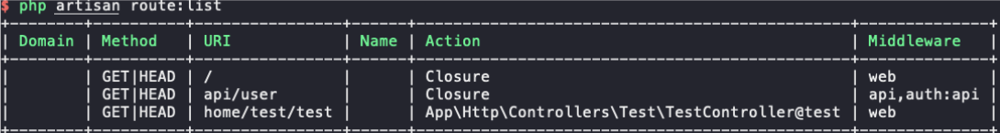
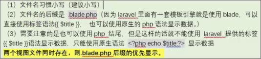
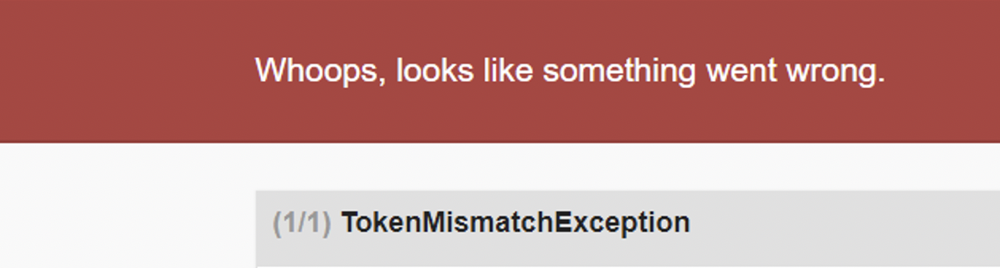

# Laravel5.8教程

## 一、目录结构

```markdown
projectName
｜- app
  ｜- http
  ｜	- Controller：控制器所在目录
  ｜	- User.php：默认模型文件
｜- config：所有配置文件所在目录
｜- bootstrap：启动目录
｜- database
  ｜- migrations：数据库迁移文件目录
  ｜- seed：数据库模拟数据文件目录
｜- public：公共文件目录
｜- routes
  ｜- web.php：路由配置文件
｜- .env:配置文件
```

新建项目：

```php
composer create-project laravel/laravel=5.8.* --prefer-dist ./
```


## 二、路由

### 1. 路由分组

```php
Route::group(["prefix"=>'user'],function(){
	Route::get('login',"Admin\IndexController@login");
});
```

### 2. 命令行查看现有路由

```php
php aritsan route:list
```



### 3. 路由别名

```php
Route::get('login',"Admin\IndexController@login")->name("别名名称");
```


## 三、数据库增删改查

### 1. 获取表

```php
$db=DB::table("tableName");
```

### 2. 添加数据

```php
// 返回true|false,可以同时插入多条数据
$db->insert([]);

// 返回新建id，只能插入一条数据
$db->insertGetId([]);
```

### 3. 修改数据

```php
// 返回收到影响的行数
$db->where()->update([]);

// $db->increment("字段名称")：每次➕1
// $db->increment("字段名称",5)：每次➕5
```

### 4. 查询数据

#### 1. get()

```php
// 查询全部数据,返回值是一个集合对象(Collection)
$db->get();
```

> 查询的每一行的记录是对象的形式，不是数组，所以需要使用$item->id,而不能使用$item['id']。

#### 2.value()

```php
// 取出一个指定字段的值
$db->where()->value("字段名称")
```

#### 3.orderBy()

```php
$db->orderBy('id','desc')->get();
```

#### 4.分页操作

```php
$db->limit(3)->offset(2)->get();
```

> limit:表示限制输出的条数
>
> offset：表示从什么地方开始

### 5. 删除数据

```php
// 删除数据
$db->delete();

// 清空数据
$db->truncate();
```

### 6. 执行任意的sql语句

```php
// 影响记录的语句
DB::statement("sql语句");

// 不影响记录的语句
DB::select("sql语句");
```


## 四、视图

### 1.路径

```php
/resources/views/
```

### 2. 命名规则



### 3. 展示视图方法

```php
// 视图可以分目录管理：“home/test/test1” or "home.test.test1"
return view('视图文件的名称');

// 重定向
return redirect(路由);
```

### 4. 变量分配和展示

- `view("模板文件名称",数组)`
- `view("模板文件名称")->with(数组)`
- `view("模板文件名称")->with(名称,值)->with(名称,值)`
- 展示：`{{$value1}}`

> compact: 
>
> - 语法：compact(var1,var2...)
>
> - 创建一个包含变量名和它们的值的数组。
>
> - 任何没有变量名与之对应的字符串都被略过。
>
>   

### 5. 模板中使用函数

```php
{{函数名(参数1，参数2,...)}}
```

### 6. foreach循环遍历标签

```php
@foreach($data as $key=>$value)
...
@endforeach
```

### 7.if判断条件标签

```php
@if(条件表达式1)
执行的语句1
@elseif(条件表达式2)
执行的语句2
@elseif(条件表达式3)
执行的语句3
...
@else
默认的执行语句
@endif
```

### 8. 模版的继承和包含

- 公共模板使用`@yield(“区块名称”)`

```html
<h1>公共头部</h1>
<!-- 可变区域 -->|
@yield("名字")
<!-- 可变区域 -->
<h1>公共尾部</h1>
```

- 子页面

```html
@extends(需要继承的模板文件名)
@section("模板中定义的yield的名字")
代码
@endsection
```

- 模版包含

  ```html
  @include("文件名")
  ```

### 9. 外部静态文件的引入

```html
<!-- 通过路径来引入，注意href前面加上/ -->
<link rel="stylesheet" type="text/css" href="/css/app.css">

<!-- 通过系统的asset方法引入,此方法会在前面加上域名-->
<link rel="stylesheet" type="text/css" href="{{asset('css')}/app.css">
```


## 五、控制器

### 1. 路径

```php
app\Http\Controller
```

### 2. 命令行创建

```shell
php artisan make:controller Admin/IndexController
```

### 3. 获取参数

- Input::has()：判断是否有参数
- Input::get("参数名称",“默认值”)
- Input::post("参数名称",“默认值”)
- Input::any("参数名称",“默认值”)
- Input::all()


## 六、模型

Laravel 自带的 Eloquent ORM 提供了一个美观、简单的与数据库打交道的 ActiveRecord 实现，每张数据表都对应一个与该表进行交互的“Model模型”，模型允许你在表中进行数据查询，以及插入、更新、删除等操作。

> **AR模式三个核心**（映射）：
>
> 每个数据表               与数据表进行交互的Model模型映射（实例化模型）
>
> 记录中的字段           与模型类的属性映射（给属性赋值）
>
> 表中的每个记录        与一个完整的请求实例映射（具体的CURD操作）

### 1. 定义模型

定义模型的位置，默认是在app目录下面，但是为了管理方便，建议分目录进行创建。

本身laravel对模型的命名没有严格的要求，一般采用 `表名(首字母大写).php`

创建模型：

```shell
php artisan make:model Home/Member
```

⚠️注意事项：

>第一：（必做）定义一个$table属性，值是不要前缀的表名，**如果不指定则使用类名的复数形式作为表名**。如果模型为Member模型在不指定table属性的情况下，其默认会去找members表。修饰词：protected

>第二：（可选）定义$primaryKey属性，值是主键名称，如果需要使AR模式的find方法，则可能需要指定主键（Model::find(n)），在主键字段不是id的时候则需要指定主键。修饰词：protected

>第三： （可选）定义$timestamps属性，值是false,如果不设置为false，则默认会操作表中的created_at和updated_at字段,我们表中一般没有这两个字段，所以设置为false,表示不要操作这两个字段。**修饰词：public**

>第四：（可选）定义$fillable属性，表示使用模型插入数据时，允许插入到数据库的字段信息。修饰词：protected

> **使用模型中create插入数据时，要设置$fillable允许入库的字段**，使用$guarded是设置排除入库的字段。

### 2. 模型控制器的调用

- 直接像使用DB门面一样的操作方式：以调用静态方法为主的形式，该形式下模型不需要实例化，例如：

  ```php
  // Member::get() 等价于 DB::table(‘member’) -> get()；
  Member::get();
  ```

- 实例化模型：

  ```php
  $model = new Member();
  $model -> get();
  ```


### 3. 模型的增删改查

首先，在控制器文件引入Request类：`use illuminate\http\Request;`

Request类的使用：

```php
$request->all()
$request->input('name');
$request->only([‘name1’,’name2’…])
$request->except([‘name1’,’name2’…])
$request->has(‘name’)
$request->get(‘name’)
```


#### 1. 添加数据

```php
Member::create($request->all())//返回值是一个对象
```

> 注意：如果使用`create`方法，则需要在模型中定义fillable属性，允许写入字段的定义，如果没有时间相关字段也需要禁用时间自动更新功能.

#### 2. 查询数据

```php
$info = Member::find(4); // 静态方法调用，获取主键为4的数据
Member::where("id",'>',4)->first(); // 获取符合指定条件的第一条数据

// 查询多行并指定字段
Member::all();
Member::all([字段1,字段2])     //与get方法的区别，all不支持连接其他的辅助查询方法
Member::get()    
Member::get([字段1,字段2])

  
// 按条件查询指定多个字段
Member::where('id','>',2)->get([' 列 1',' 列 2']);	//数组选列
Member::where('id','>',2)->select('列1','列2')->get(); //字符串选列
Member::where('id','>',2)->select( [' 列 1',' 列 2'] )->get(); //字符串选列

```

其返回值默认是一个对象。

> 如果需要在laravel中对象的结果集转化成数组，则需要在最终添加方法的调用：
>
> ```php
>  -> get()-> toArray();
> ```

#### 3. 修改数据

```php
// 先获取数据，然后修改
$user = User::find($id); 
$user->title = $_POST['title']; 
$user->content= $_POST['content'];
return $user->save() ? 'OK' : 'fail';

// 使用模型的update方法
$result = Member::where('id','7')->update([
  'age'=>'82',
]);
```

#### 4. 删除数据

```php
$user = User::find($id);
return $user->delete() ? 'ok' : 'fail';
```

## 七、CSRF攻击

### 1. 什么是CSRF攻击

CSRF是跨站请求伪造（Cross-site request forgery）的英文缩写：

Laravel框架中避免CSRF攻击很简单：Laravel自动为每个用户Session生成了一个CSRF Token，该Token可用于验证登录用户和发起请求者是否是同一人，如果不是则请求失败。【**该原理和验证码的原理是一致**】

Laravel提供了一个全局帮助函数csrf_token来获取该Token值，因此只需在视图提交表单中添加如下HTML代码即可在请求中带上Token：

```php
<input type="hidden" name="_token" value="<?php echo csrf_token(); ?>">
```

### 2. laravel中CSRF机制

在laravel中是默认开启csrf验证机制的，如果不携带token值，会提示报错：



如何携带：

```php
//1.
<input type="hidden" name="_token" value="<?php echo csrf_token(); ?>">
  
//2.
<input type="hidden" name="_token" value="{{csrf_token()}}">
  
//3.
{{csrf_field()}}
```

> csrf_token和csrf_field的区别：
>
> - csrf_token：只是输出token的值
> - csrf_field：输出了一整个的input隐藏域

⚠️：在ajax请求中需要使用`csrf_token`。


### 3. 从CSRF验证中排除例外路由

并不是所有请求都需要避免CSRF攻击，比如去第三方API获取数据的请求。

可以通过在VerifyCsrfToken（`app/Http/Middleware/VerifyCsrfToken.php`）中间件中将要排除的请求URL添加到`$except`属性数组中：

```php
    /**
     * The URIs that should be excluded from CSRF verification.
     *
     * @var array
     */
    protected $except = [
        // 单个路由写法，不能写别名：
      '/home/test/test1',
      '/home/test/test2',
        // 排除所有路由csrf验证：
      '*'
    ];
```


## 八、表单验证

在Laravel中，验证器检测验证参数不通过时，会将提示信息和表单数据都保存在`session`中，并且验证不通过时候会`自动跳转到上一个页面`。

### 1. 基本语法：

```php
$this->validate($request,[验证规则]);
```

validate方法接受一个HTTP请求输入数据和验证规则，如果验证规则通过，代码会继续往下执行；

然而，如果验证失败，则会抛出一个异常，相应的错误响应也会自动发送给客户。在一个传统的HTTP请求中，将会生成一个重定向响应，如果是AJAX请求则会返回一个JSON响应。

> 补充：
>
> ```php
> Input::method(); // 返回GET或者POST，用于判断请求类型
> ```


### 2. 基本验证规则：

- required：不能为空
- max:255：最长255个字符
- min:1：最少1个字符
- email ： 验证邮箱是否合法
- confirmed：验证两个字段是否相同，如果验证的字段是password，则必须输入一个与之匹配的password_confirmation字段
- integer：验证字段必须是整型
- ip：验证字段必须是ip地址
- numeric：验证字段必须是数值
- max:value：验证字段必须小于等于最大值，和字符串、数值、文件字段的size规则一起使用。
- min:value：验证字段必须大于等于最小值，和字符串、数值、文件字段的size规则一起使用。
- size:value ：验证字段必须有和给定值value想匹配的尺寸，对字符串而言，value是相应的字符数目，对数值而言，value是给定整型值；对文件而言，value是相应的文件字节数。
- string： 验证字段必须是字符串
- unique：表名，字段，需要排除的ID

> 注意：多个验证规则之间用`"|"`字符来进行分割。

例如：

```php
if(Input::method() == "POST"){
  $this->validate($request,[
    "name"  => "required|min:2|max:20",
    "age"   => "required|min:1|max:100|integer",
    "email" => "required|email"
  ]);
}
```

### 3. 输出错误信息

Laravel会自动将验证错误信息保存到session中，每一次请求视图的时候，Laravel都会自动从session数据中检查错误信息，如果有则将其绑定到视图。

我们可以很方便的通过laravel给定的`$errors`变量，获取该对象的所有的错误信息。`$errors`变量是一个`Illuminate\Support\MessageBag`实例。

在页面中展示错误信息：

```php
@if (count($errors) > 0)
  @foreach ($errors->all() as $error)
     <li>{{$error}}</li>
  @endforeach
@endif
```

### 4. 将输出结果转换为中文

前往https://packagist.org 搜索`larval-lang`，

使用composer安装；

```shell
composer require caouecs/laravel-lang:~3.0
```

> **语言包文件在vendor/caoue/laravel-lang中；将你需要的语言目录复制到resources/lang目录下即可。**同时，修改配置文件`config\app.php`中的`locale`配置项。
>
> ```php
> 'locale' => 'zh-CN',
> ```

## 九、文件上传

> 在Laravel中，文件上传被看作是一个简单的http请求来看待。

在页面中想要实现表单上传，需要以下要求：

- 具有form标签，method必须为post，必须具备enctype属性
- 至少具有一个input类型为file的标签；
- 具有一个提交按钮；

```html
<form action="" method="post" enctype="multipart/form-data">
  <input type="file" name="avatar"/>
  <!-- 注意：在laravel中post表单提交需要添加csrf_token验证 -->
  {{csrf_filed()}}
  <input type="submit" name="提交"/>
</form>
```

> 文件上传错误状态码error的取值范围为0-7，但是不包括5，其中0表示成功；
>
> 在php中文件上传的本质则是文件的移动：`move_upload_file()`

### 1. 获取文件

在Laravel中，可以使用`Illuminate\Http\Request`实例提供的`file`方法或者动态属性来访问上传文件，`file`方法返回一个`Illuminate\Http\UploadedFile`类的实例，该类继承自PHP标准库中提供与文件交互方法的`SqlFIleInfo`类：

```php
$file = $request->file('avatar');
// or
$file = $request->avatar;
```

### 2.判断文件是否存在

也可以使用`hasFile`方法来判断文件在请求中是否存在：

```php
if ($request->hasFile('avatar')){
  //
}
```

### 3. 验证文件是否上传成功

使用`isValid`方法判断文件在上传过程中是否出错：

```php
if ($request->file('avatar')->isValid()){
  //
}
```

### 4. 获取错误信息

如果文件上传错误，可以使用`getErrorMessage()`方法获取错误信息:

```php
$request->file('avatar')->getErrorMessage();
```

### 5. 保存文件

使用`move`方法保存文件：

```php
$request->file('avatar')->move('保存路径');
```

> 关于项目中使用路径的说明：
>
> 如果路径是给php代码使用的，则路径建议使用`./`形式；如果路径是给浏览器使用的则建议使用`/`形式。

### 6. 实例

```php
public function upload(Request $request){
  if(Input::method() == 'POST'){
    if($request->hasFile('avatar') && $request->file('avatar')->isValid()){
      // 路径为public目录下的uploads目录，
      $path = './uploads',md5(time().rand(1000,9999)).'.'.$request->file('avatar')->getClientOriginalExtension();
      $request->file('avatar')->move($path);
      // 将数据写入数据库
      $data = $request->all();
      $data['avatar'] = '/uploads/'.$path;
      $result = User::create($data);
    }else if($request->hasFile('avatar'){
      echo $request->file('avatar')->getErrorMessage();
    }
  }
}
```

> 如果使用的是create方法添加数据到数据表中，则这里还要修改一下模型里面的一个fillable属性，代表允许插入到数据库的字段。

## 十、数据分页

在laravel里面要完成分页是很简单的，它的思想之前的框架有些不一样，之前框架使用的是分页类完成分页，laravel是直接调用**模型**的分页方法，返回对应的数据和分页的字符串。

分页类路径：`vender/laravel/framework/src/Illuminate/Pagination`

```php
$users = User::where('id','>',100)->paginate(15);
// 简单分页：只有上一页和下一页
$users = User::where('id','>',100)->simplePapginate(15);
```

> 当调用`paginate`方法，获取`Illuminate\Pagination\LengthAwarepaginator`实例；
>
> 当调用`simplePaginate`方法，获取`Illuminate\Pagination\Paginator`实例；

在页面中可以调用`links`方法现实分页页码.

分页模板文件路径：

```shell
vender/laravel/framework/src/Illuminate/Pagination/resources/views/default.blade.php
```

可以在此文件中修改页面的提示“>>”和“<<”改成上一页和下一页提示文字。

常用方法总结：

```markdown
分页数据对象->count()        			//当前页数据条数
分页数据对象->currentPage()  		//当前页码
分页数据对象->firstItem()    			//当前页第一条数据的序号
分页数据对象->hasMorePages() 		//是否有后续页码
分页数据对象->lastItem()     			//当前页最后一条数据的序号
分页数据对象->lastPage() 				//最后页序号
分页数据对象->nextPageUrl()  		//下一页的链接地址
分页数据对象->perPage()      			//每页显示数据条数
分页数据对象->previousPageUrl()  	//上一页的链接地址
分页数据对象->total() 					//记录总条数
分页数据对象->url(5)         			//制作指定页码的链接地址
```

## 十一、验证码

Laravel框架自身并不具有验证码包，所以需要安装第三方依赖：

https://packagist.org/packages/mews/captcha

## 十二、数据表的迁移和填充

迁移：**创建**数据表的操作+**删除**数据表的操作

填充：往数据表里填充写入测试的数据（数据的插入操作）

### 1. 数据的迁移

在迁移过程中，操作可以分为两个部分：**创建与编写迁移文件、执行迁移文件**。

#### 1.1 迁移文件编写

迁移文件路径：`database/migrations/`，存放在该目录下的文件都被称为迁移文件。

创建迁移文件，迁移文件名命名规则：`create_paper_table`,中间为表名

```shell
php artisan make:migration 迁移文件名
```

生成的初始代码包括`up`和`down`方法：

- `up`方法表示创建数据表的方法
- `down`方法表示删除数据表的方法

```php
public function up(){
  Schema::create('users',function (Blueprint $table){
    $table->increments('id');
    $table->string('name');
    $table->string('email')->unique();
  });
}


public function down(){
  Schema::dropIfExists('users');
}
```


#### 1.2 执行迁移文件

Up方法的执行：

>  如果在当前的项目中第一次执行迁移文件的话，则需要先去执行：
>
> ```php
> php artisan migrate:install
> ```

在执行过上述的命令之后，在数据表中会多出一个数据表，migrations，用于创建记录迁移文件的记录数据表；

```php
php artisan migrate
```


Down方法执行：（回滚操作，删除数据表）

```php
php artisan migrate:rollback	【回滚最后一次的迁移操作，回滚操作不删除迁移文件】
```

> 注意：**删除（回滚）之后会删除上一个批次的迁移记录，并且同批次建立的数据表也会删除，但是迁移文件依旧存在，方便后期继续迁移（创建数据表）**。

### 2. 数据表填充器

#### 2.1 种子文件的编写

填充器默认目录：`database/seeds/`,该目录是填充器的默认目录。

创建填充器:

```php
php artisan make:seeder 大写表名+TableSeeder
```

填充器中有`run`方法用于往数据库中写入数据。

> 在填充器文件中可以使用DB门面去新增数据，但是需要注意，DB门面在使用的时候不需要用户自己引入，一旦引入则报错，可以直接使用。建议使用DB门面方法写入新的数据

#### 2.2 执行填充器文件

种子文件不像迁移文件，迁移操作有单独的对应关系表去记录，由于种子文件的执行没有任何的记录，所以在执行种子文件的时候需要指定需要执行的种子文件。

```php
php artisan db:seed --class=需要执行的种子文件名（不带.php）
```

**填充器的执行操作没有回滚一说，没有删除。如果需要回滚，则可以手动清空对应的数据表。**


## 十三、命令行

常用命令行操作：

```markdown
php artisan make:controller
php artisan make:model
php artisan make:migration
php artisan make:seeder

php artisan migrate
php artisan migrate:install
php artisan migrate:rollback

php artisan db:seed --class=className

php artisan serve

php artisan route:list
```

## 十四、ajax

在laravel中框架如果需要响应json数据，则写成语法：

```php
return response() -> json(需要json输出的数据);
```

> 补充：在laravel中布尔值是不能被直接通过return 响应输出的。

