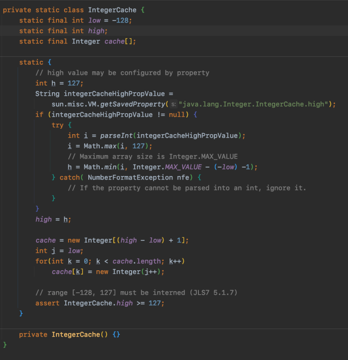
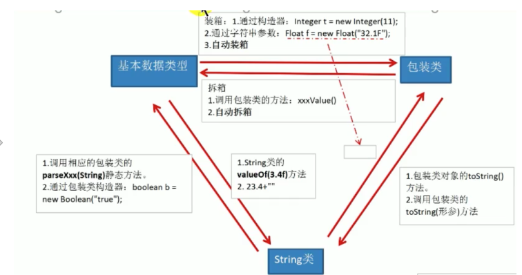
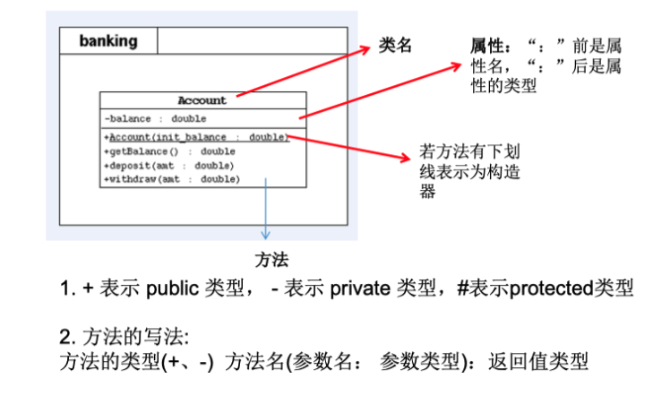
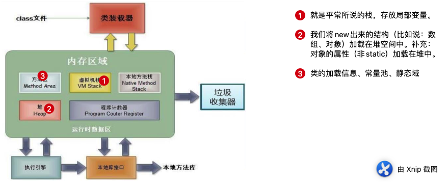

### 001- 局部变量和成员变量的区别

在java中局部变量没有初始值,而成员变量有初始值。

### 002- Integer内部自动装箱范围为-128-127的内部细节

查看下列代码:

```java
Integer m = 1;
Integer n = 1;
System.out.println(m==n); //true

Integer x = 128;
Integer y = 128;
System.out.println(x==y); //false
```

我们可以看出`m==n`为true,但是`x==y`则为false,这是为什么呢?

原来在Integer类的内部结构中定义了IntegerCache内部类,创建了Integer[]数组,保存了`-128~127`范围内的整数,因此当如果使用自动装箱的方式赋值时,可以直接从该数组中使用对应的元素,而不用再去new一个,这样做的目的是为了`提高效率`.



### 003- 基本数据类型及其包装类的映射关系


### 004- 基本数据类型、包装类和String类型之间的转换



- 基本数据类型和包装类之间的转换：在JDK5之后，使用自动装箱和自动拆箱。
- 基本数据类型、包装类和String类型之间的转换：
  - 基本数据类型、包装类-->String类型：调用String类的`valueOf(Xxxx xxx)`方法。
  - String类型--->基本数据类型、包装类：调用包装类的`parseXxx(String)`静态方法。

### 005- 什么是JavaBean？

JavaBean是一种Java语言编写的可复用的组建。

所谓的JavaBean其实就是一个符合以下规则的类：

1. 类是公共的
2. 有一个无参的公共的构造器
3. 有属性，且有对应的get、set方法

### 006- 属性赋值的先后顺序

1. 默认初始化
2. 显示初始化 / 代码块初始化: 按照先后顺序
3. 构造器赋值
4. 方法中的赋值

### 007- 四种访问修饰符

| 修饰符    | 类内部 | 同一个包 | 不同包的子类 | 同一个工程 |
| --------- | ------ | -------- | ------------ | ---------- |
| private   | ✅      | ❌        | ❌            | ❌          |
| default   | ✅      | ✅        | ❌            | ❌          |
| protected | ✅      | ✅        | ✅            | ❌          |
| public    | ✅      | ✅        | ✅            | ✅          |

> :exclamation:Tips：对于class的权限修饰符只可以使用public和default（默认缺省）

### 008- UML类图展示



### 009- JDK中主要包的内容有哪些？

1. **java.lang-**--- 包含一些 Java 语言的核心类 ， 如 String 、 Math 、 Integer 、 System 和 Thread，提供常用功能
2.  **java.net**----  包含执行与网络相关的操作的类和接口。
3. **java.io** ----    包含能提供多种输入/输出功能的类。
4. **java.util**----   包含一些实用工具类，如定义系统特性、接口的集合框架类、使用与日 期日历相关的函数。
5.  **java.text**----  包含了一些java格式化相关的类
6.  **java.sql**----   包含了java进行JDBC数据库编程的相关类/接口
7.  **java.awt**----  包含了构成抽象窗口工具集（abstract window toolkits）的多个类，这 些类被用来构建和管理应用程序的图形用户界面(GUI)。 B/S C/S

### 010- JVM内存结构有哪些？




### 011- ==和equals的区别

1. ==既可以用于基本类型，也可以用于引用类型。equals只能用于引用类型。
2. ==用于基本类型比较的是两个数值是否相等，用于引用类型比较的是两个地址是否一致。equals如果没有被重写的话相当于==，比较的是地址值。
3. String类中的euqals方法就被重写过，并且String类用的很多，久而久之，就造成了equals就是用来比较值大小的错觉。
4. 对于重写equals方法，会比较类的内容是否相等（即类中所有的属性）

下面是String类中equals方法的重写：

```java
    public boolean equals(Object anObject) {
        // 1. 首先比较两个对象的地址值是否相等，如果相等直接返回true
        if (this == anObject) {
            return true;
        }
      
        // important!:注意一定要比较getClass是否相同，如果不同则返回false
        if (o == null || getClass() != o.getClass()) return false;

        // 2. 再判断所比较对象是否是String类型或者是其子类
        // if (anObject instanceof String) {
            // 2.1 如果是的话就强制转换为String类型进行比较
            String anotherString = (String)anObject;
            int n = value.length;
            if (n == anotherString.value.length) {
                char v1[] = value;
                char v2[] = anotherString.value;
                int i = 0;
                while (n-- != 0) {
                    if (v1[i] != v2[i])
                        return false;
                    i++;
                }
                return true;
            }
       // }
       // 2.2 如果不是的话就直接返回false
        return false;
    }
```

> 重写步骤总结：
>
> 1. 首先比较两个对象的地址值是否相等，如果相等直接返回true
> 2. 判断getClass是否相同，有可能是子父类的关系。如果不同直接返回false
> 3. ~~再判断所比较对象是否是String类型或者是其子类~~
> 4.  如果是的话就强制转换为String类型进行比较
> 5. 如果不是的话就直接返回false
>
> 注意：以后就可以直接使用自动生成的equals()方法，就可以不用自己去手动写了。（IDE自动生成equals和[hashcode](https://www.baeldung.com/java-hashcode)方法）

### 012- 向上转型和向下转型

#### 1. 什么是向上转型?

多态。

#### 2. 为什么要使用向下转型?

当有了对象的多态性之后，内存中实际上是加载了子类的属性和方法，但是编译的时候声明的时候是父类的类型，所以只能使用父类中定义的属性和方法，如果想要使用子类中特有的属性和方法，就必须要使用向下转型。

#### 3. 如何使用向下转型？

使用强制类型转换符：`()`

#### 4. 向下转型的注意点

- 当使用强转的时候，可能会出现ClassCastException异常。
- 为了避免出现ClassCastException异常而导致程序中断，在进行强转之前首先需要使用instanceof来进行判断，如果为true则继续，如果为false则不能进行强转。

#### 5. instanceof的使用细则

- a instanceof A：判断对象a是否是类A的实例。如果是，则返回true，反之返回false。
- 如果类B是类A的父类，那么如果a instanceof A返回为true，则a isntanceof B也返回为true。
- :red_circle: 对象a所属的类X和类A两者之间必须是子类或父类的关系，否则则编译失败。


### 012- 谈谈你对多态性的理解

1. 实现了代码的通用性。
2. 抽象类、接口的使用必须用到多态性，因为它们本身是没有方法体的。
3. 例子：Object类中定义的public boolean equals(Object obj){}方法的实现；JDBC中连接不同数据库的方法的实现。

### 013- 多态性是编译时行为还是运行时行为？

多态性是运行时行为。

### 014- static属性

#### 1. 如何确定一个属性是static的？

属性可以被多个对象所共享，不会随着对象的不同而不同。

#### 2. 如何确定一个方法是static的？

- 一般来说用来调用静态属性的方法都声明为static的。
- 用于工具类的方法，例如：Arrays、Collections、Maths等。

### 015- 单例模式的饿汉式和懒汉式

饿汉式：还没用的时候就把一切都准备好。

坏处：加载时间长。

好处：天然的线程安全。

```java
/**
 * 饿汉模式
 */
class Bank{
    // 1. 设定构造函数为私有的
    private Bank(){}
    // 2. 设置static变量存放对象
    private static Bank bank = new Bank();
    // 3. 创建static方法调用静态对象
    public static Bank getInstance(){
        return bank;
    }
}
```


懒汉式：只有需要用的时候才生成。

好处：延迟对象的创建。

坏处：线程不安全。

> Tips:目前来说还是线程不安全的。可以通过多线程知识进行二次修改。

```java
/**
 * 懒汉式
 */
class Bank2{
    private Bank2(){};
    private static Bank2 bank2 = null;
    public static Bank2 getInstance(){
        if (bank2==null){
            bank2 = new Bank2();
        }
        return bank2;
    }
}
```

### 016- interface的使用细节

#### 1. 在interface中可以定义的成员有哪些？

- JDK7之前，只能定义全局常量和抽象方法。
  - 全局常量：public static final 
  - 抽象方法：public abstract

- JDK8之后，除了定义全局常量和抽象方法之外，还可以定义静态方法和默认方法。

  - 静态方法：接口中定义的静态方法只能通过`接口.静态方法名`的方式进行调用，无法通过实例化对象的方式调用。

  - 默认方法：使用`default`修饰方法名，类似于类中定义的方法，可供实例化对象调用。

    > 注意：
    >
    > 1. 如果实现了接口的类继承了父类，且父类和接口中定义的默认方法同名同参数，则调用父类中定义的方法（类优先原则）
    >
    > 2. 如果实现类实现了多个接口，且多个接口中都定义了同名同参数的默认方法，则实现类会报错:`接口冲突`，需要强制在实现类中重写该冲突方法，进行覆盖。
    >
    > 3. 如何在实现类中调用接口中定义的被覆盖的默认方法呢？
    >
    >    ```java
    >    接口名.super.默认方法名();
    >    ```

#### 2. 接口中不能定义构造器，则接口不能被实例化。

### 017- 抽象类和接口有哪些异同？

- 相同点：不能实例化，都可以包含抽象方法。
- 不同点：
  - 抽象类有构造器，接口没有构造器
  - 接口只能定义常量，抽象类可以定义成员变量
  - jdk8之后接口还可以定义静态方法和默认方法，jdk9之后可以定义私有方法。
  - 抽象类只能单继承，接口可以多继承。


### 018- 如何创建静态成员内部类和非静态成员内部类实例？

静态成员内部类实例：

```java
Person.Dog dog = new Person.Dog();
```

非静态成员内部类实例：

```java
Person p = new Person();
Person.Bird b = p.new Bird();
```

### 019- 局部内部类使用细节

如果想要在局部内部类中调用所在方法定义的局部变量的话，该局部变量必须是final的。

### 020- throw和throws的区别

- throw：用于抛出一个异常的对象，在方法体内。
- throws：用于抛出一个异常的声明，在方法声明处出现。