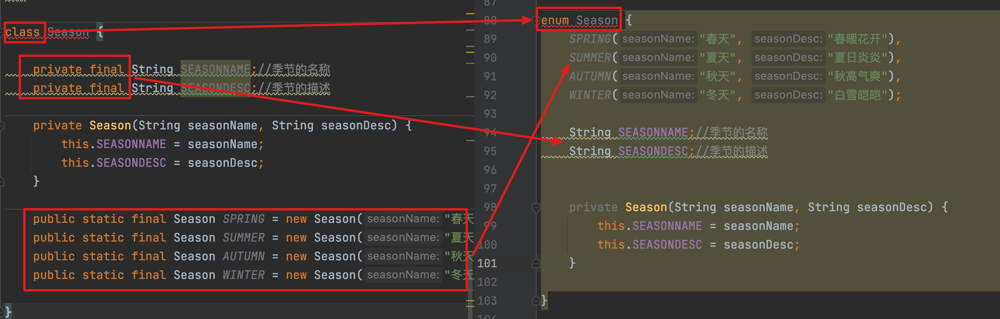

# 枚举类的使用

枚举类的实现有以下两种方式：

- JDK5.0之前需要自定义枚举类
- JDK5.0新增的`enum`关键词用于定义枚举类

## 1. 自定义枚举类

自定义枚举类需要具有以下步骤：

1. `private final `成员变量
2. `私有化`有参构造器
3. 定义`public static final `实例对象
4. 定义getXxx成员变量方法
5. 定义toString()方法

```java
class Season {
    private final String SEASONNAME;//季节的名称 
    private final String SEASONDESC;//季节的描述 

    private Season(String seasonName, String seasonDesc) {
        this.SEASONNAME = seasonName;
        this.SEASONDESC = seasonDesc;
    }

    public static final Season SPRING = new Season("春天", "春暖花开");
    public static final Season SUMMER = new Season("夏天", "夏日炎炎");
    public static final Season AUTUMN = new Season("秋天", "秋高气爽");
    public static final Season WINTER = new Season("冬天", "白雪皑皑");
}
```

## 2. 使用enum定义枚举类

使用说明：

- 使用enum定义的枚举类默认继承了`java.lang.Enum`类，因此不能再继承其他类了。
- 枚举类的构造器只能使用private权限修饰符
- 枚举类的所有实例必须在枚举类中放在首部，且用`,`分割，`;`结尾。列出的所有实例对象默认为public static final的。
- JDK1.5之后可以在switch表达式中使用Enum定义的枚举类的对象作为表达式，case子句可以直接使用枚举值的名字，不需要添加枚举类作为限定。

```java
enum Season {
    SPRING("春天", "春暖花开"),
    SUMMER("夏天", "夏日炎炎"),
    AUTUMN("秋天", "秋高气爽"),
    WINTER("冬天", "白雪皑皑");

    String SEASONNAME;//季节的名称
    String SEASONDESC;//季节的描述


    private Season(String seasonName, String seasonDesc) {
        this.SEASONNAME = seasonName;
        this.SEASONDESC = seasonDesc;
    }

}
```



## 3. Enum类的主要方法

- values()方法：返回枚举类型的对象数组。可以遍历所有的枚举值。
- valueOf(String str)：可以把一个字符串转为对应的枚举类对象。如果不是，则抛出运行时异常：IllegalArgumentException。
- toString()：返回当前枚举类对象常量的名称。

```java
Season[] values = Season.values();
for (Season value : values) {
    System.out.println("value = " + value);
}
```

## 4. 实现接口的枚举类

- 和普通 Java 类一样，枚举类可以实现一个或多个接口

- 若每个枚举值在调用实现的接口方法呈现相同的行为方式，则只 要统一实现该方法即可。 

-  若需要每个枚举值在调用实现的接口方法呈现出不同的行为方式, 则可以让每个枚举值分别来实现该方法。