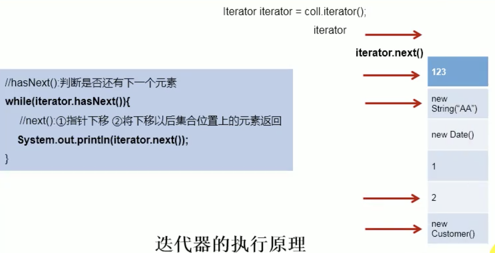
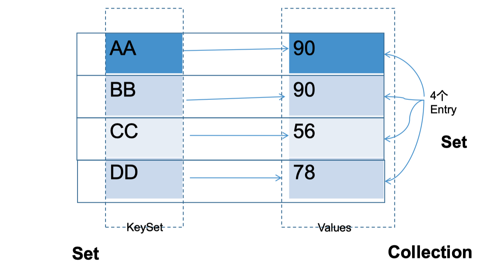
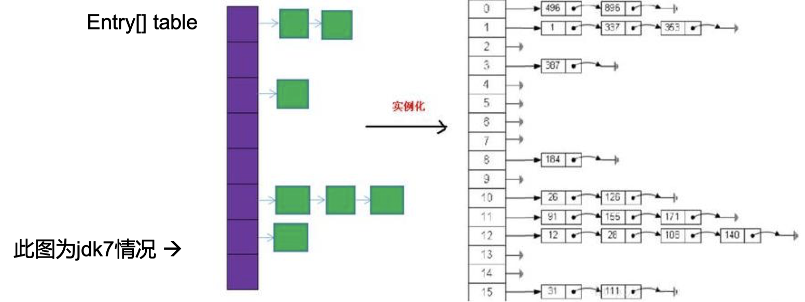
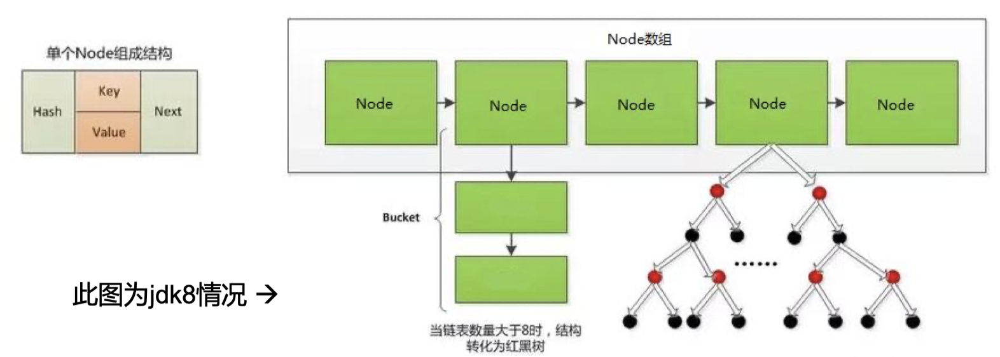
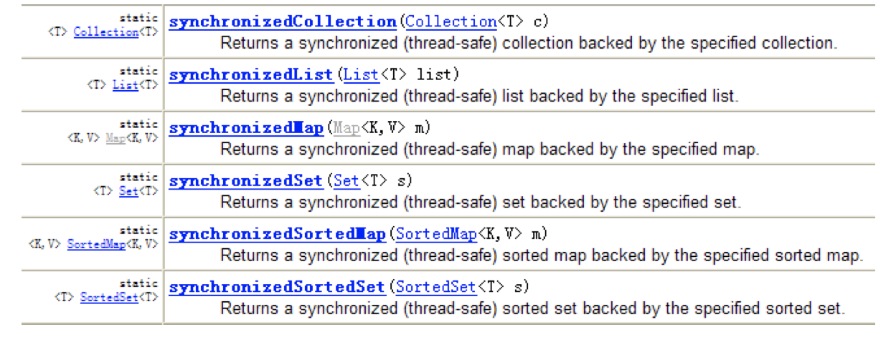

# 集合的使用

## 1. Java容器有哪些

Java容器可以分为三类：数组、Collection和Map，它们的特点有：

- **数组**：长度确定，元素类型确定。
- **Collection**：存放的单列数据，分为List和Set。
  - List：有序可重复数据（也被称为动态数组）
  - Set：无序不可重复数据
- **Map**：存放的是key-value形式的双列数据。

其中，Collection和Map统称为集合，集合框架如下：

```bash
集合
|--Collection
|		|--List
|		|		|--ArrayList、LinkedList、Vector
|		|--Set
|		|		|--HashSet、LinkedHashSet、TreeSet
|--Map
|		|--HashMap、LinkedHashMap、TreeMap、HashTable、Properties
```

## 2. Collection的使用

### 2.1 Collection接口常用的方法

```markdown
- add(Object obj)
- seize()：获取的是collection中元素的个数，而不是集合中数组的长度。
- addAll(Collection col)
- isEmpty()
- clear()：清空集合，将所有元素设置为null

- contains(Object obj)：是否包含obj，底部调用的是obj的equals()方法，将每一个add的对象作为形参放入obj的equals方法中进行比较。
- contains(Collection col)：是否包含col中的所有元素。
- remove(Object obj)：底部调用了obj的euqals方法
- removeAll(Collcetion col)：求差集，求当前集合和col的差集，去除当前集合中包含的所有的col的元素，并且重赋值给当前对象。
- retianAll(Collection col)：求子集，求当前集合和col所共有的，并重新赋值给当前集合。
- equals(Collection col)：判断当前集合和col所有的元素是否相等。如果是List，则必须所有元素的顺序一致。

- hashCode()
- toArray()：将集合转换为数组。
- iterator()：返回Iterator接口实例，用于便利集合元素。
```

### 2.2 集合和数组之间的转换

- 将集合转换为数组：使用集合的`toArray()`方法。

  ```java
  ArrayList list = new ArrayList();
  list.add(1);
  list.add("nihao");
  list.add(new Person("xiaomi",18));
  Object[] objects = list.toArray();
  for (int i = 0; i < objects.length; i++) {
    System.out.println(objects[i]);
  }
  ```

- 将数组转换为集合，使用Arrays工具类的`asList(T...)`方法。

  ```java
  List<String> list1 = Arrays.asList(new String[]{"AAA","BBB","CCC"});
  System.out.println(list1);
  
  List<int[]> list2 = Arrays.asList(new int[]{1, 2, 3});
  System.out.println(list2);//[[I@cb51256]
  System.out.println(list2.size());//1
  
  List<Integer> list3 = Arrays.asList(new Integer[]{1, 2, 3});
  System.out.println(list3);//[1, 2, 3]
  System.out.println(list3.size());//3
  ```

  > ⚠️：Arrays.asList(T... a)中a形参不能为基本数据类型，必须为包装类类型数组。
  >
  > Arrays.asList(new int[]{1,2,3})将会转换为只包含一个元素的List集合。系统会默认将整个new int[]{1,2,3}当作是一个int[]类型的元素，而不是一个需要转换的数组，解决办法有：
  >
  > 1. Arrays.asList(new Integer[]{1,2,3});
  > 2. Arrays.asList(1,2,3);

### 2.3 使用Collection集合存储对象，要求对象所属的类符合什么要求？

向Collection接口的实现类添加对象obj的时候，要求obj所属的类重写了`equals()`方法。


## 3. Iterator接口和foreach循环

### 3.1 遍历Collection的两种方式

- 使用迭代器Iterator
- foreach循环（或增强for循环）

### 3.2 java.utils.Iterator接口说明

Iterator对象称为迭代器（设计模式的一种）,GOF给迭代器模式的定义是：提供一种方法访问一个容器（container）对象中各个元素，而又不需要暴露该对象的内部细节。迭代器模式就是为容器而生的。它主要用于**遍历Collection集合中的元素。**

> 迭代器不能用于Map。

如何使用Iterator：

```java
ArrayList list = new ArrayList();
list.add(1);
list.add("nihao");
list.add(new Person("xiaomi",18));
// 1. 通过集合的iterator()方法创建迭代器实例
Iterator iterator = list.iterator();
// 2. 使用while循环，通过hasNext()方法判断是否还有下一个元素
while (iterator.hasNext()){
  //3. 如果有，则使用next()方法将迭代器指向下一个元素，并且返回其元素值
  System.out.println(iterator.next());
}
```

迭代器的执行原理如下：



> 迭代器也可以通过`remove()`方法，在遍历的时候，删除当前位置的元素值。

### 3.3 jdk5.0新特性---增强for循环（foreach）

在jdk5.0之后新增了foreach循环，用于遍历集合和数组。

```java
ArrayList list = new ArrayList();
list.add(1);
list.add("nihao");
list.add(new Person("xiaomi",18));

for (Object o : list) {
  System.out.println(o);
}
```

> 注意：其内部仍然调用的是迭代器方法。

同时，在jdk8之后，我们可以直接使用迭代器的默认方法forEach()进行循环：

```java
list.forEach(System.out::println);
```

## 4. Collection子接口：List接口

### 4.1 List接口介绍

List接口是Collection的子接口，它存储数据的特点是：

- 有序的
- 可重复的

它的常用实现类包括：ArrayList、LinkedList、Vector等。

```markdown
List
|--ArrayList:List接口的主要实现类，线程不安全，效率高，底部使用object[]存储elementData
|--LinkedList:底部使用双向链表存储，对于频繁的插入、删除，效率比ArrayList高
|--Vector:古老实现类，java1.0出现，线程安全，效率低，底层使用objectp[]存储elementData
```

> :star:List存储对象的要求：对象所在的类必须重写了equals()方法。

### 4.2 常用方法

```markdown
- void add(int index, Object ele):在index位置插入ele元素
- boolean addAll(int index, Collection eles):从index位置开始将eles中所有的元素添加进来
- Object get(int index):获取指定index位置的元素
- int indexOf(Object obj):返回obj在集合中首次出现的位置
- int lastIndexOf(Object obj):返回obj在集合中最后出现的位置
- Object remove(int index):移除指定index位置的元素，并返回该元素
- Object set(int index, Object ele):设置指定index位置的元素为ele
- List subList(int formIndex, int toIndex):返回从formIndex对toIndex位置的子集合[左闭右开]
```

对上述方法的总结如下：

- 增：add(Object obj)

- 删：remove(int index)  / remove(Object obj)

  > 如果remove方法的形参发生冲突的话，则会优先调用remove(int index)方法。

- 改：set(int index, Object ele)

- 查：get(int index)

- 插：add(int index, Object obj)

- 长度：size()

- 遍历：1.Iterator迭代器；2.增强for循环；3.普通的循环

### 4.3 :star:ArrayList源码分析

- JDK7的情况下：

  ArrayList list = new ArrayList();// 底层创建了长度为10的Object[]数组elementData.

  list.add(123);// elementData[0] = new Integer(123);

  ...

  list.add(11);//如果此次添加导致底层elementData数组容量不够，则扩容。

  默认情况下，扩容为原来的1.5倍，同时需要将原有数组中的数据复制到新的数组中。

  > 总结：建议开发中使用带参的构造器：ArrayList list = new ArrayList(int capacity)；
  >
  > 这样可以减少过多的扩容操作所带来的内存的消耗。

- JDK8的情况下：

  ArrayList list = new ArrayList();// 底层Object[] elementData初始化为{},而不是直接创建数组。

  list.add(123);// 第一次调用add()时，底层才创建长度为10的数组，并将数据123，添加到elementData的0号位置上。

  ...

  后续的添加和扩容操作与jdk7一样。

> 总结：jdk7中的ArrayList的对象的创建类似于单例模式中的饿汉式，而djk8中的ArrayList的对象创建则像单例模式中的懒汉式，延迟了数组的创建，节省了内存。

### 4.4 LinkedList源码分析

LinkedList list = new LinkedList();// 内部声明了Node类型的first和last属性，默认值为null

list.add(123); // 将123封装的Node中，创建了Node对象。

其中，Node的定义体现了LinkedList的双向链表的说法:

```java
private static class Node<E> {
  E item;
  Node<E> next;
  Node<E> prev;

  Node(Node<E> prev, E element, Node<E> next) {
    this.item = element;
    this.next = next;
    this.prev = prev;
  }
}
```


### 4.5 Vector源码分析

jdk7 和jdk8中通过Vector()构造器创建对象时，底层创建了长度为10的数组；

在扩容方面，默认扩容为原来数组长度的2倍。

### 4.6 面试题：ArrayList、LinkedList、Vector三者的异同？

- 相同点：三个类都是实现了List接口，存储数据的特点相同：存储有序的可重复的数据。
- 不同点：
  - ArrayList与Vector相比，Vector的默认扩容策略是原来的2倍，而ArrayList的扩容策略是原来的1.5倍。并且ArrayList是线程不安全的，效率高；而Vector是线程安全的，效率低。
  - ArrayList与LinkedList相比，LinkedList底层使用的是双向链表的方式存储数据，而ArrayList底层使用的是数组的方式存储数据。对于频繁的插入删除操作，LinkedList效率比ArrayList高。

## 5. Collection子接口：Set接口

### 5.1 Set接口介绍

Set是Collection的子接口，它存储数据的特点是：（以HashSet为例）

- 无序的：不等于随机性。存储的数据在底层数组中并非按照数组索引的顺序添加，而是根据数据的哈希值决定的。
- 不可重复的：保证添加的元素按照equals()判断时，不能返回true。即：相同的元素只能添加一个。

Set的实现类包括：HashSet、LinkedHashSet、TreeSet等。

```markdown
Set
|--HashSet:Set接口的主要实现类，线程不安全，可以存储null值
|--LinkedHashSet:HashSet的子类，在遍历内部数据时，可以按照添加的顺序读取。在添加数据的时候，每个数据还维护了两个引用，用于记录上一个数据和下一个数据的位置。
|--TreeSet:可以按照添加对象的指定属性进行排序，所有添加的对象必须属于同一个类
```

> 在开发中，Set使用的不是很多。

### 5.2 元素添加过程（以HashSet为例）

我们向HashSet中添加元素a，首先调用元素a所在类的hashCode()方法，计算元素a的哈希值，此哈希值接着通过某种算法计算出在HashSet底层数组中的存放位置（即为：索引位置）。判断数组此位置上是否已经有元素：

- 如果此位置上没有其他元素，则元素a添加成功。**------>情况1**
- 如果此位置上已经有其他元素b（或者以链表的形式存在的多个元素），则比较元素a和元素b的hash值：
  - 如果hash值不同，则元素a添加成功.**-------->情况2**
  - 如果hash值相同，进而调用元素a所在类的equals()方法，与此位置上链表的所有元素进行比较：
    - 如果equals()返回true，则元素a添加失败
    - 如果equals()返回false，则元素a添加成功。**---------->情况3**

> 对于添加的情况2和情况3而言：元素a与已经存在指定索引位置上数据以链表的形式存储。
>
> Jdk7:元素a存放到数组中，指向原来的元素。
>
> Jdk8:原来的元素在数组中，指向元素a。
>
> 总结：七上八下

> ⚠️HashSet的底层的存储结构：在jdk7中是数组+链表的结构。​

### 5.3 存储对象所在类的要求

- HashSet和LinkedHashSet：所在类需要重写hashCode()方法和equals()方法。且两个方法必须保证一致性，即hashCode()方法和equals()方法都要涉及到类的所有成员变量。
- TreeSet：所在类以比较器作为判别标准：自然排序和定制排序。
  - 自然排序：比较两个对象是否相同的标准：compareTo(Object obj)是否返回0。
  - 定制排序：比较两个对象是否相同的标准：compare(Object obj1, Object obj2)是否返回true。

### 5.4 TreeSet使用细则

TreeSet在使用的时候需要遵守两个规则：

- 向TreeSet中添加数据的时候，必须是相同类的对象。
- 要使用两种排序方式：自然排序或者是定制排序。

自然排序demo:

```java
// Person.java
public class Person implements Comparable<Person> {
    private String name;
    private int age;
  
    public Person(String name, int age) {
        this.name = name;
        this.age = age;
    }
    @Override
    public int compareTo(Person o) {
        // 根据年龄比较大小
        return Integer.compare(this.age, o.age);
    }
  
  // ...getter and setter、tostring...
}


// test.java
TreeSet<Person> people = new TreeSet<>();
people.add(new Person("xiaomi", 43));
people.add(new Person("zhangsan", 23));
people.add(new Person("lisi", 73));
people.forEach(System.out::println);
```

输出结果为：

```bash
Person{name='zhangsan', age=23}
Person{name='xiaomi', age=43}
Person{name='lisi', age=73}
```


定制排序demo:

```java
// 定制排序
Comparator<Person> comparator = new Comparator<Person>() {
  @Override
  public int compare(Person o1, Person o2) {
    return Integer.compare(o1.getAge(), o2.getAge());
  }
};
// 使用有参构造器声明比较器
TreeSet<Person> people = new TreeSet<>(comparator);
people.add(new Person("xiaomi", 43));
people.add(new Person("zhangsan", 23));
people.add(new Person("lisi", 73));
people.forEach(System.out::println);
```

### 5.5 HashSet面试题

```java
HashSet animals = new HashSet();
Animal a1 = new Animal(1001, "AA");
Animal a2 = new Animal(1002, "BB");
animals.add(a1);
animals.add(a2);
// [Animal{id=1002, name='BB'}, Animal{id=1001, name='AA'}]
System.out.println(animals);

a1.name = "CC";
animals.remove(a1);
// 1⃣️[Animal{id=1002, name='BB'}, Animal{id=1001, name='CC'}]
System.out.println(animals);

animals.add(new Animal(1001, "CC"));
// 2⃣️[Animal{id=1002, name='BB'}, Animal{id=1001, name='CC'}, Animal{id=1001, name='CC'}]
System.out.println(animals);
animals.add(new Animal(1001, "AA"));
// 3⃣️[Animal{id=1002, name='BB'}, Animal{id=1001, name='CC'}, Animal{id=1001, name='CC'}, Animal{id=1001, name='AA'}]
System.out.println(animals);
```

- 1⃣️：当调用animals.remove(a1)时，首先根据现在a1的hashCode()方法计算哈希值，而a1的name属性已经发生变化，所以其哈希值也发生了变化，随后根据哈希值所求的在底层数组中的索引位置也发生了变化，所以没有找到其位置上元素，删除失败。
- 2⃣️：与1同理，可以添加
- 3⃣️：添加3的时候，首先根据hash值分配到最初a1元素所在位置，然后通过比较两者hash值不同，存入链表。

## 6. Map的使用

### 6.1 Map接口介绍

Map存储的是上列数据，存储key-value对的数据，类似于高中的函数：y=f(x)。

Map接口的主要实现类包括：HashMap、TreeMap、Hashtable等。

```markdown
Map
|--HashMap:Map主要实现类，线程不安全、效率高，可以存储null的key和value值
|		|--LinkedHashMap:保证在遍历map元素时，可以按照添加的顺序实现遍历。
|		|									原因：在原有的HashMap底层结构基础上，添加了一对指针，指向前一个和后一个元
|	  |										  素，对于频繁的遍历操作，此类的执行效率高于HashMap								
|--TreeMap:保证按照添加的key-value对进行排序，实现排序遍历。此时考虑key的自然排序和定制排序，底层 
|					 用的是红黑树。
|--Hashtable:作为古老实现类，线程安全，效率低；不能存储null的key和value值。
|		|--Properties:常用来处理配置文件。key和value都是String类型的。
```

> HashMap的底层：数组+链表              （jdk7之前）
>
> ​										数组+链表+红黑树（jdk8之后）

### 6.2 Map涉及到的面试题

- **HashMap的底层实现原理？【高频】**
- HashMap和Hashtable的异同？
- CurrentHashMap和Hashtable的异同？

### 6.3 存储结构的理解



- Map中的key：无序的，不可重复的，使用Set存储所有的key。

  > key所在的类要重写equals()和hashCode()方法。【以HashMap为例】

- Map中的value：无序的，可重复的，使用Collection存储所有的value。

  > value所在的类要重写equals()方法。

- Map中的entry：一个key-value组成了一个entry，是无序的，不可重复的，使用Set存储所有的entry。

### 6.4 Map接口常用方法

```markdown
- 添加、删除、修改操作：
- Object put(Object key, Object value):将指定key-value添加到(或修改)当前map对象中
- void putAll(Map m):将m中的所有key-value对存放到当前map中。【如果m中有key和当前map对象中key相同，则修改现有的value值为m中的value值】
- Object remove(Object key):移除指定key的key-value对，并返回value
- void clear():清空当前map中的所有数据[并非将map对象设为null，而是将底层数组元素全设为null]

- 元素查询的操作：
- Object get(Object key)：获取指定key对应的value
- boolean containsKey(Object key)：是否包含指定的key 
- boolean containsValue(Object value)：是否包含指定的value 
- int size()：返回map中key-value对的个数 
- boolean isEmpty()：判断当前map是否为空 
- boolean equals(Object obj)：判断当前map和参数对象obj是否相等

- 元视图操作的方法：
- Set keySet()：返回所有key构成的Set集合
- Collection values()：返回所有value构成的Collection集合
- Set entrySet()：返回所有key-value对构成的Set集合
```

上述方法总结：

- 增：put(Object key, Object value)
- 删：remove(Object key)
- 改：put(Object key, object value)
- 查：get(Object key)
- 长度：size()
- 遍历：keySet()/values()/entrySet()

### 6.5 遍历Map的三种方式

- 使用keySet()

  ```java
  Map map1 = new HashMap();
  map1.put("name","zhangsan");
  map1.put("age",12);
  Set set = map1.keySet();
  Iterator iterator = set.iterator();
  while (iterator.hasNext()){
    Object key = iterator.next();
    Object value = map1.get(key);
    System.out.println("value = " + value);
  }
  ```

- 使用values()

  ```java
  Map map1 = new HashMap();
  map1.put("name", "zhangsan");
  map1.put("age", 12);
  Collection values = map1.values();
  Iterator iterator = values.iterator();
  while (iterator.hasNext()){
    Object value = iterator.next();
    System.out.println("value = " + value);
  }
  ```

- 使用entrySet()

  ```java
  Map map1 = new HashMap();
  map1.put("name", "zhangsan");
  map1.put("age", 12);
  Set set = map1.entrySet();
  Iterator iterator = set.iterator();
  while (iterator.hasNext()){
    Map.Entry entry = (Map.Entry)iterator.next();
    Object key = entry.getKey();
    Object value = entry.getValue();
    System.out.println("key = " + key + ",value = " + value);
  }
  ```

  

### 6.6 HashMap的底层实现原理

- **在jdk7中**

  `HashMap map = new HashMap();`

  在实例化之后，底层创建了长度为16的一维数组Entry[] table。

  `......可能已经执行过多次put......`

  `map.put(Object key1, Object value1);`

  首先调用key1所在类的hashCode()方法计算key1的哈希值，此哈希值经过某种算法后，得到在Entry[] table数组中的存放索引位置：

  - 如果此位置上的数据为空， 此时的key1-value1添加成功. ------情况1⃣️

  - 如果此位置上的数据不为空（意味着此位置上存在一个或多个以链表的方式存在的数据），比较key1和已存在的一个或多个数据的哈希值：
    - 如果key1的哈希值与已存在的数据的哈希值都不相同，此时的key1-value1添加成功。 ----情况2⃣️
    - 如果key1的哈希值和已经存在的某一个数据(key2-value2)的哈希值相同，则继续比较：调用key1所在类的equals(key2)方法，比较：
      - 如果equals()返回false：此时key1-value1添加成功。 ---情况3⃣️
      - 如果equals()返回true：此时value1替换value2.

  > 补充：关于情况2⃣️和3⃣️，此时的key1-value1和原来的数据以链表的方式存储。存储规则是七上八下。

  在不断的添加过程中，会涉及到扩容问题，**当超出临界值且要存放的位置不为空的时候**，扩容。默认的扩容机制是原来的2倍，并将原来的数据复制过来。

  

- **在jdk8中**

  HashMap在jdk8中相较于jdk7在底层实现方面的不同有：

  1. new HashMap():底层没有创建一个长度为16的数组
  2. jdk8底层的数组是：Node[]，而不是Entry[]
  3. 首次调用put()方法时，底层创建长度为16的数组
  4. jdk7底层结构为：数组+链表。jdk8中底层结构为：数组+链表+红黑树。
     - 形成链表时：七上八下（jdk7中新元素指向旧元素。jdk8中旧的元素指向新的元素。）
     - 当数组的某一个索引位置上的元素以链表的形式存在的数据个数>=8且当前数组的元素个数超过64个时，此时该索引位置上的所有数据改为使用红黑树存储。

  

### 6.7 HashMap底层典型属性的说明

- `DEFAULT_INITIAL_CAPACITY `: HashMap的默认容量，16

- MAXIMUM_CAPACITY ： HashMap的最大支持容量，2^30 

- `DEFAULT_LOAD_FACTOR`：HashMap的默认加载因子 0.75f

- `TREEIFY_THRESHOLD`：Bucket中链表长度大于该默认值，转化为红黑树 8

-  UNTREEIFY_THRESHOLD：Bucket中红黑树存储的Node小于该默认值，转化为链表 

- `MIN_TREEIFY_CAPACITY`：桶中的Node被树化时最小的hash表容量。64（当桶中Node的 数量大到需要变红黑树时，若hash表容量小于MIN_TREEIFY_CAPACITY时，此时应执行 resize扩容操作这个MIN_TREEIFY_CAPACITY的值至少是TREEIFY_THRESHOLD的4 倍。） 

- table：存储元素的数组，总是2的n次幂 

- entrySet：存储具体元素的集

-  size：HashMap中存储的键值对的数量 

- modCount：HashMap扩容和结构改变的次数。 

- threshold：扩容的临界值，=容量*填充因子  默认是12

- loadFactor：填充因子

  > **[面试题]：负载因子loadFactor值的大小，对HashMap有什么影响？**
  >
  > - 负载因子的大小决定了HashMap的数据密度。 
  > - 负载因子越大密度越大，发生碰撞的几率越高，数组中的链表越容易长, 造成查询或插入时的比较次数增多，性能会下降。 
  > - 负载因子越小，就越容易触发扩容，数据密度也越小，意味着发生碰撞的 几率越小，数组中的链表也就越短，查询和插入时比较的次数也越小，性 能会更高。但是会浪费一定的内容空间。而且经常扩容也会影响性能，建 议初始化预设大一点的空间。 
  > - 按照其他语言的参考及研究经验，会考虑将负载因子设置为0.7~0.75，此 时平均检索长度接近于常数。

### 6.8 LinkedHashMap底层源码解析（了解）

LinkedHashMap与HashMap底层源码没有什么区别。原因在于LinkedHashMap本身就继承于HashMap。**唯一的区别在于：LinkedHashMap使用Entry替代了HashMap使用的Node。这使得LinkedHashMap在遍历的时候，可以按照添加的顺序读取数据。**

HashMap中的Node的数据结构为：

```java
static class Node<K,V> implements Map.Entry<K,V> { 
  final int hash; 
  final K key; 
  V value; 
  Node<K,V> next; 
}
```

LinkedHashMap中Entry的数据结构为：

```java
static class Entry<K,V> extends HashMap.Node<K,V> { 
  Entry<K,V> before, after; 
  Entry(int hash, K key, V value, Node<K,V> next) { 
    super(hash, key, value, next); 
  } 
}
```

### 6.9 TreeMap的使用

向TreeMap中添加key-value，要求key必须是同一个类的对象。因为要使用key进行排序：自然排序和定制排序。

TreeMap可以保证所有的key-value对处于有序的状态。它的底层使用**红黑树结构**存储数据。

### 6.10 使用Properties读取配置文件

```java
package com.bk.collection;

import java.io.FileInputStream;
import java.io.IOException;
import java.util.Properties;

/**
 * Create by bear
 * Date 2021/1/23 11:06 上午
 */
public class PropertiesTest {
    public static void main(String[] args) {
        FileInputStream fis = null;
        try {
            // 默认在项目的根目录下存放source.properties文件
            fis = new FileInputStream("source.properties");
            Properties properties = new Properties();
            properties.load(fis);
            String name = properties.getProperty("name");
            String age = properties.getProperty("age");
            Integer ageInt = Integer.parseInt(age);
            System.out.println("name = " + name);
            System.out.println("ageInt = " + ageInt);
        } catch (IOException e) {
            e.printStackTrace();
        } finally {
            try {
                fis.close();
            } catch (IOException e) {
                e.printStackTrace();
            }
        }
    }
}
```

## 7. Collections的使用

Collections是用来操作Collection和Map的工具类。Collections 中提供了一系列静态的方法对集合元素进行排序、查询和修改等操作， 还提供了对集合对象设置不可变、对集合对象实现同步控制等方法。

Collections中常用方法有：

```markdown
- 排序操作
- reverse(List list)：反转List中元素的顺序 
- shuffle(List list)：对List集合元素进行随机排序 
- sort(List list)：根据元素的自然顺序对指定List集合元素按升序排序 
- sort(List list，Comparator comparator)：根据指定的Comparator产生的顺序对List集合元素进行排序 
- swap(List list，int i， int j)：将指定list集合中的i处元素和j处元素进行交换

- 查找、替换
- Object max(Collection)：根据元素的自然顺序，返回给定集合中的最大元素  
- Object max(Collection，Comparator)：根据Comparator指定的顺序，返回给定集合中的最大元素  
- Object min(Collection)  
- Object min(Collection，Comparator)  
- int frequency(Collection，Object)：返回指定集合中指定元素的出现次数  
- ⭐️void copy(List dest,List src)：将src中的内容复制到dest中  
- boolean replaceAll(List list，Object oldVal，Object newVal)：使用新值替换List 对象的所有旧值
```

> 对于copy方法，要求dest不能比src的元素个数小，否则则会报错。

⚠️注意：

**Collections同时还提供了一套线程安全的函数，可以帮助我们将ArrayList、HashMap等线程不安全的集合和Map转换成线程安全的。使用方法为：synchronizedList(List list)和synchronizedMap(Map map)。**




