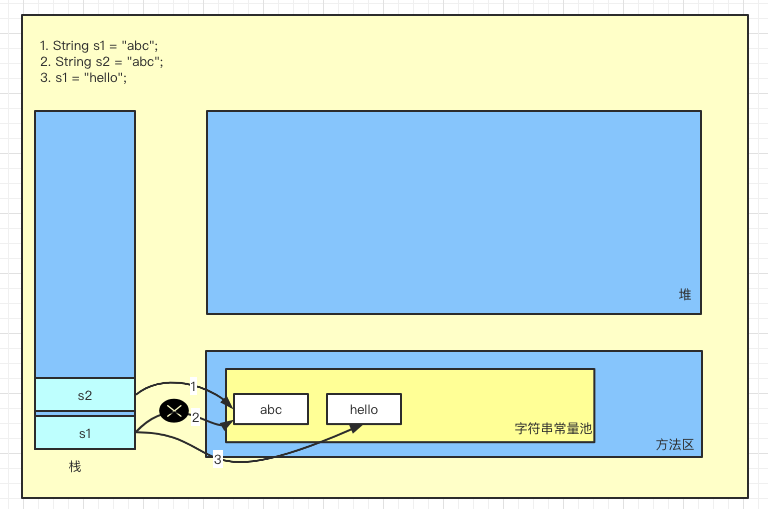
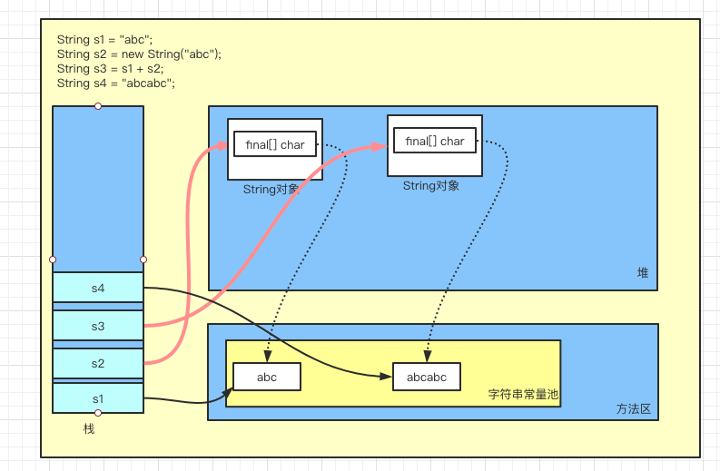

## 1. 概述

- String类被声明为`final`的，不可被继承。

- String类实现了`Serializable`接口：表示字符串是可以被序列化的。
- String实现了`Comparable`接口：表示字符串可以比较大小

- String内部定义了`final char[] value`变量来存储字符串数据。

- 通过字面量的方式(`String s1="hello";`)给一个字符串赋值，此时的字符串声明在字符串常量池中。而通过new的方法给一个字符串赋值，此时的字符串声明在堆空间中。

- 字符串常量池中是不会存储相同内容（使用String类的equals()方法返回true则为相同内容）的字符串的。

## 2. String的不可变性

### 2.1 概述

String具有不可变性，即代表不可变的字符序列：

> String代表了不可变的字符序列。

- 当对字符串重新赋值时，需要重写指定内存区域赋值，不能使用原有的value进行赋值。
- 当对现有的字符串进行连接操作的时候，需要重写指定内存区域赋值，不能使用原有的value进行赋值。
- 当调用String的replace()方法修改指定字符或者字符串的时候，需要重写指定内存区域赋值。

### 2.2 代码展示

```java
String s1 = "abc";
String s2 = "abc";
s1 = "hello";
```

### 2.3 图示



## 3. String赋值的三种方式

### 3.1 概述

String赋值有三种方式：

- String s1 = "abc";
- String s2 = new String("abc");
- String s3 = s1 + s2;

s1使用的是字面量的方式赋值，此时，"abc"字符串是保存在字符串常量池中；

s2使用的是new一个String对象的方式赋值，此时首先在堆中创建一个String对象，同时将s2指向堆中创建的这个对象，同时在字符串常量池中查找是否有“abc”字符串，如果没有则先在字符串常量池中首先创建这个字符串，并且将堆中的String对象中的`char[] value`指向字符串常量池中“abc”字符串对应的地址；

> 注意：s2的创建方式创建了几个对象？
>
> 创建了两个对象，一个是堆中的String对象，一个是字符串常量池中的”abc“

⭐️s3使用的链接符的方式赋值，需要注意：只要连接符两边有一个是变量，那么就如同s2的创建方式一样，如果两边都是字面量或者是常量，则使用s1的创建方式。

### 3.2 代码展示

```java
String s1 = "abc";
String s2 = new String("abc");
String s3 = s1 + s2;
String s4 = "abcabc";
System.out.println(s3 == s4);//false
```

### 3.3 图示



## 4. 字符串常用方法列表

```java
int length()：返回字符串的长度： return value.length
char charAt(int index)： 返回某索引处的字符return value[index]
boolean isEmpty()：判断是否是空字符串：return value.length == 0
String toLowerCase()：使用默认语言环境，将 String 中的所有字符转换为小写
String toUpperCase()：使用默认语言环境，将 String 中的所有字符转换为大写
String trim()：返回字符串的副本，忽略前导空白和尾部空白
boolean equals(Object obj)：比较字符串的内容是否相同
boolean equalsIgnoreCase(String anotherString)：与equals方法类似，忽略大
小写
String concat(String str)：将指定字符串连接到此字符串的结尾。 等价于用“+”
int compareTo(String anotherString)：比较两个字符串的大小

boolean endsWith(String suffix)：测试此字符串是否以指定的后缀结束
boolean startsWith(String prefix)：测试此字符串是否以指定的前缀开始
boolean startsWith(String prefix, int toffset)：测试此字符串从指定索引开始的
子字符串是否以指定前缀开始

  
  
  
String	substring(int	beginIndex)： 返回一个新的字符串， 它是此字符串的从
beginIndex开始截取到最后的一个子字符串。
String substring(int beginIndex, int endIndex) ：返回一个新字符串，它是此字 符串从beginIndex开始截取到endIndex(不包含)的一个子字符串。
  
  
  
  
boolean contains(CharSequence s)：当且仅当此字符串包含指定的 char 值序列 时，返回 true
int indexOf(String str)：返回指定子字符串在此字符串中第一次出现处的索引
int indexOf(String str, int fromIndex)：返回指定子字符串在此字符串中第一次出 现处的索引，从指定的索引开始
int lastIndexOf(String str)：返回指定子字符串在此字符串中最右边出现处的索引
int lastIndexOf(String str, int fromIndex)：返回指定子字符串在此字符串中最后 一次出现处的索引，从指定的索引开始反向搜索
注：indexOf和lastIndexOf方法如果未找到都是返回-1
  
  
  
String replace(char oldChar, char newChar)：返回一个新的字符串，它是
通过用 newChar 替换此字符串中出现的所有 oldChar 得到的。
String replace(CharSequence target, CharSequence replacement)： 使 用指定的字面值替换序列替换此字符串所有匹配字面值目标序列的子字符串。
String	replaceAll(String	regex,	String	replacement) ： 使 用 给 定 的
replacement 替换此字符串所有匹配给定的正则表达式的子字符串。
String	replaceFirst(String	regex,	String	replacement) ： 使用给定的
replacement 替换此字符串匹配给定的正则表达式的第一个子字符串。

  
  
boolean matches(String regex)：告知此字符串是否匹配给定的正则表达式。

  
  
String[] split(String regex)：根据给定正则表达式的匹配拆分此字符串。
String[] split(String regex, int limit)：根据匹配给定的正则表达式来拆分此 字符串，最多不超过limit个，如果超过了，剩下的全部都放到最后一个元素中。

```

## 5. 字符串与其他类型的转换

### 5.1 String与基本数据类型转换

- 字符串---> 基本数据类型、包装类

  - Integer包装类的public static int **parseInt(String** **s)**：可以将由“数字”字 符组成的字符串转换为整型。

  - 类似地,使用java.lang包中的Byte、Short、Long、Float、Double类调相应

    的类方法可以将由“数字”字符组成的字符串，转化为相应的基本数据类型。

- 基本数据类型、包装类-----> 字符串

  - 调用String类的public String **valueOf(int** **n)**可将int型转换为字符串

  - 相应的valueOf(byte b)、valueOf(long l)、valueOf(float f)、valueOf(double

    d)、valueOf(boolean b)可由参数的相应类型到字符串的转换

### 5.2 String与char数组的转换

- 字符串----> 字符数组
  - **public** **char[]** **toCharArray()**：将字符串中的全部字符存放在一个字符数组中的方法。
  - **public void getChars(int srcBegin, int srcEnd, char[] dst,int dstBegin)**：提供了将指定索引范围内的字符串存放到数组中的方法。
- 字符数组-----> 字符串
  - String 类的构造器：**String(char[]) 和 String(char[]，intoffset，int length)**分别用字符数组中的全部字符和部分字符创建字符串对象

### 5.3 String与byte数组的转换

- 字符串----> 字节数组

  - **public** **byte[] getBytes()** **：**使用平台的默认字符集将此 String 编码为

    byte 序列，并将结果存储到一个新的 byte 数组中。

    **public** **byte[]** **getBytes(String** **charsetName)** **：**使用指定的字符集将 此 String 编码到 byte 序列，并将结果存储到新的 byte 数组。

- 字节数组----> 字符串

  - **String(byte[])：**通过使用平台的默认字符集解码指定的 byte 数组，构 造一个新的 String。
  - **String(byte[]，int** offset**，int** length) ：用指定的字节数组的一部分， 即从数组起始位置offset开始取length个字节构造一个字符串对象。

```java
String str = "中";
System.out.println(str.getBytes("ISO8859-1").length);// -128~127
System.out.println(str.getBytes("GBK").length);  System.out.println(str.getBytes("UTF-8").length);

System.out.println(new String(str.getBytes("ISO8859-1"),
"ISO8859-1"));// 乱码，表示不了中文
System.out.println(new String(str.getBytes("GBK"), "GBK"));
System.out.println(new String(str.getBytes("UTF-8"), "UTF-8"));

```

## 6. String、StringBuffer、StringBulder三者对比

- String：不可变的字符序列，底层用char[]存储
- StringBuffer：可变的字符序列，线程安全的，效率比StringBuilder低，比String高，底层用char[]存储
- StringBuilder：可变的字符序列，JDK1.5之后出现，线程不安全的，效率最高，底层用char[]存储

> StringBuilder与StringBuffer方法一样，唯一的区别就是StringBuilder是线程不安全的。

## 7. StringBuffer的底层分析

StringBuffer底层同样使用char[]存储数据，但是它与String不同的是，String的char[] value是声明的final，而StringBuffer则不是。如果调用StringBuffer的空参构造器：`new StringBuffer()`，则char[]的默认为16，如果调用的是`new StringBuffer(String str)`构造器，则char[]的数组长度为：`str.length()+16`。

> 注意：StringBuffer的lenght()方法获取的是实际存放的字符个数，而不是整个数组的长度。

StringBuffer的扩容问题：

如果要添加的数据底层数组放不下了，则需要扩容底层数组，默认情况下，扩容为原来容量的`2倍+2`,同时将原数组中的元素复制到新的数组中。

## 8. StringBuffer、StringBuilder常用方法

- 增：append(xxx)
- 删：delete(int start, int end)
- 改：setCharAt(int n, char ch) / replace(int start, int end, String str)
- 查：charAt(int n)
- 插：insert(int offset, xxx)
- 长度：length()

## 9. String、StringBuffer、StringBuilder三者效率对比

String<StringBuffer<StringBuilder

```java
long startTime = 0L;
long endTime = 0L;
String text = "";
StringBuffer buffer = new StringBuffer("");
StringBuilder builder = new StringBuilder("");
//开始对比
startTime = System.currentTimeMillis();
for (int i = 0; i < 20000; i++) {
    //buffer.append(String.valueOf(i));
    buffer.append(i);
}
endTime = System.currentTimeMillis();
System.out.println("StringBuffer的执行时间：" + (endTime - startTime));

startTime = System.currentTimeMillis();
for (int i = 0; i < 20000; i++) {
    //builder.append(String.valueOf(i));
    builder.append(i);
}
endTime = System.currentTimeMillis();
System.out.println("StringBuilder的执行时间：" + (endTime - startTime));

startTime = System.currentTimeMillis();
for (int i = 0; i < 20000; i++) {
    text = text + i;
}
endTime = System.currentTimeMillis();
System.out.println("String的执行时间：" + (endTime - startTime));
```

