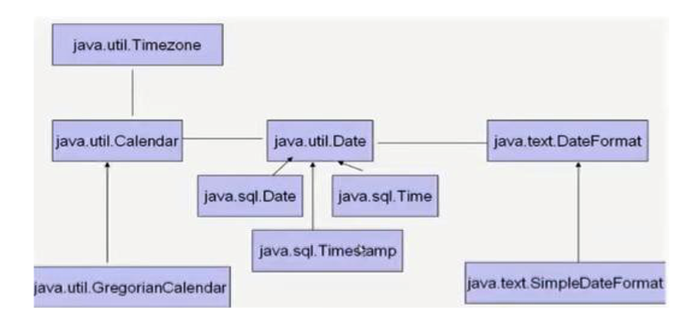
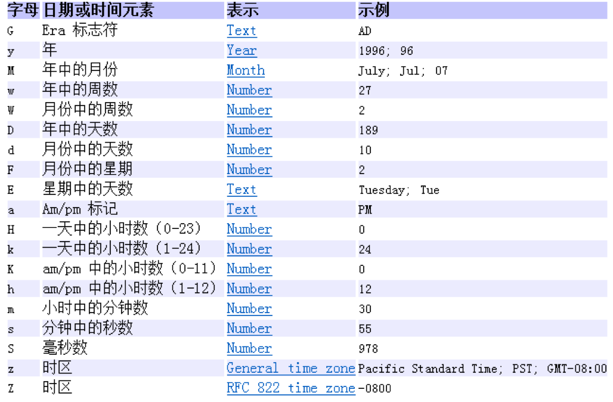
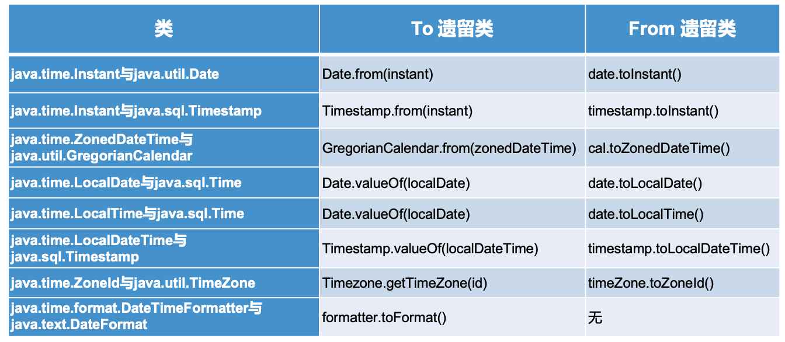

# 时间日期常用类的使用

[TOC]

## 1. Java中时间日期API分类

- JDK8.0之前
  - **System.currentTimeMillis()**：获取当前系统时间戳
  - Date类：
    - **java.util.Date**类
    - java.sql.Date类：对应数据库中日期类型的变量
  - **java.text.SimpleDateFormat**类：对Date类的格式化和解析
  - **Calendar**类

  

- JDK8.0之后
  - **LocalDate、LocalTime、LocalDateTime**类
  - **Instant**类：类似于Date类
  - **DateTimeFormatter**类：对LocalDateTime类的格式化和解析


## 2. Java.lang.System类

System类提供的`public static long currentTimeMillis()`用来返回当前时 间与1970年1月1日0时0分0秒之间以毫秒为单位的时间差。

## 3. java.util.Date类

Date类在JDK1.0之后诞生，但是由于Calendar日历类的产生，很多方法已经被抛弃了，目前还能稳定使用的方法不多。

### 3.1 构造器

- Date()：使用无参构造器创建的对象可以获取本地的当前时间。
- Date(long date)：根据时间戳创建对象。

### 3.2 常用方法

- getTime()：获取当前对象的时间戳。

### 3.3 代码展示

```java
import java.util.Date;

Date date = new Date();
System.out.println(date);

System.out.println(System.currentTimeMillis());
System.out.println(date.getTime());

Date date1 = new Date(date.getTime());

System.out.println(date1.getTime());  
System.out.println(date1.toString());
```

## 4. java.sql.Date类

java.sql.Date类是java.util.Date类的子类，主要用于数据库中日期类型的变量的转换。

### 4.1 java.util.Date类如何转换为java.sql.Date类？

```java
java.sql.Date sqlDate = new java.sql.Date(new java.util.Date().getTime());
```

## 5. java.text.SimpleDateFormat类

simpleDateFormat类是对Date类的格式化和解析日期的具体类。

### 5.1 构造器

SimpleDateFormat(String pattern):用参数pattern指定的格式创建一个对象，并使用该对象的格式来格式化和解析日期。

参数pattern可以使用以下规则：



> 常用的格式为："yyyy-MM-dd HH:mm:ss"
>
> 注意：hh表示的是12小时制的小时数，HH表示的24小时制的小时数。

代码展示：

```java
import java.text.SimpleDateFormat;

// 创建SimpleDateFormat实例对象
SimpleDateFormat sdf = new SimpleDateFormat("yyyy-MM-dd HH:mm:ss");
```


### 5.2 常用方法

- public String format(Date date)：将Date日期对象转换为字符串。
- public Date parse(String dateStr)：将字符串解析成Date对象。


### 5.3 代码展示

```java
import java.text.ParseException;
import java.text.SimpleDateFormat;
import java.util.Date;

// 创建SimpleDateFormat实例，构造器参数为日期样式pattern
SimpleDateFormat sdf = new SimpleDateFormat("yyyy-MM-dd HH:mm:ss");
Date date = new Date();
// 使用格式化将日期转换为字符串
String format = sdf.format(date);
System.out.println("format = " + format);

// 使用解析将字符串解析长日期Date格式，解析格式必须和构造器参数格式一致，否则就会报错java.text.ParseException
try {
  Date parse = sdf.parse("2019-01-12 23:45:23");
  System.out.println("parse = " + parse);
} catch (ParseException e) {
  e.printStackTrace();
}
```


### 5.4 将字符串"2020-01-02"转换成java.sql.Date类型

```java
import java.text.ParseException;
import java.text.SimpleDateFormat;
import java.util.Date;

SimpleDateFormat sdf = new SimpleDateFormat("yyyy-MM-dd");
Date date = sdf.parse("2020-01-02");
java.sql.Date mysqlDate = new java.sql.Date(date.getTime());
System.out.println("mysqlDate = " + mysqlDate);
```


## 6. java.util.Calendar日历类

Calendar类本身是一个抽象类，主要用于日期字段之间相互操作的功能。

### 6.1 实例化Calendar的方法

- 调用它的实现子类`GregorianCalendar`类的构造器。
- 使用`Calendar.getInstance()`方法，它实际上内部也是`new GregroianCalendar()`的方式实例化的。

### 6.2 常用方法

- get(int filed)：根据field获取想要的时间信息。比如：YEAR、MONTH、DAY_OF_WEEK、HOUR_OF_DAY、MINUTE、SECOND等。
- set(int filed,int value)：
- add(int filed,int amount)：加减天数小时
- getTime()：将日历类转换为Date对象
- setTime(Date date)：将Date对象转换为日历类对象

> 注意：
>
> ->获取月份时：一月是0，二月是1，。。。十二月是11.
>
> ->获取星期时：周日是1，。。。周六是7.

### 6.3 代码展示

```java
import java.util.Calendar;
import java.util.Date;

Calendar calendar = Calendar.getInstance();
// get方法
int dayOfMonth = calendar.get(Calendar.DAY_OF_MONTH);
System.out.println("dayOfMonth = " + dayOfMonth);
// set方法
calendar.set(Calendar.DAY_OF_MONTH,29);
dayOfMonth = calendar.get(Calendar.DAY_OF_MONTH);
System.out.println("dayOfMonth = " + dayOfMonth);
// add方法
calendar.add(Calendar.DAY_OF_MONTH,-4);
dayOfMonth = calendar.get(Calendar.DAY_OF_MONTH);
System.out.println("dayOfMonth = " + dayOfMonth);
// getTime():日历类--->Date类
Date date = calendar.getTime();
System.out.println("date = " + date);
// setTime():Date类---->日历类
Date date1 = new Date();
calendar.setTime(date1);
dayOfMonth = calendar.get(Calendar.DAY_OF_MONTH);
System.out.println("dayOfMonth = " + dayOfMonth);
```


## 7. LocalDate、LocalTime、LocalDateTime

### 7.1 概述

JDK 1.0中包含了 一个java.util.Date类，但是它的大多数方法已经在JDK 1.1引入Calendar类之后被弃用 了。而Calendar并不比Date好多少。它们面临的问题是：

- 可变性：像日期和时间这样的类应该是不可变的。

- 偏移性：Date中的年份是从1900开始的，而月份都从0开始。 格式化：格式化只对Date有用，Calendar则不行。

- 此外，它们也不是线程安全的；不能处理闰秒等。

为了解决这些问题，在JDK8.0之后，引入了`java.time`API来解决上述问题。

而LocalDate、LocalTime、LocalDateTime 类是其中较重要的几个类，它们的实例 **是不可变的对象**

### 7.2 常用方法

#### 7.2.1 对象实例化

- now()/now(ZoneId zone)：静态方法，根据当前时间创建对象/指定时区的对象。
- of()：静态方法，根据指定日期/时间创建对象。

#### 7.2.2 获取日期数据getXxx

#### 7.2.3 设置属性等withXxx

#### 7.2.4 添加属性等plusXxx

#### 7.2.5 减少属性等minusXxx

> LocalDate、LocalTime、LocalDateTime的实例是不可变对象，通过上述方法对其的操作，都会返回一个全新的实例对象。

### 7.3 代码展示

```java
import java.time.LocalDateTime;

// 通过now实例化LocalDateTime对象
LocalDateTime lof = LocalDateTime.now(); //2021-01-09T12:45:03.496
// 通过of实例化LocalDateTime对象
//LocalDateTime of = LocalDateTime.of(2021, 1,6, 23, 24,55);

// getXxx获取属性值
System.out.println(lof.getDayOfMonth()); //9
System.out.println(lof.getDayOfWeek());  //SATURDAY
System.out.println(lof.getDayOfYear());  //9

// withXxx设置属性
System.out.println(lof.withDayOfMonth(1)); //2021-01-01T12:43:51.577

// plus添加属性
System.out.println(lof.plusDays(20)); //2021-01-29T12:44:24.521

// minus减少属性值
System.out.println(lof.minusDays(2)); //2021-01-07T12:45:03.496
```

## 8. Instant 瞬时

它只是简单的表示自1970年1月1日0时0分0秒（UTC）开始的秒数。精度可以达到纳秒级。

| **方法**                              | **描述**                                                     |
| ------------------------------------- | ------------------------------------------------------------ |
| **now()**                             | 静态方法，返回默认UTC时区的Instant类的对象                   |
| **ofEpochMilli(long** **epochMilli)** | 静态方法，返回在1970-01-01  00:00:00基础上加上指定毫秒 数之后的Instant类的对象 |
| **atOffset(ZoneOffset** **offset)**   | 结合即时的偏移来创建一个 OffsetDateTime                      |
| **toEpochMilli()**                    | 返回1970-01-01  00:00:00到当前时间的毫秒数，即为时间戳       |

## 9. DateTimeFormatter

DateTimeForMatter是JDK8.0中新增的用于格式化与解析日期或者时间的类，一般用ofPattern()进行实例化：

`DateTimeForMatter.ofPattern("yyyy-MM-dd HH:mm:ss");`

它有format()和parse()两个方法用于格式化和解析。

代码展示：

```java
import java.time.LocalDate;
import java.time.format.DateTimeFormatter;
import java.time.temporal.TemporalAccessor;


DateTimeFormatter dtf = DateTimeFormatter.ofPattern("yyyy-MM-dd");
String format = dtf.format(LocalDate.now());
System.out.println("format = " + format);
TemporalAccessor parse = dtf.parse("2021-01-02");
LocalDate localDate = LocalDate.from(parse);
System.out.println("localDate = " + localDate);
```

## 10. JDK8中新日期时间API与遗留类的转换

