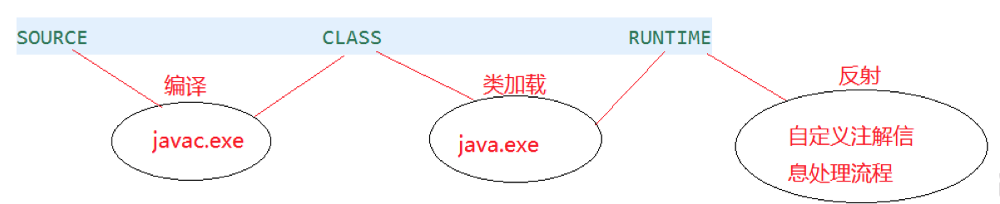
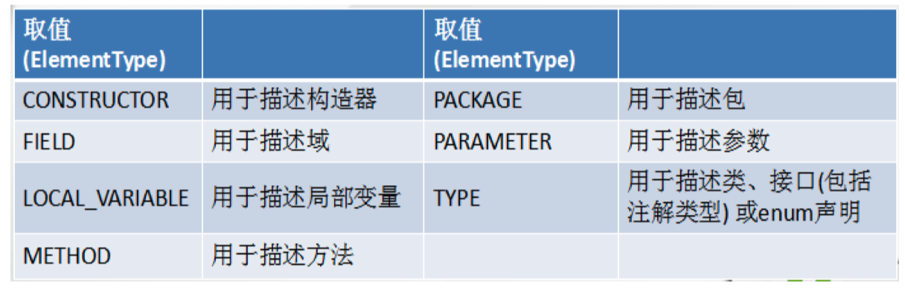

# 注解的使用

## 1. JDK中的元注解

所谓的元注解是用于修饰其他Annotation的。

JDK5.0提供了四大标准的元注解，分别是：

- Retention
- Target
- Document
- Inhreited

### 1.1 Retention

只能用于修饰一个 Annotation 定义, 用于指定该 Annotation 的生命 周期, @Rentention 包含一个 RetentionPolicy 类型的成员变量, 使用 @Rentention 时必须为该 value 成员变量指定值:

- **RetentionPolicy.SOURCE**:在源文件中有效（即源文件保留），编译器直接丢弃这种策略的 注释
- **RetentionPolicy.CLASS**:在class文件中有效（即class保留） ， 当运行 Java 程序时, JVM 不会保留注解。 这是默认值
- **RetentionPolicy.RUNTIME**:在运行时有效（即运行时保留），当运行 Java 程序时, JVM 会 保留注释。程序可以通过反射获取该注释。



```java
@Retention(RetentionPolicy.SOURCE)
@interface MyAnnotation1{ }

@Retention(RetentionPolicy.RUNTIME)
@interface MyAnnotation2{ }
```

### 1.2 Target

用于修饰 Annotation 定义, 用于指定被修饰的 Annotation 能用于 修饰哪些程序元素。 @Target 也包含一个名为 value 的成员变量。



### 1.3 Documented

用于指定被该元 Annotation 修饰的 Annotation 类将被 javadoc 工具提取成文档。默认情况下，javadoc是不包括注解的。

> 定义为Documented的注解必须设置Retention值为RUNTIME。

### 1.4 Inherited

被它修饰的 Annotation 将具有继承性。如果某个类使用 @Inherited 修饰的 Annotation, 则其子类将自动具有该注解。

> - 比如：如果把标有@Inherited注解的自定义的注解标注在类级别上，子类则可以 继承父类类级别的注解
>
> - 实际应用中，使用较少

