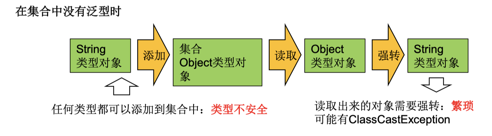

# 泛型的使用

## 泛型的理解

### 泛型的概念

所谓泛型，就是允也称为许在定义类、接口时通过一个标识表示类中的某个属性的类型或者是某个方法的返回值及参数类型。这个类型参数将在使用时（例如，继承或实现这个接口时，用这个类型声明变量、创建对象时确定[即传入实际的类型参数，也称为类型实参]）。

### 泛型的引入背景

集合容器类在设计阶段/声明阶段不能确定这个容器到底实际存的是什么类型的 对象，所以在JDK1.5之前只能把元素类型设计为Object，JDK1.5之后使用泛型来 解决。因为这个时候除了元素的类型不确定 ，其他的部分是确定的，例如关于 这个元素如何保存 ，如何管理等是确定的，因此此时把元素的类型设计成一个 参数，这个类型参数叫做泛型。Collection<E>，List<E>，ArrayList<E> 这个<E>就 是类型参数，即泛型。

## 泛型在集合中的使用

### 在集合中使用泛型之前的例子

```java
/**
* 在集合中使用泛型之前的情况
*/
@Test
public void test1(){
  ArrayList list = new ArrayList();
  // 需求：存放学生的成绩
  list.add(78);
  list.add(76);
  list.add(82);
  list.add(88);
  // 问题1:类型不安全
  //list.add("Tom");
  for(Object score: list){
    //问题2:强转时，可能出现ClassCastException
    int stuScore = (Integer) score;
    System.out.println(stuScore);
  }
}
```



### 在集合中使用泛型例子1

```java
//在集合中使用泛型的情况：以ArrayList为例
@Test
public void test2(){
  ArrayList<Integer> list =  new ArrayList<Integer>();

  list.add(78);
  list.add(87);
  list.add(99);
  list.add(65);
  //编译时，就会进行类型检查，保证数据的安全
  //        list.add("Tom");

  //方式一：
  //        for(Integer score : list){
  //            //避免了强转操作
  //            int stuScore = score;
  //
  //            System.out.println(stuScore);
  //
  //        }
  //方式二：
  Iterator<Integer> iterator = list.iterator();
  while(iterator.hasNext()){
    int stuScore = iterator.next();
    System.out.println(stuScore);
  }

}

```


### 在集合中使用泛型例子2

```java

//在集合中使用泛型的情况：以HashMap为例
@Test
public void test3(){
  //Map<String,Integer> map = new HashMap<String,Integer>();
  //jdk7新特性：类型推断
  Map<String,Integer> map = new HashMap<>();

  map.put("Tom",87);
  map.put("Jerry",87);
  map.put("Jack",67);

  //map.put(123,"ABC");
  //泛型的嵌套
  Set<Map.Entry<String,Integer>> entry = map.entrySet();
  Iterator<Map.Entry<String, Integer>> iterator = entry.iterator();

  while(iterator.hasNext()){
    Map.Entry<String, Integer> e = iterator.next();
    String key = e.getKey();
    Integer value = e.getValue();
    System.out.println(key + "----" + value);
  }

}
```


### 在集合中使用泛型总结

- 集合接口或集合类在JDK5.0时修改为带泛型的结构。

- 在实例化集合类时，可以指明具体的泛型类型。指明完之后，在集合类或接口中凡是定义类或者接口时，内部结构（比如：方法、构造器、属性等使用到类的泛型的位置，都指明为实例化的泛型类型）。

  比如：add(E e)------------>实例化后：add(Integer e)

- 泛型的类型必须时类，不能时基本数据类型，如果要用到基本数据类型的地方，需要使用其包装类类型替代。

- 如果实例化时没有指明泛型的类型，默认类型为java.lang.Object类型。

- JDK7之后，可以使用类型推断：

  ```java
  // 原来：
  ArrayList<Integer> list = new ArrayList<Integer>();
  // JDK7之后：
  ArrayList<Integer> list = new ArrayList<>();
  ```

  

## 自定义泛型、泛型接口、泛型方法

1. 泛型类可能有多个参数，此时应将多个参数一起放在尖括号内。比如： <E1,E2,E3>

2. 泛型类的构造器如下：public GenericClass(){}。 而下面是错误的：public GenericClass<E>(){}

3. 实例化后，操作原来泛型位置的结构必须与指定的泛型类型一致。

4. 泛型不同的引用不能相互赋值。

>尽管在编译时ArrayList<String>和ArrayList<Integer>是两种类型，但是，在运行时只有 一个ArrayList被加载到JVM中。

5. 泛型如果不指定，将被擦除，泛型对应的类型均按照Object处理，但不等价 于Object。经验：泛型要使用一路都用。要不用，一路都不要用。
6. 如果泛型结构是一个接口或抽象类，则不可创建泛型类的对象。
7. jdk1.7，泛型的简化操作：ArrayList<Fruit> flist = new ArrayList<>();
8. 泛型的指定中不能使用基本数据类型，可以使用包装类替换。
9. 在类/接口上声明的泛型，在本类或本接口中即代表某种类型，可以作为非静态 属性的类型、非静态方法的参数类型、非静态方法的返回值类型。但在静态方法中不能使用类的泛型。

10. 异常类不能是泛型的

11. 不能使用new E[]。但是可以：E[] elements = (E[])new Object[capacity];

> 需要先定义为Object类型，再进行类型强转成E类型的。
>
> 参考：ArrayList源码中声明：Object[] elementData，而非泛型参数类型数组。

12. 父类有泛型，子类可以选择保留泛型也可以选择指定泛型类型：

- 子类不保留父类的泛型：按需实现
  - 没有类型 擦除 
  - 具体类型

- 子类保留父类的泛型：泛型子类
  - 全部保留 
  - 部分保留

结论：子类必须是“富二代”，子类除了指定或保留父类的泛型，还可以增加自 己的泛型

13. 泛型方法的使用：在方法中出现了泛型的结构，泛型参数与类的泛型参数没有关系。

    ```java
    // 定义泛型方法需要在前面声明泛型类型,并使用尖括号包裹起来：<E>
    public <E> List<E> copyFromArrayList(E[] arr){
      
    }
    ```

    

## 泛型在继承上的体现

如果B时A的一个子类型（子类或者子接口），而G时具有泛型声明的类或接口，则G<B>并不是G<A>的子类型！

即G<A>和G<B>二者不具备子父类的关系，二者是并列关系。

比如：String是Object的子类，但是List<String>并不是List<Object>的子类。


```java
public void testGenericAndSubClass() { 
  Person[] persons = null; 
  Man[] mans = null; 
  // 而 Person[] 是 Man[] 的父类. 
  persons = mans;
	Person p = mans[0];
  
  
	// 在泛型的集合上 
  List<Person> personList = null; 
  List<Man> manList = null;
	// personList = manList;(报错)
  // List<Person>和List<Man>二者没有任何关系。

}
```

## 通配符

### 通配符的使用

使用类型通配符：`?`。

比如：`List<?>`,`Map<?,?>`等。List<?>是List<String>、List<Object>等各种泛型List的父类。

```java
List<?> list = null;
List<String> list1 = new List<String>();
List<Object> list2 = new List<Object>();
list = list1; // 成立
list = list2; // 成立
// list2 = list1; // 不成立
```

### 涉及通配符的集合的数据的写入和读取

- 读取

  读取List<?>的对象list中的元素时，永远是安全的，因为不管?代表的是什么类型，它总是包含有Object的。

- 写入

  无法写入list中的元素，因为我们并不知道list的元素类型，无法添加确认的元素对象。

  > 唯一例外的是null，它是所有类型的成员。
  >
  > ```java
  > List<?> list = new List<String>();
  > 
  > list.add(null);
  > ```

### 通配符使用的注意点

1. 不能用在泛型方法声明上，返回值类型前面<>不能使用?

   ```java
   public static <?> void test(ArrayList<?> list){
   }
   ```

2. 不能用在泛型类的声明上

   ```java
   class GenericTypeClass<?>{
   }
   ```

3. 不能用在创建对象上市，右边属于创建集合对象

   ```java
   ArrayList<?> list2 = new ArrayList<?>();
   ```

### 有限制条件的通配符的使用

- <?>：允许所有泛型的引用调用

- 上限extends：使用时指定的类型必须是继承某个类，或者实现某个接口，即<=

  ```java
  <? extends Number> (无穷小 , Number]
  只允许泛型为Number及Number子类的引用调用                   
  ```

- 下限super：使用指定的类型不能小于操作的类，即>=

  ```java
  <? super Number>  [Number,无穷大]
  只允许泛型为Number及Number父类的引用调用
  ```

例子：

```java
public static void printCollection3(Collection<? extends Person> coll) { 
  //Iterator只能用Iterator<?>或Iterator<? extends Person>.why? 
  Iterator<?> iterator = coll.iterator(); 
  while (iterator.hasNext()) { 
    System.out.println(iterator.next()); 
  } 
}

public static void printCollection4(Collection<? super Person> coll) { 
  //Iterator只能用Iterator<?>或Iterator<? super Person>.why? 
  Iterator<?> iterator = coll.iterator(); 
  while (iterator.hasNext()) {
    System.out.println(iterator.next()); 
  } 
}
```

【练习题】

```java
public static void addStrings(List<? extends Object> list){
     // 编译失败：形参list必须是Object或者是Object的子类，那么用户传来的类型可能是无穷小，比Object小很多很多，这个时候就不能添加Object对象了。
     list.add(new A());
     list.add(new Object());
}

public void addString(List<? super Object> list){
    // 编译成功：形参list必须是Object或者比Object大，那么用户传来的类型不管怎么样都是Object或者其父类，比Object大，所以可以添加其子类类型。
    list.add(new A());
    list.add(new Object());
}
```

