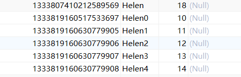
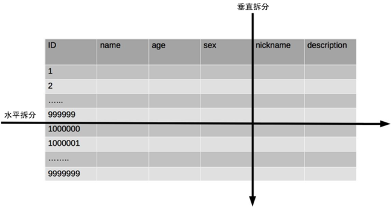
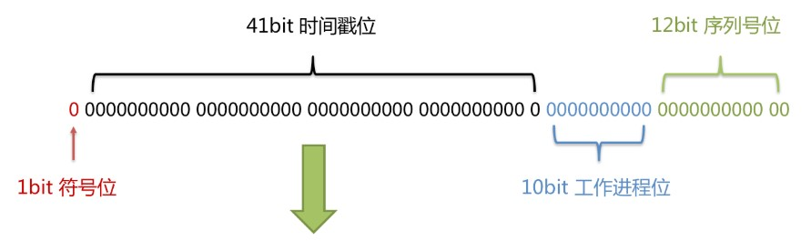
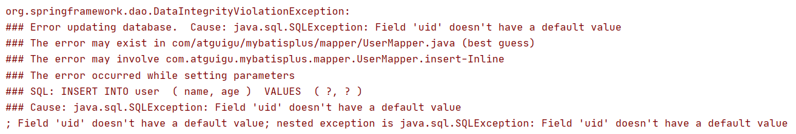
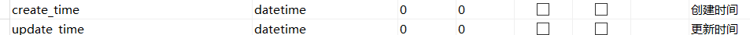
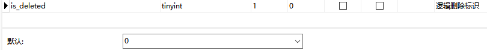

# **一、@TableName**

## value属性

实体类的名字是User，数据库表名是t_user

```
@TableName(value = "t_user")
public class User {
```

# **二、@TableId**

## 1、雪花算法

默认情况下数据库的id列使用的是基于雪花算法的策略生成



### **背景**

随着业务规模的不断扩大，需要选择合适的方案去应对数据规模的增长，以应对逐渐增长的访问压力和数据量。

数据库的扩展方式主要包括：业务分库、主从复制，数据库分表。

### 数据库分表

将不同业务数据分散存储到不同的数据库服务器，能够支撑百万甚至千万用户规模的业务，但如果业务继续发展，同一业务的单表数据也会达到单台数据库服务器的处理瓶颈。例如，淘宝的几亿用户数据，如果全部存放在一台数据库服务器的一张表中，肯定是无法满足性能要求的，此时就需要对单表数据进行拆分。

单表数据拆分有两种方式：垂直分表和水平分表。示意图如下：



**垂直分表：**

- 垂直分表适合将表中某些不常用且占了大量空间的列拆分出去。
- **例如，**前面示意图中的 nickname 和 description 字段，假设我们是一个婚恋网站，用户在筛选其他用户的时候，主要是用 age 和 sex 两个字段进行查询，而 nickname 和 description 两个字段主要用于展示，一般不会在业务查询中用到。description 本身又比较长，因此我们可以将这两个字段独立到另外一张表中，这样在查询 age 和 sex 时，就能带来一定的性能提升。

**水平分表：**

- 水平分表适合表行数特别大的表，有的公司要求单表行数超过 5000 万就必须进行分表，这个数字可以作为参考，但并不是绝对标准，关键还是要看表的访问性能。对于一些比较复杂的表，可能超过 1000 万就要分表了；而对于一些简单的表，即使存储数据超过 1 亿行，也可以不分表。
- 但不管怎样，当看到表的数据量达到千万级别时，作为架构师就要警觉起来，因为这很可能是架构的性能瓶颈或者隐患。

水平分表相比垂直分表，会引入更多的复杂性，例如数据id：

**主键自增：**

- 以最常见的用户 ID 为例，可以按照 1000000 的范围大小进行分段，1 ~ 999999 放到表 1中，1000000 ~ 1999999 放到表2中，以此类推。
- 复杂点：分段大小的选取。分段太小会导致切分后子表数量过多，增加维护复杂度；分段太大可能会导致单表依然存在性能问题，一般建议分段大小在 100 万至 2000 万之间，具体需要根据业务选取合适的分段大小。
- 优点：可以随着数据的增加平滑地扩充新的表。例如，现在的用户是 100 万，如果增加到 1000 万，只需要增加新的表就可以了，原有的数据不需要动。
- 缺点：分布不均匀。假如按照 1000 万来进行分表，有可能某个分段实际存储的数据量只有 1 条，而另外一个分段实际存储的数据量有 1000 万条。

**Hash ：**

- 同样以用户 ID 为例，假如我们一开始就规划了 10 个数据库表，可以简单地用 user_id % 10 的值来表示数据所属的数据库表编号，ID 为 985 的用户放到编号为 5 的子表中，ID 为 10086 的用户放到编号为 6 的子表中。
- 复杂点：初始表数量的确定。表数量太多维护比较麻烦，表数量太少又可能导致单表性能存在问题。
- 优点：表分布比较均匀。
- 缺点：扩充新的表很麻烦，所有数据都要重分布。

**雪花算法：**

雪花算法是由Twitter公布的分布式主键生成算法，它能够保证不同表的主键的不重复性，以及相同表的主键的有序性。

- 核心思想：

  - 长度共64bit（一个long型）。

  - 首先是一个符号位，1bit标识，由于long基本类型在Java中是带符号的，最高位是符号位，正数是0，负数是1，所以id一般是正数，最高位是0。
  - 41bit时间截(毫秒级)，存储的是时间截的差值（当前时间截 - 开始时间截)，结果约等于69.73年。
  - 10bit作为机器的ID（5个bit是数据中心，5个bit的机器ID，可以部署在1024个节点）。
  - 12bit作为毫秒内的流水号（意味着每个节点在每毫秒可以产生 4096 个 ID）。



- 优点：整体上按照时间自增排序，并且整个分布式系统内不会产生ID碰撞，并且效率较高。

## 2、指定主键列

- 测试：将数据库表中的id列改为 uid，将实体类中的id属性改成 uid，执行数据插入，则报告如下错误



- 原因：因为MP默认认为**id**是主键列，其他名字的属性MP无法默认自动填充
- 解决方案：为主键列添加 @TableId 注解

## 3、value属性

实体类的属性名是 id，数据库的列名是 uid，此时使用 value 属性将属性名映射到列名

```java
@TableId(value = "uid")
private String id;
```

## **4、type属性**

type属性用来定义主键策略

- **IdType.ASSIGN_ID：**使用基于雪花算法的策略生成数据id

```java
@TableId(type = IdType.ASSIGN_ID)
private Long id;
```

> 注意：当对象的id被明确赋值时，不会使用雪花算法

- **IdType.AUTO：**使用数据库的自增策略

```java
@TableId(type = IdType.AUTO)
private Long id;
```

> 注意：该类型请确保数据库设置了 ID自增 否则无效

- **全局配置：**要想影响所有实体的配置，可以设置全局主键配置

```properties
#全局设置主键生成策略
mybatis-plus.global-config.db-config.id-type=auto
```

# 三、@TableField

## 1、value属性

功能同TableId的value属性

注意：MP会自动将数据库中的下划线命名风格转化为实体类中的驼峰命名风格

**例如，**数据库中的列 create_time 和 update_time 自动对应实体类中的 createTime 和 updateTime



```java
private LocalDateTime createTime;
private LocalDateTime updateTime;
```

扩展知识：为什么建议使用你 LocalDateTime ，而不是 Date？https://zhuanlan.zhihu.com/p/87555377

- java.util.Date的大多数方法已经过时
- java.util.Date的输出可读性差
- java.util.Date对应的格式化类SimpleDateFormat是线程不安全的类。阿里巴巴开发手册中禁用static修饰SimpleDateFormat。
- LocalDateTime 对应的格式化类DateTimeFormatter是线程安全的

## 2、自动填充

**需求描述：**

项目中经常会遇到一些数据，每次都使用相同的方式填充，例如记录的创建时间，更新时间等。我们可以使用MyBatis Plus的自动填充功能，完成这些字段的赋值工作。

**例如，**阿里巴巴的开发手册中建议每个数据库表必须要有create_time 和 update_time字段，我们可以使用自动填充功能维护这两个字段

- **step1：**添加fill属性

```java
@TableField(fill = FieldFill.INSERT)
private LocalDateTime createTime;
@TableField(fill = FieldFill.INSERT_UPDATE)
private LocalDateTime updateTime;
```

- **step2：**实现元对象处理器接口 -> 创建handler包，创建MyMetaObjectHandler类

注意：不要忘记添加 @Component 注解

```java
package com.atguigu.mybatisplus.handler;
@Slf4j
@Component
public class MyMetaObjectHandler implements MetaObjectHandler {
    @Override
    public void insertFill(MetaObject metaObject) {
        log.info("start insert fill ....");
        this.strictInsertFill(metaObject, "createTime", LocalDateTime.class, LocalDateTime.now());
        this.strictInsertFill(metaObject, "updateTime", LocalDateTime.class, LocalDateTime.now());
    }
    @Override
    public void updateFill(MetaObject metaObject) {
        log.info("start update fill ....");
        this.strictUpdateFill(metaObject, "updateTime", LocalDateTime.class, LocalDateTime.now());
    }
}
```

## 3、测试

- 测试新增
- 测试修改

## 4、优化

- 避免自动填充时开销过大，填充前先判断当前对象中是否有相关属性

```java
@Override
public void insertFill(MetaObject metaObject) {
    
    //其他代码
    
    //判断是否具备author属性
    boolean hasAuthor = metaObject.hasSetter("author");
    if(hasAuthor){
        log.info("start insert fill author....");
        this.strictInsertFill(metaObject, "author", String.class, "Helen"); 
    }
}
```

- 用户明确定义了属性值，则无需自动填充，否则使用自动填充 

```java
@TableField(fill = FieldFill.INSERT)
private Integer age;
```

 

```java
 @Override
public void insertFill(MetaObject metaObject) {
    //其他代码
    
    //判断age是否赋值
    Object age = this.getFieldValByName("age", metaObject);
    if(age == null){
        log.info("start insert fill age....");
        this.strictInsertFill(metaObject, "age", String.class, "18");
    }
}
```

# 四、@TableLogic

## 1、逻辑删除

- 物理删除：真实删除，将对应数据从数据库中删除，之后查询不到此条被删除的数据
- 逻辑删除：假删除，将对应数据中代表是否被删除字段的状态修改为“被删除状态”，之后在数据库中仍旧能看到此条数据记录

使用场景：可以进行数据恢复

## 2、实现逻辑删除

- **step1：**数据库中创建逻辑删除状态列



- **step2：**实体类中添加逻辑删除属性

```java
@TableLogic
@TableField(value = "is_deleted")
private Integer deleted;
```

## 3、测试

- 测试删除：删除功能被转变为更新功能

```sql
-- 实际执行的SQL
update user set is_deleted=1 where id = 1 and is_deleted=0
```

- 测试查询：被逻辑删除的数据默认不会被查询

```sql
-- 实际执行的SQL
select id,name,is_deleted from user where is_deleted=0
```