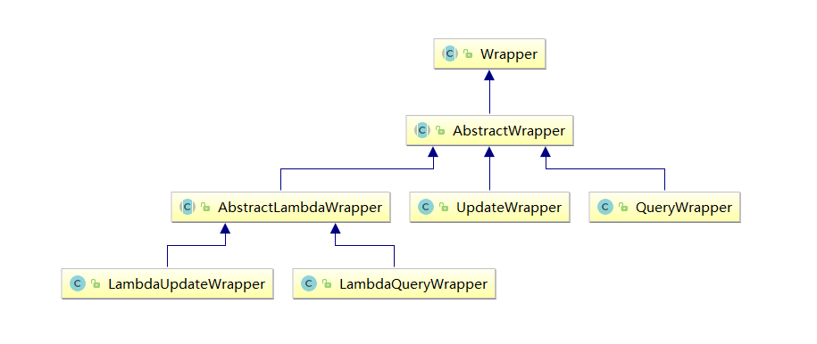

# **一、wapper介绍** 

## 1、Wrapper家族

在MP中我们可以使用通用Mapper（BaseMapper）实现基本查询，也可以使用自定义Mapper（自定义XML）来实现更高级的查询。当然你也可以结合条件构造器来方便的实现更多的高级查询。



- Wrapper ： 条件构造抽象类，最顶端父类  
  - AbstractWrapper ： 用于查询条件封装，生成 sql 的 where 条件
  -  QueryWrapper ： 查询条件封装
  -  UpdateWrapper ： Update 条件封装

-  AbstractLambdaWrapper ： 使用Lambda 语法
  -  LambdaQueryWrapper ：用于Lambda语法使用的查询Wrapper
  - LambdaUpdateWrapper ： Lambda 更新封装Wrapper

## 2、创建测试类 

```java
@SpringBootTest
public class WrapperTests {
    
    @Resource
    private UserMapper userMapper;
}
```

# 二、QueryWrapper

## **1**、例1：组装查询条件

查询名字中包含n，年龄大于等于10且小于等于20，email不为空的用户

```java
@Test
public void test1() {
    QueryWrapper<User> queryWrapper = new QueryWrapper<>();
    queryWrapper
        .like("name","n")
        .between("age", 10, 20)
        .isNotNull("email");
    List<User> users = userMapper.selectList(queryWrapper);
    users.forEach(System.out::println);
}
```

## **2、例2：组装排序条件**

按年龄降序查询用户，如果年龄相同则按id升序排列 

```java
@Test
public void test2() {
    QueryWrapper<User> queryWrapper = new QueryWrapper<>();
    queryWrapper
        .orderByDesc("age")
        .orderByAsc("id");
    List<User> users = userMapper.selectList(queryWrapper);
    users.forEach(System.out::println);
}
```

## **3、例3：组装删除条件**

删除email为空的用户

```java
@Test
public void test3() {
    QueryWrapper<User> queryWrapper = new QueryWrapper<>();
    queryWrapper.isNull("email");
    int result = userMapper.delete(queryWrapper); //条件构造器也可以构建删除语句的条件
    System.out.println("delete return count = " + result);
}
```

## 4、例4：条件的优先级

查询名字中包含n，且（年龄小于18或email为空的用户），并将这些用户的年龄设置为18，邮箱设置为 user@atguigu.com

```java
@Test
public void test4() {
    //修改条件
    QueryWrapper<User> queryWrapper = new QueryWrapper<>();
    queryWrapper
        .like("name", "n")
        .and(i -> i.lt("age", 18).or().isNull("email")); //lambda表达式内的逻辑优先运算
    User user = new User();
    user.setAge(18);
    user.setEmail("user@atguigu.com");
    int result = userMapper.update(user, queryWrapper);
    System.out.println(result);
}
```

**5、例5：组装select子句**

查询所有用户的用户名和年龄

```java
@Test
public void test5() {
    QueryWrapper<User> queryWrapper = new QueryWrapper<>();
    queryWrapper.select("name", "age");
    
    //selectMaps()返回Map集合列表，通常配合select()使用，避免User对象中没有被查询到的列值为null
    List<Map<String, Object>> maps = userMapper.selectMaps(queryWrapper);//返回值是Map列表
    maps.forEach(System.out::println);
}
```

## **6、例6：实现子查询**

查询id不大于3的所有用户的id列表

```java
@Test
public void test6() {
    QueryWrapper<User> queryWrapper = new QueryWrapper<>();
    queryWrapper.inSql("id", "select id from user where id <= 3");
    //selectObjs的使用场景：只返回一列
    List<Object> objects = userMapper.selectObjs(queryWrapper);//返回值是Object列表
    objects.forEach(System.out::println);
}
```

但上面的方式容易引发sql注入

```java
 queryWrapper.inSql("id", "select id from user where id <= 3 or true"); // 或插叙出所有用户id
```

可是使用下面的查询方式替换

```java
queryWrapper.in("id", 1, 2, 3 );
// 或
queryWrapper.le("id", 3 );
```

# 三、UpdateWrapper

## **例7：需求同例4**

查询名字中包含n，且（年龄小于18或email为空的用户），并将这些用户的年龄设置为18，邮箱设置为 user@atguigu.com

```java
@Test
public void test7() {
    
    //组装set子句
    UpdateWrapper<User> updateWrapper = new UpdateWrapper<>();
    updateWrapper
        .set("age", 18)
        .set("email", "user@atguigu.com")
        .like("name", "n")
        .and(i -> i.lt("age", 18).or().isNull("email")); //lambda表达式内的逻辑优先运算
    //这里必须要创建User对象，否则无法应用自动填充。如果没有自动填充，可以设置为null
    User user = new User();
    int result = userMapper.update(user, updateWrapper);
    System.out.println(result);
}
```

# 四、condition

## 例8：动态组装查询条件

查询名字中包含n，年龄大于10且小于20的用户，查询条件来源于用户输入，是可选的 

```java
@Test
public void test8() {
    
    //定义查询条件，有可能为null（用户未输入）
    String name = null;
    Integer ageBegin = 10;
    Integer ageEnd = 20;
    QueryWrapper<User> queryWrapper = new QueryWrapper<>();
    if(StringUtils.isNotBlank(name)){
        queryWrapper.like("name","n");
    }
    if(ageBegin != null){
        queryWrapper.ge("age", ageBegin);
    }
    if(ageEnd != null){
        queryWrapper.le("age", ageEnd);
    }
    List<User> users = userMapper.selectList(queryWrapper);
    users.forEach(System.out::println);
}
```

上面的实现方案没有问题，但是代码比较复杂，我们可以使用带condition参数的重载方法构建查询条件，简化代码的编写

```java
@Test
public void test8Condition() {
    //定义查询条件，有可能为null（用户未输入）
    String name = null;
    Integer ageBegin = 10;
    Integer ageEnd = 20;
    QueryWrapper<User> queryWrapper = new QueryWrapper<>();
    queryWrapper
        .like(StringUtils.isNotBlank(name), "name", "n")
        .ge(ageBegin != null, "age", ageBegin)
        .le(ageEnd != null, "age", ageEnd);
    List<User> users = userMapper.selectList(queryWrapper);
    users.forEach(System.out::println);
}
```

# 五、LambdaXxxWrapper

## 1、例9：Query - 需求同例8 

```java
@Test
public void test9() {
    //定义查询条件，有可能为null（用户未输入）
    String name = null;
    Integer ageBegin = 10;
    Integer ageEnd = 20;
    LambdaQueryWrapper<User> queryWrapper = new LambdaQueryWrapper<>();
    queryWrapper
        //避免使用字符串表示字段，防止运行时错误
        .like(StringUtils.isNotBlank(name), User::getName, "n")
        .ge(ageBegin != null, User::getAge, ageBegin)
        .le(ageEnd != null, User::getAge, ageEnd);
    List<User> users = userMapper.selectList(queryWrapper);
    users.forEach(System.out::println);
}
```

## 2、例10：Update - 需求同例4

```java
@Test
public void test10() {
    //组装set子句
    LambdaUpdateWrapper<User> updateWrapper = new LambdaUpdateWrapper<>();
    updateWrapper
        .set(User::getAge, 18)
        .set(User::getEmail, "user@atguigu.com")
        .like(User::getName, "n")
        .and(i -> i.lt(User::getAge, 18).or().isNull(User::getEmail)); //lambda表达式内的逻辑优先运算
    
    User user = new User();
    int result = userMapper.update(user, updateWrapper);
    System.out.println(result);
}
```