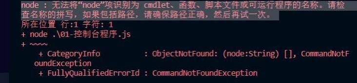
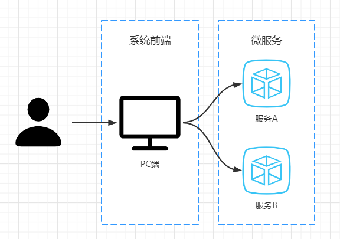
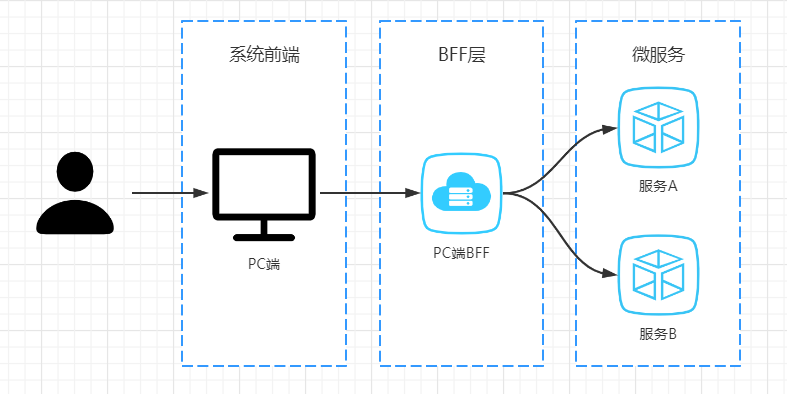

# 一、Node.js的概念 

## 1、JavaScript引擎

浏览器的内核包括两部分核心：

- DOM渲染引擎
- JavaScript解析引擎

创建文件夹01-Node_demo，

案例：dom引擎和js引擎.html

```html
<!DOCTYPE html>
<html lang="en">
  <head>
    <meta charset="UTF-8" />
    <meta name="viewport" content="width=device-width, initial-scale=1.0" />
    <title>Document</title>
  </head>
  <body>
    <!-- Dom渲染引擎会将html元素渲染成相应的表现形式 -->
    <h1>Hello Node.js</h1>
    <!-- JavaScript解析引擎会在浏览器中解析并执行JavaScript代码 -->
    <script>
      alert('hello Node.js')
    </script>
  </body>
</html>
```

## 2、什么是Node.js

脱离浏览器环境也可以运行JavaScript，只要有JavaScript引擎就可以。Node.js内置了Chrome的V8 引擎，可以在Node.js环境中直接运行JavaScript程序：

- Node.js没有浏览器API，即document，window的等。
- 增加了许多Node.js 专属API，例如文件系统，进程，http功能。

# 二、下载和安装

## 1、下载和安装

官网：https://nodejs.org/en/ 

中文网：http://nodejs.cn/ 

LTS：长期支持版本（推荐下载）

Current：最新版


## 2、查看安装是否成功

查看版本，如果输出版本号则安装成功

```shell
node -v
```

# **三、初始Node.js程序**

## **1、运行一个程序**

案例：01-hello-node.js

```javascript
console.log('Hello Node.js')
```

打开命令行终端：`Ctrl + ~`

进入到程序所在的目录，输入

```shell
node 01-hello-node.js
```

### **常见问题**

如果安装Node.js之前已经打开了VS Code，则会看到如下错误

解决方案：重启VSCode或者重启你的电脑



## 2、文件的读取

案例：02-read-file.js

```javascript
// 引入Node.js文件系统模块：
// fs是Node.js自带的模块，使用Node.js中的关键字require将模块引入，使用const定义模块常量
const fs = require('fs')
//调用readFile方法读取磁盘文件：异步操作
fs.readFile('./他.txt', function (err, data) {
  //当文件读取失败时，可以获取到err的值，输出错误信息
  if (err) throw err
  //当文件读取成功时，可以获取到data的值，输出响应的内容
  console.log(data.toString())
})
console.log('读取文件')
```

## 3、服务器端程序

案例：03-node-server.js 

```javascript
//引入Node.js的http模块：
const http = require('http')
//调用createServer创建服务器
http.createServer(function (request, response) {
    // 发送 HTTP 头部
    // HTTP 状态值: 200 : OK
    // 内容类型: text/plain
    response.writeHead(200, { 'Content-Type': 'text/html' })
    // 发送响应数据 "Hello World"
    response.end('<h1>Hello Node.js Server</h1>')
  }).listen(8888) //调用listen方法在8888端口监听客户端请求
// 终端打印如下信息
console.log('Server running at http://127.0.0.1:8888/')
```

# 三、Node.js的作用

## 1、Node.js的应用场景

- 如果你是一个前端程序员，想开发类似JavaWeb的简单后端程序，那么Node.js是一个非常好的选择。
- 如果你是一个架构师，想部署一些高性能的服务，那么Node.js也是一个非常好的选择。
- 通常他会被用来作一个BFF层，即 **B**ackend **F**or **F**rontend（服务于前端的后端），通俗的说是一个专门用于为前端业务提供数据的后端程序。

## 2、BFF 解决什么问题

一个前端页面向 服务A 和 服务B 发送请求，不同的微服务返回的值用于渲染页面中不同的组件。此时，所有的数据在PC端浏览器渲染。



我们可以使用一个BFF层提前将页面渲染好，发送给浏览器，那么BFF层可以提前将多个服务的数据聚合起来。


