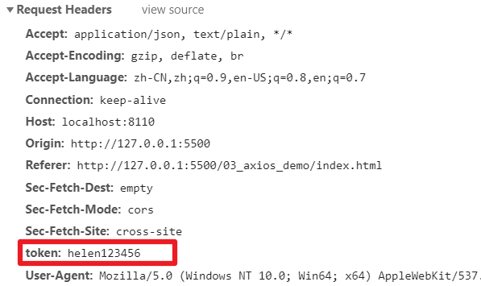

# 一、axios入门 

## 1、axios的作用

Axios 是一个基于 promise 的 HTTP 库，可以用在浏览器和 node.js 中。

官方网站：http://www.axios-js.com

## **2、axios应用案例**

**step1：**mybatis-plus中添加后端接口

依赖

```xml
<dependency>
    <groupId>org.springframework.boot</groupId>
    <artifactId>spring-boot-starter-web</artifactId>
</dependency>
```

controller

```java
@RestController
@RequestMapping("/user")
public class UserController {
    @Resource
    private UserService userService;
    @GetMapping("/list")
    public List<User> list(){
        return userService.list();
    }
}
```

启动主类

访问：http://localhost:8080/user/list

**step2：**创建03-axios-demo文件夹

**step3：**复制axios.js至文件夹

**step4：**创建index.html

```html
<!DOCTYPE html>
<html lang="en">
  <head>
    <meta charset="UTF-8" />
    <meta name="viewport" content="width=device-width, initial-scale=1.0" />
    <title>Document</title>
  </head>
  <body>
    <script src="axios.js"></script>
    <script>
      //基于promise
      axios({
        method: 'get',
        url: 'http://localhost:8080/user/list',
      })
        .then((response) => {
          console.log('获取数据成功', response)
        })
        .catch((error) => {
          console.log('获取数据失败', error)
        })
      //另一种写法
      axios
        .get('http://localhost:8080/user/list')
        .then((response) => {
          console.log('获取数据成功1', response)
        })
        .catch((error) => {
          console.log('获取数据失败1', error)
        })
    </script>
  </body>
</html>
```

# 二、跨域

## 1、为什么会出现跨域问题？

出于浏览器的同源策略限制。

所谓同源（即指在同一个域）就是两个地址具有相同的协议（protocol）、主机（host）和端口号（port）

以下情况都属于跨域：

| 跨域原因说明       | 示例                               |
| ------------------ | ---------------------------------- |
| 域名不同           | www.jd.com 与 www.taobao.com       |
| 域名相同，端口不同 | www.jd.com:8080 与 www.jd.com:8081 |
| 二级域名不同       | item.jd.com 与 miaosha.jd.com      |

http和https也属于跨域。

如果域名和端口都相同，但是请求路径不同，不属于跨域，如：[www.jd.com/item ](http://www.jd.com/item )和 www.jd.com/goods

同源策略会阻止一个域的javascript脚本和另外一个域的内容进行交互。

而我们刚才是从localhost:5500端口去访问localhost:8080端口，这属于端口不同，跨域了。

## 2、解决跨域问题

Spring早就给我们提供了解决方案，我们只需要在对应controller上添加一个注解就可以了

我们在 UserController 类上添加跨域标签@CrossOrigin，再进行测试，则测试成功！

```java
@CrossOrigin //解决跨域问题
```

# 三、自定义配置

## 1、配置axios实例

可以对axios进行配置，简化代码的编写

```js
//使用自定义配置
const request = axios.create({
    baseURL: 'http://localhost:8080', //url前缀
    timeout: 1000, //超时时间
    headers: {'token': 'helen123456'} //携带令牌
})
```

## 2、配置请求参数

这样，远程接口的url地址就可以修改成相对路径了

```js
//基于promise
//注意：这里使用了前面定义的request
request({
    method:'get',
    url:'/user/list'
}).then(response => {
    console.log('获取数据成功', response)
}).catch(error => {
    console.log('获取数据失败', error)
})
```

# 四、拦截器

在请求或响应被 then 或 catch 处理前拦截他们。

## 1、请求拦截器

在发送axios请求前，可以拦截请求，对请求做一些处理

```js
// 请求拦截器
request.interceptors.request.use(
  function (config) {
    // 在发送请求之前做些什么，例如：在请求头中携带一个令牌
    config.headers.token = 'helen123456'
    return config
  },
  function (error) {
    // 对请求错误做些什么
    return Promise.reject(error)
  }
)
```

发送请求时，在请求头中会携带这个token



## 2、响应拦截器

在发送完请求，获取到响应后，可以对响应做一些处理，再返回给前端用户