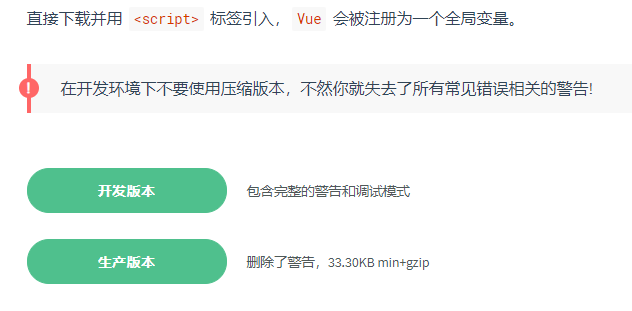
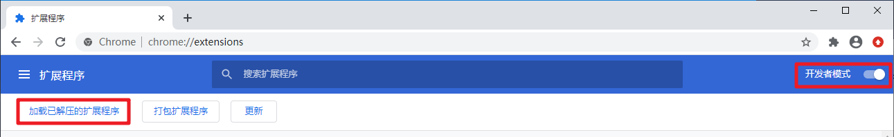
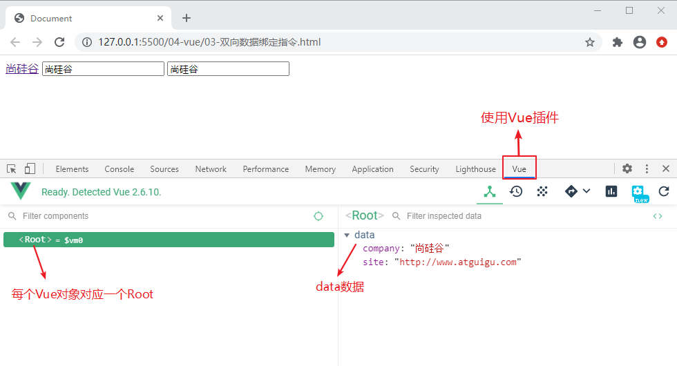
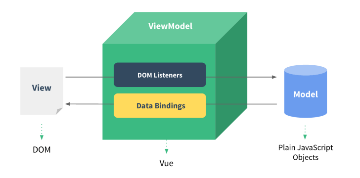

# 一、Vue.js的基本认识

## 1、官网

英文官网：https://vuejs.org

中文官网：https://cn.vuejs.org

## 2、简介

渐进式JavaScript 框架（核心 + 扩展）

作者：尤雨溪(一位华裔前 Google 工程师) 

作用：动态构建用户界面

## 3、优点

体积小：压缩后33K

更高的运行效率：基于虚拟dom

双向数据绑定：不操作dom，关注业务逻辑

生态丰富、学习成本低：入门容易，学习资料多

# 二、第一个Vue应用

## 1、引入脚本库



创建文件夹05-vue，复制vue.js，创建 01-hello.html，创建<script>标签

```js
<script src="vue.js"></script>
```

## 2、数据绑定

```html
<body>
    <!-- id标识vue作用的范围，绑定的数据必须写在这个div内部 -->
    <div id="app">
        <!-- {{}} 插值表达式，声明式渲染，绑定vue中的data数据 -->
        {{ message }}
    </div>
    <script src="vue.js"></script>
    <script>
        // 创建一个vue对象
        // Vue构造函数的参数是一个配置对象，对象中的key是一些固定的关键字
        new Vue({
            el: '#app', //绑定vue作用的范围，用id选择器选中div
            data: {
                //在data中注册变量，用于视图中的数据绑定
                message: 'Hello Vue!',
            }
        })
    </script>
</body>
```

这就是声明式渲染：Vue.js 的核心是一个允许采用简洁的模板语法来声明式地将数据渲染进 DOM 的系统

```js
data: {
    message: 'Hello Vue!'
}
```

也可以写成

```js
data() {
    return {
        message: 'Hello Vue!'
    }
}
```

# 三、数据绑定指令

## 1、数据绑定指令

**step1：**创建 02-数据绑定指令.html

**step2：**引入脚本，创建Vue对象 

```html
  <script src="vue.js"></script>
  <script>
    new Vue({
      el: '#app',
      data: {
        company: '尚硅谷',
        site: 'http://www.atguigu.com'
      }
    })
  </script>
```

**step3：**使用数据绑定指令做数据渲染

```html
<div id="app">
    <a v-bind:href="site" target="_blank">{{company}}</a>
    <input type="text" v-bind:value="company">
</div>
```

v-bind: 指令的简写形式

```html
<!-- v-bind: 指令的简写形式 : -->
<a :href="site" target="_blank">{{company}}</a>
<input type="text" :value="company">
```

## **2、双向数据绑定指令**

**step1：**创建 03-双向数据绑定指令.html

**step2：**将02的代码复制到03

**step3：**将 v-bind:value 修改成 v-model

```html
<!--  v-bind:value 单向数据绑定  -->
<input type="text" v-bind:value="company">
<!--  v-model 双向数据绑定  -->
<input type="text" v-model="company">
```

### 什么是双向数据绑定？

- 当数据发生变化的时候，视图也会跟着发生变化

- - 数据模型发生了改变，会直接显示在页面上

- 当视图发生变化的时候，数据也会跟着同步变化

- - 用户在页面上的修改，会自动同步到数据模型中去

**注意：**v-model只用于用户交互组件中

# 四、理解MVVM

## 1、安装Vue.js devtools

- 离线安装

先解压Vue.jsDevtools

然后在Chrome中加载已解压的扩展程序



- 在线安装

先离线安装安装谷歌访问助手

然后在Chrome网上应用商店，搜索Vue.js devtools扩展程序，并安装

- 使用Vue插件



## 2、MVVM



# 五、绑定事件监听

创建 04-绑定事件监听.html

使用 v-on 进行事件绑定，v-on:click 表示处理鼠标点击事件，事件调用的方法定义在 vue 对象声明的 methods 节点中

```html
<body>
  <div id="app">
    <button v-on:click="study">去学习</button>
  </div>
  
  <script src="vue.js"></script>
  <script>
    new Vue({
      el: '#app',
      data: {
        company: '尚硅谷'
      },
      methods: {
        study(){
          alert('我要去' + this.company + '学习')
        }
      }
    })
  </script>
</body>
```

v-on 指令的简写形式

```html
<!-- v-on: 指令的简写形式 @ -->
<button @click="study">去学习</button>
```

六、计算属性创建 05-计算属性.html例1：模板中使用js表达式 

```html
<body>
    <script src="vue.js"></script>
    <script>
        new Vue({
            el: '#app',
            data: {
                message: 'hello',
            },
        })
    </script>
</body>
```

模板表达式非常便利，但是设计它们的初衷是用于简单运算的。在模板中放入太多的逻辑会难以维护。

```html
<div id="app">
    <p>原始值: {{ message }}</p>
    <!-- 1、插值数据绑定中使用表达式 -->
    <p>反转消息: {{ message.split('').reverse().join('') }}</p>
</div>
```

所以，对于任何复杂逻辑，你都应当使用**计算属性**例2：使用计算属性

```js
computed: {
    reversedMessage () {
        console.log('计算属性执行')
        return this.message.split('').reverse().join('')
    }
}
```

 

```html
<!-- 2、使用计算属性 -->
<p>反转消息: {{ reversedMessage }}</p>
```

**例3：使用方法**

```js
methods:{
    reversed () {
        console.log('方法执行')
        return this.message.split('').reverse().join('')
    }
}
```


```html
<!-- 3、使用方法 -->
<p>反转消息: {{ reversed() }}</p>
```

[**计算属性缓存 vs 方法**](https://cn.vuejs.org/v2/guide/computed.html#计算属性缓存-vs-方法)看起来计算属性和方法能完成相同的功能，那么他们有什么区别呢？**计算属性基于缓存**
**方法将总会再次执行**

```html
<!-- 2、使用计算属性 -->
<p>反转消息: {{ reversedMessage }}</p>
<!-- 调用两次只执行一次属性的计算 -->
<p>反转消息: {{ reversedMessage }}</p>
<!-- 3、使用方法 -->
<p>反转消息: {{ reversed() }}</p>
<!-- 调用两次执行了两次属性的计算 -->
<p>反转消息: {{ reversed() }}</p>
```

## 计算属性的例子：计算属性的单向绑定和双向绑定

创建06-计算用户全名.html

```html
<body>
    <div id="app">
        姓: <input placeholder="First Name" v-model="firstName" /><br />
        名: <input placeholder="Last Name" v-model="lastName" /><br />
        姓名1(单向): <input placeholder="Full Name1" v-model="fullName1" /><br />
        姓名2(双向): <input placeholder="Full Name2" v-model="fullName2" /><br />
    </div>
    <script src="vue.js"></script>
    <script>
        new Vue({
            el: '#app',
            data: {
                firstName: 'Helen',
                lastName: 'Yao',
                // fullName: 'Helen Yao',
            },
            computed: {
                fullName1() {
                    console.log('计算fullName1')
                    return this.firstName + ' ' + this.lastName
                },
                fullName2: {
                    get() {
                        console.log('计算fullName2')
                        return this.firstName + ' ' + this.lastName
                    },
                    //当给fullName2指定新值时自动调用：实现双向绑定
                    set(value) {
                        console.log('fullName2 的 setter')
                        const names = value.split(' ')
                        this.firstName = names[0]
                        this.lastName = names[1]
                    },
                },
            },
        })
    </script>
</body>
```

# 七、监视

创建 07-监视.html

```html
<body>
    <div id="app">
        姓: <input placeholder="First Name" v-model="firstName" /><br />
        名: <input placeholder="Last Name" v-model="lastName" /><br />
        姓名: <input placeholder="Full Name" v-model="fullName" /><br />
    </div>
    <script src="vue.js"></script>
    <script>
        new Vue({
            el: '#app',
            data: {
                firstName: 'Helen',
                lastName: 'Yao',
                // fullName: 'Helen Yao',
            },
            watch: {
                //当firstName改变时自动调用
                firstName(value) {
                    console.log('watch firstName')
                    this.fullName = value + ' ' + this.lastName
                    console.log(this.fullName)
                },
                //当lastName改变时自动调用
                lastName(value) {
                    console.log('watch lastName')
                    this.fullName = this.firstName + ' ' + value
                }
            },
        })
    </script>
</body>
```

# 八、条件渲染

创建 08-条件渲染.html

```html
<script src="vue.js"></script>
<script>
    new Vue({
        el: '#app',
        data: {
            ok: false
        }
    })
</script>
```

点击复选框，显示或隐藏协议内容。分别使用 `v-if` 和` v-show` 实现

```html
<div id="app">
    <input type="checkbox" v-model="ok" />同意许可协议
    <!-- v:if条件指令：还有v-else、v-else-if 切换开销大 -->
    <p v-if="ok">yes.</p>
    <p v-else>no.</p>
    <!-- v:show 条件指令 初始渲染开销大 -->
    <p v-show="ok">yes.</p>
    <p v-show="!ok">no.</p>
</div>
```

# 九、列表渲染

创建 09-列表渲染.html

```html
<script src="vue.js"></script>
<script>
    new Vue({
        el: '#app',
        data: {
            userList: [
                { username: 'helen', age: 18 },
                { username: 'peter', age: 28 }
            ]
        }
    })
</script>
```

v-for：列表循环指令

```html
<div id="app">
    <ul>
        <!-- item：当前元素，index：当前元素的索引 -->
        <li v-for="(item, index) in userList">
            {{index}} {{item.username}} {{item.age}}
        </li>
    </ul>
</div>
```

# 十、实例生命周期

创建 10-实例的生命周期.html

```html
<div id="app">
    <h3 id="h3">{{ message }}</h3>
</div>
```

分析生命周期相关方法的执行时机

```html
<script src="vue.js"></script>
<script>
    new Vue({
        el: '#app',
        data: {
            message: '床前明月光'
        },
        // 页面在内存中已经初始化完毕：
        // 可以操作 data 中的数据、调用methods中的方法
        // 但是数据尚未被渲染到页面中：用户看不见
        created() {
            console.log('created')
            //可以操作 data 中的数据
            console.log(this.message)
            //可以调用methods中的方法
            this.show()
            //无法取出dom节点取数据，说明用户无法在浏览器中看见这个内容
            console.log(document.getElementById('h3').innerText)
        },
        
        // 数据已经被渲染到页面中
        mounted() { // 第四个被执行的钩子方法
            console.log('mounted')
            //可以取出dom节点取数据，说明用户已经在浏览器中看见内容
            console.log(document.getElementById('h3').innerText)
        },
        
        methods: {
            show() {
                console.log('show方法被调用')
            }
        },
    })
</script>
```

# 综合案例

创建：综合案例.html

```html
<body>
  <div id="app">
    <table>
      <tr>
        <th>序号</th>
        <th>姓名</th>
        <th>年龄</th>
        <th>email</th>
      </tr>
      <tr v-for="(item, index) in userList">
        <td>{{index + 1}}</td>
        <td>{{item.name}}</td>
        <td>{{item.age}}</td>
        <td>{{item.email}}</td>
      </tr>
    </table>
  </div>
  <script src="vue.js"></script>
  <script src="axios.js"></script>
  <script>
    new Vue({
      el: '#app',
      data() {
        return {
          userList: [],
        }
      },
      created() {
        this.showList()
      },
      methods: {
        showList() {
          //使用自定义配置
          const request = axios.create({
            baseURL: 'http://localhost:8080', //url前缀
            timeout: 1000, //超时时间
            headers: { token: 'helen123456' }, //携带令牌
          })
          // 请求拦截器
          request.interceptors.request.use(
            function (config) {
              // 在发送请求之前做些什么，例如：在请求头中携带一个令牌
              config.headers.token = 'helen123456'
              return config
            },
            function (error) {
              // 对请求错误做些什么
              return Promise.reject(error)
            }
          )
          // 添加响应拦截器
          request.interceptors.response.use(
            function (response) {
              // 对响应数据做点什么，例如：使用response.data替代response，简化前端拿到的数据结果
              return response.data
            },
            function (error) {
              // 对响应错误做点什么
              return Promise.reject(error)
            }
          )
          //基于promise
          request({
            method: 'get',
            url: '/user/list',
          })
            .then((response) => {
              console.log('获取数据成功', response)
              this.userList = response
            })
            .catch((error) => {
              console.log('获取数据失败', error)
            })
        },
      },
    })
  </script>
</body>
```