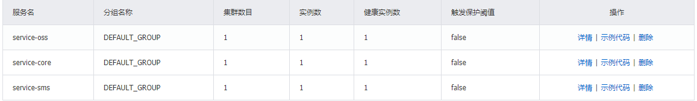

# 一、运行Nacos注册中心

## 1、Nacos下载和安装

下载地址：https://github.com/alibaba/nacos/releases

 

## 2、Windows启动Nacos

参考：https://github.com/alibaba/nacos

解压：将下载的压缩包解压

启动：startup.cmd -m standalone

## 3、访问

http://localhost:8848/nacos

用户名密码：nacos/nacos


# 二、服务发现

## 1、引入依赖

service-base模块中配置Nacos客户端依赖

```xml
<!--服务发现-->
<dependency>
    <groupId>com.alibaba.cloud</groupId>
    <artifactId>spring-cloud-starter-alibaba-nacos-discovery</artifactId>
</dependency>
```

## 2、添加服务配置信息

在需要注册到注册中心的微服务放入配置文件中添加配置

```yaml
#spring:
  cloud:
    nacos:
      discovery:
        server-addr: localhost:8848 # nacos服务地址
```

## 3、启动微服务

启动已注册的微服务，查看 “服务管理 => 服务列表”，可就以看到已注册的微服务

