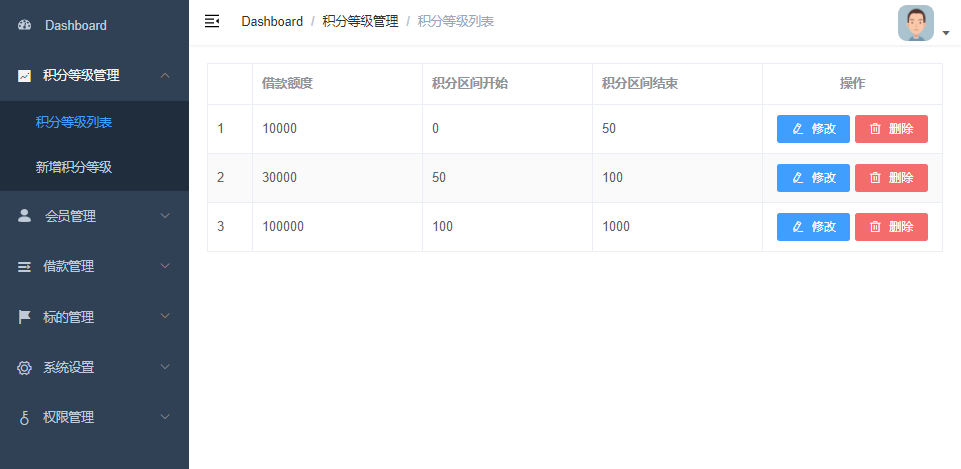
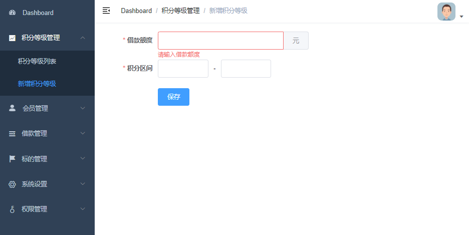

# 需求

积分等级CRUD列表和表单





# 一、创建父工程srb 

## 1、创建SpringBoot项目

Group：com.atguigu

Artifact：srb

## 2、删除src目录

## 3、配置SpringBoot版本

```xml
<parent>
    <groupId>org.springframework.boot</groupId>
    <artifactId>spring-boot-starter-parent</artifactId>
    <version>2.3.4.RELEASE</version>
</parent>
```

## 4、配置pom依赖版本号

```xml
<properties>
    <java.version>1.8</java.version>
    <spring-cloud-alibaba.version>2.2.2.RELEASE</spring-cloud-alibaba.version>
    <spring-cloud.version>Hoxton.SR8</spring-cloud.version>
    <mybatis-plus.version>3.4.1</mybatis-plus.version>
    <velocity.version>2.0</velocity.version>
    <swagger.version>2.9.2</swagger.version>
    <swagger-bootstrap-ui.version>1.9.2</swagger-bootstrap-ui.version>
    <commons-lang3.version>3.9</commons-lang3.version>
    <commons-fileupload.version>1.3.1</commons-fileupload.version>
    <commons-io.version>2.6</commons-io.version>
    <alibaba.easyexcel.version>2.1.1</alibaba.easyexcel.version>
    <apache.xmlbeans.version>3.1.0</apache.xmlbeans.version>
    <fastjson.version>1.2.28</fastjson.version>
    <gson.version>2.8.2</gson.version>
    <json.version>20170516</json.version>
    <aliyun-java-sdk-core.version>4.3.3</aliyun-java-sdk-core.version>
    <aliyun-sdk-oss.version>3.10.2</aliyun-sdk-oss.version>
    <jodatime.version>2.10.1</jodatime.version>
    <jwt.version>0.7.0</jwt.version>
    <httpclient.version>4.5.1</httpclient.version>
</properties>
```

## 5、配置pom依赖

```xml
<dependencyManagement>
    <dependencies>
        <!--Spring Cloud-->
        <dependency>
            <groupId>org.springframework.cloud</groupId>
            <artifactId>spring-cloud-dependencies</artifactId>
            <version>${spring-cloud.version}</version>
            <type>pom</type>
            <scope>import</scope>
        </dependency>
        <!--Spring Cloud Alibaba-->
        <dependency>
            <groupId>com.alibaba.cloud</groupId>
            <artifactId>spring-cloud-alibaba-dependencies</artifactId>
            <version>${spring-cloud-alibaba.version}</version>
            <type>pom</type>
            <scope>import</scope>
        </dependency>
        <!--mybatis-plus-->
        <dependency>
            <groupId>com.baomidou</groupId>
            <artifactId>mybatis-plus-boot-starter</artifactId>
            <version>${mybatis-plus.version}</version>
        </dependency>
        <!--mybatis-plus 代码生成器-->
        <dependency>
            <groupId>com.baomidou</groupId>
            <artifactId>mybatis-plus-generator</artifactId>
            <version>${mybatis-plus.version}</version>
        </dependency>
        <!-- Mybatis Plus 代码生成器模板引擎,  -->
        <dependency>
            <groupId>org.apache.velocity</groupId>
            <artifactId>velocity-engine-core</artifactId>
            <version>${velocity.version}</version>
        </dependency>
        <!--swagger-->
        <dependency>
            <groupId>io.springfox</groupId>
            <artifactId>springfox-swagger2</artifactId>
            <version>${swagger.version}</version>
        </dependency>
        <!--swagger ui-->
        <dependency>
            <groupId>io.springfox</groupId>
            <artifactId>springfox-swagger-ui</artifactId>
            <version>${swagger.version}</version>
        </dependency>
        <!--swagger-bootstrap-ui-->
        <dependency>
            <groupId>com.github.xiaoymin</groupId>
            <artifactId>swagger-bootstrap-ui</artifactId>
            <version>${swagger-bootstrap-ui.version}</version>
        </dependency>
        <!--commons-lang3-->
        <dependency>
            <groupId>org.apache.commons</groupId>
            <artifactId>commons-lang3</artifactId>
            <version>${commons-lang3.version}</version>
        </dependency>
        <!--文件上传-->
        <dependency>
            <groupId>commons-fileupload</groupId>
            <artifactId>commons-fileupload</artifactId>
            <version>${commons-fileupload.version}</version>
        </dependency>
        <!--commons-io-->
        <dependency>
            <groupId>commons-io</groupId>
            <artifactId>commons-io</artifactId>
            <version>${commons-io.version}</version>
        </dependency>
        <!--excel解析-->
        <dependency>
            <groupId>com.alibaba</groupId>
            <artifactId>easyexcel</artifactId>
            <version>${alibaba.easyexcel.version}</version>
        </dependency>
        <!--excel解析依赖-->
        <dependency>
            <groupId>org.apache.xmlbeans</groupId>
            <artifactId>xmlbeans</artifactId>
            <version>${apache.xmlbeans.version}</version>
        </dependency>
        <!--json-->
        <dependency>
            <groupId>com.alibaba</groupId>
            <artifactId>fastjson</artifactId>
            <version>${fastjson.version}</version>
        </dependency>
        <dependency>
            <groupId>org.json</groupId>
            <artifactId>json</artifactId>
            <version>${json.version}</version>
        </dependency>
        <dependency>
            <groupId>com.google.code.gson</groupId>
            <artifactId>gson</artifactId>
            <version>${gson.version}</version>
        </dependency>
        <!--阿里云SDK远程调用-->
        <dependency>
            <groupId>com.aliyun</groupId>
            <artifactId>aliyun-java-sdk-core</artifactId>
            <version>${aliyun-java-sdk-core.version}</version>
        </dependency>
        <!--阿里云文件管理-->
        <dependency>
            <groupId>com.aliyun.oss</groupId>
            <artifactId>aliyun-sdk-oss</artifactId>
            <version>${aliyun-sdk-oss.version}</version>
        </dependency>
        <!--日期时间工具-->
        <dependency>
            <groupId>joda-time</groupId>
            <artifactId>joda-time</artifactId>
            <version>${jodatime.version}</version>
        </dependency>
        <!--jwt工具-->
        <dependency>
            <groupId>io.jsonwebtoken</groupId>
            <artifactId>jjwt</artifactId>
            <version>${jwt.version}</version>
        </dependency>
        <!--httpclient-->
        <dependency>
            <groupId>org.apache.httpcomponents</groupId>
            <artifactId>httpclient</artifactId>
            <version>${httpclient.version}</version>
        </dependency>
        
        
    </dependencies>
</dependencyManagement>
<dependencies>
    <dependency>
        <groupId>org.springframework.boot</groupId>
        <artifactId>spring-boot-starter-test</artifactId>
        <scope>test</scope>
    </dependency>
</dependencies>
```

# 二、创建模块guigu-common

## 1、创建Maven模块

在srb下创建普通maven模块

Group：com.atguigu

Artifact：guigu-common

## 2、配置pom

```xml
<dependencies>
    <dependency>
        <groupId>org.springframework.boot</groupId>
        <artifactId>spring-boot-starter-web</artifactId>
    </dependency>
    <!--lombok用来简化实体类：需要安装lombok插件-->
    <dependency>
        <groupId>org.projectlombok</groupId>
        <artifactId>lombok</artifactId>
    </dependency>
</dependencies>
```


# 三、创建模块service-base

## 1、创建Maven模块

在srb下创建普通maven模块

Group：com.atguigu

Artifact：service-base

## 2、配置pom

注意：依赖guigu-common

```xml
<dependencies>
    <dependency>
        <groupId>com.atguigu</groupId>
        <artifactId>guigu-common</artifactId>
        <version>0.0.1-SNAPSHOT</version>
    </dependency>
    <!--swagger-->
    <dependency>
        <groupId>io.springfox</groupId>
        <artifactId>springfox-swagger2</artifactId>
    </dependency>
    <!--swagger ui-->
    <dependency>
        <groupId>io.springfox</groupId>
        <artifactId>springfox-swagger-ui</artifactId>
    </dependency>
</dependencies>
```

# 四、创建模块service-core

## 1、创建Maven模块

在srb下创建普通maven模块

Group：com.atguigu

Artifact：service-core

## 2、配置pom

注意：依赖service-base

```xml
<dependencies>
    <dependency>
        <groupId>com.atguigu</groupId>
        <artifactId>service-base</artifactId>
        <version>0.0.1-SNAPSHOT</version>
    </dependency>
    <!--mysql-->
    <dependency>
        <groupId>mysql</groupId>
        <artifactId>mysql-connector-java</artifactId>
    </dependency>
    <!--mybatis-plus-->
    <dependency>
        <groupId>com.baomidou</groupId>
        <artifactId>mybatis-plus-boot-starter</artifactId>
    </dependency>
    <!--mybatis-plus 代码生成器-->
    <dependency>
        <groupId>com.baomidou</groupId>
        <artifactId>mybatis-plus-generator</artifactId>
    </dependency>
    <!-- Mybatis Plus 代码生成器模板引擎,  -->
    <dependency>
        <groupId>org.apache.velocity</groupId>
        <artifactId>velocity-engine-core</artifactId>
    </dependency>
</dependencies>
```

# 五、代码生成器

## 1、创建数据库

创建数据库srb_core

并执行sql脚本初始化数据结构和数据

## 2、创建代码生成器

在test目录中创建测试用例，并执行 

```java
package com.atguigu.srb.core;
public class CodeGenerator {
    @Test
    public void genCode() {
        // 1、创建代码生成器
        AutoGenerator mpg = new AutoGenerator();
        // 2、全局配置
        GlobalConfig gc = new GlobalConfig();
        String projectPath = System.getProperty("user.dir");
        gc.setOutputDir(projectPath + "/src/main/java");
        gc.setAuthor("Helen");
        gc.setOpen(false); //生成后是否打开资源管理器
        gc.setServiceName("%sService"); //去掉Service接口的首字母I
        gc.setIdType(IdType.AUTO); //主键策略
        gc.setSwagger2(true);//开启Swagger2模式
        mpg.setGlobalConfig(gc);
        // 3、数据源配置
        DataSourceConfig dsc = new DataSourceConfig();
        dsc.setUrl("jdbc:mysql://localhost:3306/srb_core?serverTimezone=GMT%2B8&characterEncoding=utf-8");
        dsc.setDriverName("com.mysql.cj.jdbc.Driver");
        dsc.setUsername("root");
        dsc.setPassword("123456");
        dsc.setDbType(DbType.MYSQL);
        mpg.setDataSource(dsc);
        // 4、包配置
        PackageConfig pc = new PackageConfig();
        pc.setParent("com.atguigu.srb.core");
        pc.setEntity("pojo.entity"); //此对象与数据库表结构一一对应，通过 DAO 层向上传输数据源对象。
        mpg.setPackageInfo(pc);
        // 5、策略配置
        StrategyConfig strategy = new StrategyConfig();
        strategy.setNaming(NamingStrategy.underline_to_camel);//数据库表映射到实体的命名策略
        strategy.setColumnNaming(NamingStrategy.underline_to_camel);//数据库表字段映射到实体的命名策略
        strategy.setEntityLombokModel(true); // lombok
        strategy.setLogicDeleteFieldName("is_deleted");//逻辑删除字段名
        strategy.setEntityBooleanColumnRemoveIsPrefix(true);//去掉布尔值的is_前缀（确保tinyint(1)）
        strategy.setRestControllerStyle(true); //restful api风格控制器
        mpg.setStrategy(strategy);
        // 6、执行
        mpg.execute();
    }
}
```

# 六、启动应用程序 

## 1、创建application.yml

```yaml
server:
  port: 8110 # 服务端口
spring:
  profiles:
    active: dev # 环境设置
  application:
    name: service-core # 服务名
  datasource: # mysql数据库连接
    type: com.zaxxer.hikari.HikariDataSource
    driver-class-name: com.mysql.cj.jdbc.Driver
    url: jdbc:mysql://localhost:3306/srb_core?serverTimezone=GMT%2B8&characterEncoding=utf-8
    username: root
    password: 123456
mybatis-plus: #mybatis
  configuration:
    log-impl: org.apache.ibatis.logging.stdout.StdOutImpl
  mapper-locations: classpath:com/atguigu/srb/core/mapper/xml/*.xml
```

## 2、创建SpringBoot配置文件 

在service-core中创建config包，创建MybatisPlusConfig类 

```java
package com.atguigu.srb.core.config;
@Configuration
@MapperScan("com.atguigu.srb.core.mapper")
@EnableTransactionManagement //事务处理
public class MybatisPlusConfig {
    @Bean
    public MybatisPlusInterceptor mybatisPlusInterceptor() {
        MybatisPlusInterceptor interceptor = new MybatisPlusInterceptor();
        interceptor.addInnerInterceptor(new PaginationInnerInterceptor(DbType.MYSQL));//分页
        return interceptor;
    }
}
```

## 3、创建SpringBoot启动类

注意：扫描com.atguigu.srb

```java
package com.atguigu.srb.core;
@SpringBootApplication
@ComponentScan({"com.atguigu.srb"})
public class ServiceCoreApplication {
    public static void main(String[] args) {
        SpringApplication.run(ServiceCoreApplication.class, args);
    }
}
```

## 4、运行启动类 

查看控制台8110端口是否成功启动