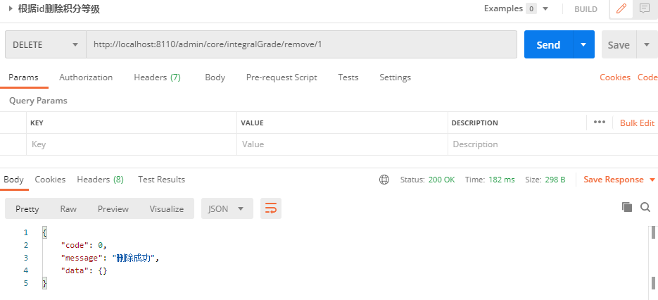

# 一、积分等级列表接口

## 1、编写积分等级管理接口

在controller中添加admin包，添加AdminIntegralGradeController类

```java
package com.atguigu.srb.core.controller.admin;
@CrossOrigin
@RestController
@RequestMapping("/admin/core/integralGrade")
public class AdminIntegralGradeController {
    @Resource
    private IntegralGradeService integralGradeService;
    @GetMapping("/list")
    public List<IntegralGrade> listAll(){
        return integralGradeService.list();
    }
}
```

## 2、测试

重启服务，访问： http://localhost:8110/admin/core/integralGrade/list 查看结果json数据

# 二、逻辑删除接口

## 1、添加删除方法

AdminIntegralGradeController添加removeById方法

```java
@DeleteMapping("/remove/{id}")
public boolean removeById(@PathVariable Long id){
    return integralGradeService.removeById(id);
}
```

## 2、使用postman测试删除



# 三、配置Swagger2

## 1、Swagger2配置文件 

在service-base中创建Swagger2Config

```java
package com.atguigu.srb.base.config;
@Configuration
@EnableSwagger2
public class Swagger2Config {
    
    @Bean
    public Docket adminApiConfig(){
        return new Docket(DocumentationType.SWAGGER_2)
                .groupName("adminApi")
                .apiInfo(adminApiInfo())
                .select()
                //只显示admin路径下的页面
                .paths(Predicates.and(PathSelectors.regex("/admin/.*")))
                .build();
    }
    private ApiInfo adminApiInfo(){
        return new ApiInfoBuilder()
                .title("尚融宝后台管理系统-API文档")
                .description("本文档描述了尚融宝后台管理系统接口")
                .version("1.0")
                .contact(new Contact("Helen", "http://atguigu.com", "55317332@qq.com"))
                .build();
    }
}
```

## 2、查看Swagger文档

重启服务器查看接口文档：[http://localhost:8110/swagger-ui.html](http://localhost:8101/swagger-ui.html)

## 3、常见注解

**实体类注解：**entity的实体类中可以添加一些自定义设置，例如：

```java
@ApiModelProperty(value = "创建时间", example = "2019-01-01 8:00:00")
private LocalDateTime createTime;
@ApiModelProperty(value = "更新时间", example = "2019-01-01 8:00:00")
private LocalDateTime updateTime;
```

**controller注解：**

定义在类上

```java
@Api(tags = "积分等级管理")
```

定义在方法上

```java
@ApiOperation("积分等级列表")
@ApiOperation(value = "根据id删除积分等级", notes = "逻辑删除")
```

定义在参数上

```java
@ApiParam(value = "数据id", required = true, example = "100")
```