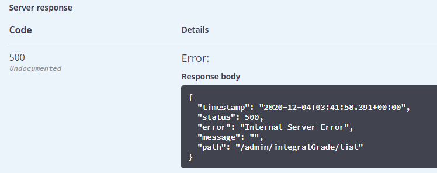
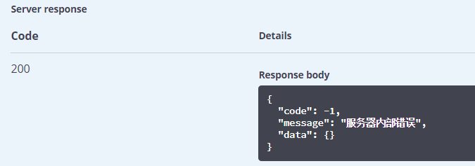
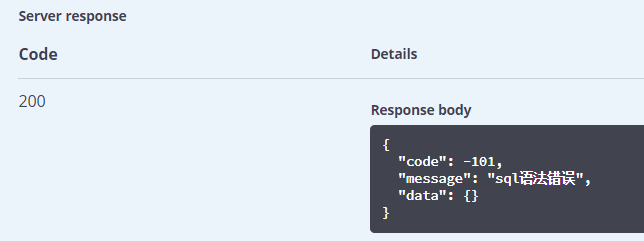
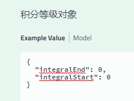
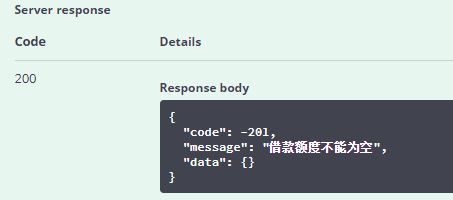
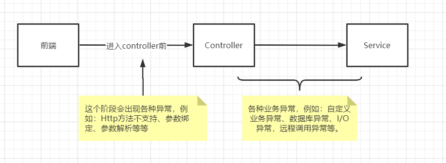
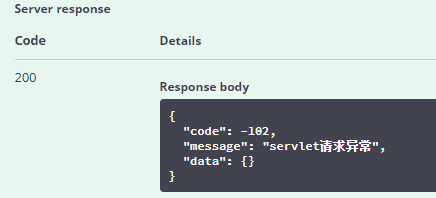

# 一、项目中的异常

## 1、制造异常

屏蔽 IntegralGrade 中的 @TableField注解 

```java
@ApiModelProperty(value = "逻辑删除(1:已删除，0:未删除)")
//@TableField("is_deleted")
@TableLogic
private Boolean deleted;
```

## 2、Swagger中测试

测试列表查询功能，查看结果，发生错误，显示响应失败



# 二、统一异常处理

目标：我们想让异常结果也显示为统一的返回结果对象，并且统一处理系统的异常信息，那么需要进行统一异常处理。

## 1、创建统一异常处理器

guigu-common中创建exception包，创建统一异常处理器类UnifiedExceptionHandler

```java
package com.atguigu.common.exception;
@Slf4j
@Component //Spring容易自动管理
@RestControllerAdvice //在controller层添加通知。如果使用@ControllerAdvice，则方法上需要添加@ResponseBody
public class UnifiedExceptionHandler {
    /**
     * 未定义异常
     */
    @ExceptionHandler(value = Exception.class) //当controller中抛出Exception，则捕获
    public R handleException(Exception e) {
        log.error(e.getMessage(), e);
        return R.error();
    }
}
```

## 2、service-core添加扫描

添加 "com.atguigu.common"

```java
@SpringBootApplication
@ComponentScan({"com.atguigu.srb", "com.atguigu.common"})
public class ServiceCoreApplication {
```

## 3、测试 

返回统一错误结果



# 三、处理特定异常

如果我们不想显示统一的“服务器内部错误”，需要个性化的显示异常信息，那么需要针对特定的异常做处理

## **1、添加依赖**

在guigu-common中添加jdbc依赖

```xml
<dependency>
    <groupId>org.springframework</groupId>
    <artifactId>spring-jdbc</artifactId>
</dependency>
```

## 2、添加异常处理方法

在 UnifiedExceptionHandler 中添加

```java
/**
* 特定异常
*/
@ExceptionHandler(BadSqlGrammarException.class)
public R handleBadSqlGrammarException(BadSqlGrammarException e){
    log.error(e.getMessage(), e);
    return R.setResult(ResponseEnum.BAD_SQL_GRAMMAR_ERROR);
}
```

## 3、测试



问题：上面的例子虽然针对特定的异常显示个性化的错误信息，但是你会发现，针对每个不同的异常我们都需要在项目中添加对应的处理方法，并捕获对应的异常对象，可能还要针对这个异常添加额外的依赖。这显然不是最好的方式。

方案：此类异常直接抛出，并且用Exception类捕获就可以了。

## 4、恢复制造的异常

```java
@TableField(value = "is_deleted")
```

# 四、自定义异常

目标：使用一个或较少的异常类，可以捕获和显示所有的异常信息。

方案：因此，我们可以创建一个自定义异常类（必须是运行时异常），在程序中抛出这个自定义异常对象，并在统一异常处理器中捕获自定义异常对象

## 1、创建自定义异常类

```java
package com.atguigu.common.exception;
@Data
@NoArgsConstructor
public class BusinessException extends RuntimeException {
    //状态码
    private Integer code;
    //错误消息
    private String message;
}
```

完整的源代码：BusinessException.java

## 2、添加异常处理方法

UnifiedExceptionHandler类中添加

```java
/**
* 自定义异常
*/
@ExceptionHandler(BusinessException.class)
public R handleBusinessException(BusinessException e){
    log.error(e.getMessage(), e);
    return R.error().message(e.getMessage()).code(e.getCode());
}
```

## 3、修改Controller

在AdminIntegralGradeController的方法中添加异常处理，业务中需要的位置抛出BusinessException自定义异常。 

```java
@ApiOperation("新增积分等级")
@PostMapping("/save")
public R save(
    @ApiParam(value = "积分等级对象", required = true)
    @RequestBody IntegralGrade integralGrade){
    //如果借款额度为空就手动抛出一个自定义的异常！
    if(integralGrade.getBorrowAmount() == null){
        //BORROW_AMOUNT_NULL_ERROR(-201, "借款额度不能为空"),
        throw new BusinessException(ResponseEnum.BORROW_AMOUNT_NULL_ERROR);
    }
    boolean result = integrationService.save(integralGrade);
    if (result) {
        return R.ok().message("保存成功");
    } else {
        return R.error().message("保存失败");
    }
}
```

## 4、测试

测试



结果




# 五、异常处理优化

目标：以优雅的 Assert(断言) 方式来校验业务的异常情况，消除 if else

## 1、什么是断言

```java
package com.atguigu.srb.core;
import org.junit.jupiter.api.Test;
import org.springframework.util.Assert;
public class AssertTests {
    //if else的用法
    @Test
    public void test1() {
        Object o = null;
        if (o == null) {
            throw new IllegalArgumentException("用户不存在.");
        }
    }
    //断言的用法：更为简洁
    @Test
    public void test2() {
        // 另一种写法
        Object o = null;
        Assert.notNull(o, "用户不存在.");
    }
}
```

## 2、自定义断言

用断言的方式封装异常的抛出

```java
package com.atguigu.common.exception;
@Slf4j
public abstract class Assert {
    /**
     * 断言对象不为空
     * 如果对象obj为空，则抛出异常
     * @param obj 待判断对象
     */
    public static void notNull(Object obj, ResponseEnum responseEnum) {
        if (obj == null) {
            log.info("obj is null...............");
            throw new BusinessException(responseEnum);
        }
    }
}
```

完整的源代码：Assert.java

## 3、修改controller

在controller中用断言替换if else

```java
 Assert.notNull(integralGrade.getBorrowAmount(), ResponseEnum.BORROW_AMOUNT_NULL_ERROR);
```

# 六、Controller上层异常

## 1、异常分类

对异常按阶段进行分类，大体可以分成：进入Controller前的异常 和 业务层异常，具体可以参考下图：



## 2、处理Controller上层异常 

UnifiedExceptionHandler中添加 

```java
/**
     * Controller上一层相关异常
     */
@ExceptionHandler({
    NoHandlerFoundException.class,
    HttpRequestMethodNotSupportedException.class,
    HttpMediaTypeNotSupportedException.class,
    MissingPathVariableException.class,
    MissingServletRequestParameterException.class,
    TypeMismatchException.class,
    HttpMessageNotReadableException.class,
    HttpMessageNotWritableException.class,
    MethodArgumentNotValidException.class,
    HttpMediaTypeNotAcceptableException.class,
    ServletRequestBindingException.class,
    ConversionNotSupportedException.class,
    MissingServletRequestPartException.class,
    AsyncRequestTimeoutException.class
        })
public R handleServletException(Exception e) {
    log.error(e.getMessage(), e);
    //SERVLET_ERROR(-102, "servlet请求异常"),
    return R.error().message(ResponseEnum.SERVLET_ERROR.getMessage()).code(ResponseEnum.SERVLET_ERROR.getCode());
}
```

## 3、测试

在save测试用例中输入非法的json参数，则得到下面的结果。我们可以在控制台日志中查看具体的错误原因。前端只需要返回相对简单友好的提示即可。

