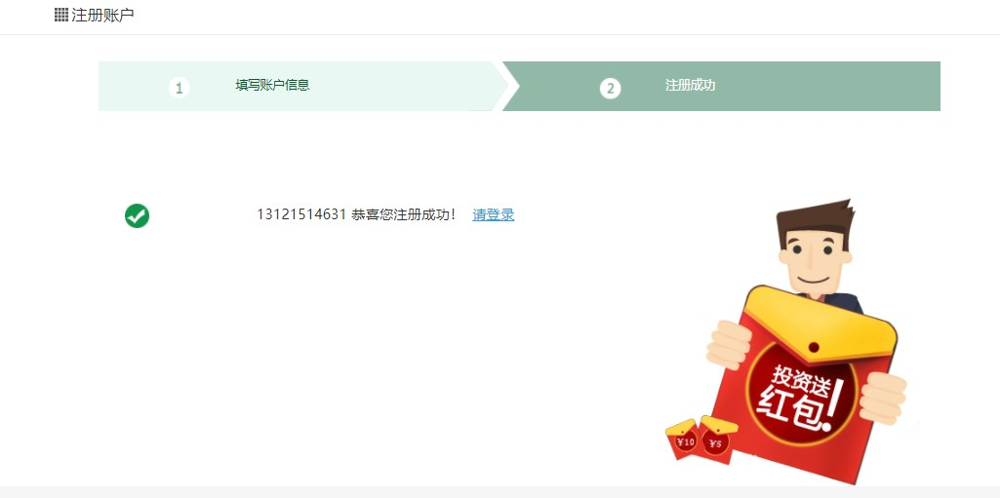

# 需求



# 一、后端接口
## 1、创建VO对象
service-core中创建vo
```java
package com.atguigu.srb.core.pojo.vo;
@Data
@ApiModel(description="注册对象")
public class RegisterVO {
    @ApiModelProperty(value = "用户类型")
    private Integer userType;
    @ApiModelProperty(value = "手机号")
    private String mobile;
    @ApiModelProperty(value = "验证码")
    private String code;
    @ApiModelProperty(value = "密码")
    private String password;
}
```

## 2、定义常量
UserInfo中添加常量
```java
public static final Integer STATUS_NORMAL = 1;
public static final Integer STATUS_LOCKED = 0;
```

## 3、引入MD5工具类
guigu-common中util包，引入工具类：
MD5.java：MD5加密

## 4、Controller
注意：将controller包中的UserInfoController移植到controller.api包下
```java
package com.atguigu.srb.core.controller.api;
@Api(tags = "会员接口")
@RestController
@RequestMapping("/api/core/userInfo")
@Slf4j
@CrossOrigin
public class UserInfoController {
    @Resource
    private UserInfoService userInfoService;
    @Resource
    private RedisTemplate redisTemplate;
    @ApiOperation("会员注册")
    @PostMapping("/register")
    public R register(@RequestBody RegisterVO registerVO){
        String mobile = registerVO.getMobile();
        String password = registerVO.getPassword();
        String code = registerVO.getCode();
        //MOBILE_NULL_ERROR(-202, "手机号不能为空"),
        Assert.notEmpty(mobile, ResponseEnum.MOBILE_NULL_ERROR);
        //MOBILE_ERROR(-203, "手机号不正确"),
        Assert.isTrue(RegexValidateUtils.checkCellphone(mobile), ResponseEnum.MOBILE_ERROR);
        //PASSWORD_NULL_ERROR(-204, "密码不能为空"),
        Assert.notEmpty(password, ResponseEnum.PASSWORD_NULL_ERROR);
        //CODE_NULL_ERROR(-205, "验证码不能为空"),
        Assert.notEmpty(code, ResponseEnum.CODE_NULL_ERROR);
        //校验验证码
        String codeGen = (String)redisTemplate.opsForValue().get("srb:sms:code:" + mobile);
        //CODE_ERROR(-206, "验证码不正确"),
        Assert.equals(code, codeGen, ResponseEnum.CODE_ERROR);
        //注册
        userInfoService.register(registerVO);
        return R.ok().message("注册成功");
    }
}
```

## 5、Service
接口：UserInfoService
```java
package com.atguigu.srb.core.service;
public interface UserInfoService extends IService<UserInfo> {
    void register(RegisterVO registerVO);
}
```

实现：UserInfoServiceImpl
```java
package com.atguigu.srb.core.service.impl;
@Service
public class UserInfoServiceImpl extends ServiceImpl<UserInfoMapper, UserInfo> implements UserInfoService {
    @Resource
    private UserAccountMapper userAccountMapper;
    @Transactional(rollbackFor = {Exception.class})
    @Override
    public void register(RegisterVO registerVO) {
        //判断用户是否被注册
        QueryWrapper<UserInfo> queryWrapper = new QueryWrapper<>();
        queryWrapper.eq("mobile", registerVO.getMobile());
        Integer count = baseMapper.selectCount(queryWrapper);
        //MOBILE_EXIST_ERROR(-207, "手机号已被注册"),
        Assert.isTrue(count == 0, ResponseEnum.MOBILE_EXIST_ERROR);
        //插入用户基本信息
        UserInfo userInfo = new UserInfo();
        userInfo.setUserType(registerVO.getUserType());
        userInfo.setNickName(registerVO.getMobile());
        userInfo.setName(registerVO.getMobile());
        userInfo.setMobile(registerVO.getMobile());
        userInfo.setPassword(MD5.encrypt(registerVO.getPassword()));
        userInfo.setStatus(UserInfo.STATUS_NORMAL); //正常
        //设置一张静态资源服务器上的头像图片
        userInfo.setHeadImg("https://srb-file.oss-cn-beijing.aliyuncs.com/avatar/07.jpg");
        baseMapper.insert(userInfo);
        //创建会员账户
        UserAccount userAccount = new UserAccount();
        userAccount.setUserId(userInfo.getId());
        userAccountMapper.insert(userAccount);
    }
}
```

# 二、前端整合
pages/register.vue
```js
//注册
register() {
  this.$axios
    .$post('/api/core/userInfo/register', this.userInfo)
    .then((response) => {
      this.step = 2
    })
},
```