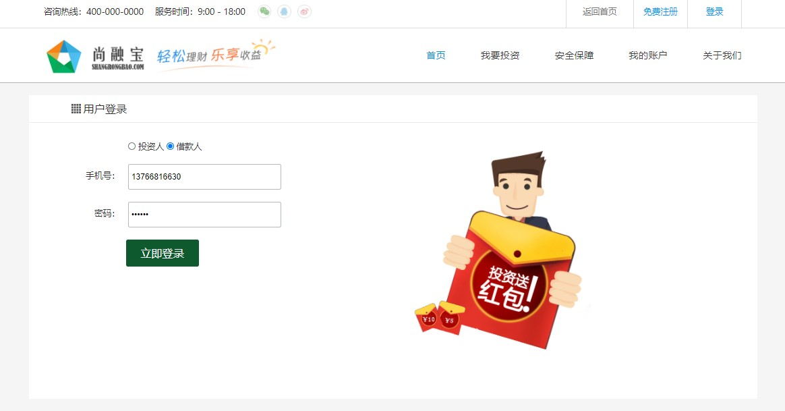

# 需求


# 一、后端的接口
## 1、集成JWT
service-base中添加依赖
```xml
<dependency>
    <groupId>io.jsonwebtoken</groupId>
    <artifactId>jjwt</artifactId>
</dependency>
```

## 2、JWT工具
service-base中添加util包
添加JwtUtils类

## 3、创建VO对象
service-core中创建登录对象
```java
package com.atguigu.srb.core.pojo.vo;
@Data
@ApiModel(description="登录对象")
public class LoginVO {
    
    @ApiModelProperty(value = "用户类型")
    private Integer userType;
    @ApiModelProperty(value = "手机号")
    private String mobile;
    @ApiModelProperty(value = "密码")
    private String password;
}
```

用户信息对象
```java
package com.atguigu.srb.core.pojo.vo;
@Data
@ApiModel(description="用户信息对象")
public class UserInfoVO {
    @ApiModelProperty(value = "用户姓名")
    private String name;
    @ApiModelProperty(value = "用户昵称")
    private String nickName;
    
    @ApiModelProperty(value = "头像")
    private String headImg;
    
    @ApiModelProperty(value = "手机号")
    private String mobile;
    @ApiModelProperty(value = "1：出借人 2：借款人")
    private Integer userType;
    @ApiModelProperty(value = "JWT访问令牌")
    private String token;
}
```

## 4、Controller
UserInfoController
```java
@ApiOperation("会员登录")
@PostMapping("/login")
public R login(@RequestBody LoginVO loginVO, HttpServletRequest request) {
    String mobile = loginVO.getMobile();
    String password = loginVO.getPassword();
    Assert.notEmpty(mobile, ResponseEnum.MOBILE_NULL_ERROR);
    Assert.notEmpty(password, ResponseEnum.PASSWORD_NULL_ERROR);
    String ip = request.getRemoteAddr();
    UserInfoVO userInfoVO = userInfoService.login(loginVO, ip);
    return R.ok().data("userInfo", userInfoVO);
}
```

## 5、Service
接口：UserInfoService 
```java
UserInfoVO login(LoginVO loginVO, String ip);
```

实现：UserInfoServiceImpl
```java
@Resource
private UserLoginRecordMapper userLoginRecordMapper;
@Transactional( rollbackFor = {Exception.class})
@Override
public UserInfoVO login(LoginVO loginVO, String ip) {
    String mobile = loginVO.getMobile();
    String password = loginVO.getPassword();
    Integer userType = loginVO.getUserType();
    //获取会员
    QueryWrapper<UserInfo> queryWrapper = new QueryWrapper<>();
    queryWrapper.eq("mobile", mobile);
    queryWrapper.eq("user_type", userType);
    UserInfo userInfo = baseMapper.selectOne(queryWrapper);
    //用户不存在
    //LOGIN_MOBILE_ERROR(-208, "用户不存在"),
    Assert.notNull(userInfo, ResponseEnum.LOGIN_MOBILE_ERROR);
    //校验密码
    //LOGIN_PASSWORD_ERROR(-209, "密码不正确"),
    Assert.equals(MD5.encrypt(password), userInfo.getPassword(), ResponseEnum.LOGIN_PASSWORD_ERROR);
    //用户是否被禁用
    //LOGIN_DISABLED_ERROR(-210, "用户已被禁用"),
    Assert.equals(userInfo.getStatus(), UserInfo.STATUS_NORMAL, ResponseEnum.LOGIN_LOKED_ERROR);
    //记录登录日志
    UserLoginRecord userLoginRecord = new UserLoginRecord();
    userLoginRecord.setUserId(userInfo.getId());
    userLoginRecord.setIp(ip);
    userLoginRecordMapper.insert(userLoginRecord);
    //生成token
    String token = JwtUtils.createToken(userInfo.getId(), userInfo.getName());
    UserInfoVO userInfoVO = new UserInfoVO();
    userInfoVO.setToken(token);
    userInfoVO.setName(userInfo.getName());
    userInfoVO.setNickName(userInfo.getNickName());
    userInfoVO.setHeadImg(userInfo.getHeadImg());
    userInfoVO.setMobile(userInfo.getMobile());
    userInfoVO.setUserType(userType);
    return userInfoVO;
}
```

# 二、前端整合
## 1、登录脚本
pages/login.vue
```js
methods: {
    //登录
    login() {
      this.$axios
        .$post('/api/core/userInfo/login', this.userInfo)
        .then((response) => {
          // 把用户信息存在cookie中
          cookie.set('userInfo', response.data.userInfo)
          window.location.href = '/user'
        })
    },
},
```

## 2、页面头信息
components/AppHeader.vue
脚本
```js
<script>
import cookie from 'js-cookie'
export default {
  data() {
    return {
      userInfo: null,
    }
  },
  mounted() {
    this.showInfo()
  },
  methods: {
    //显示用户信息  
    showInfo() {
      // debugger
      let userInfo = cookie.get('userInfo')
      if (!userInfo) {
        console.log('cookie不存在')
        this.userInfo = null
        return
      }  
      userInfo = JSON.parse(userInfo)  
      this.userInfo = userInfo
    },
    //退出  
    logout() {
      cookie.set('userInfo', '')
      //跳转页面
      window.location.href = '/login'
    },
  },
}
</script>
```