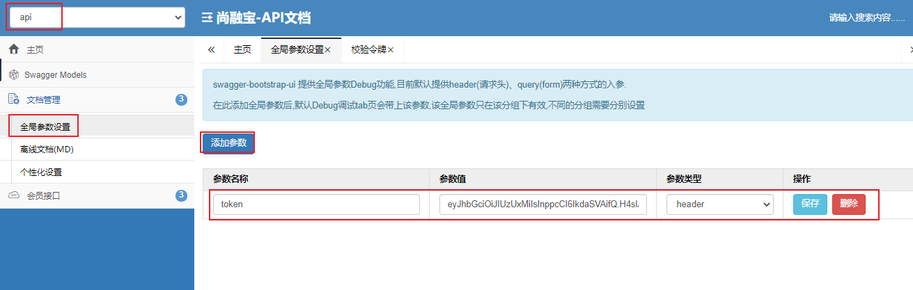
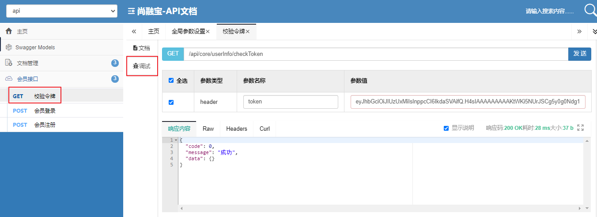

# 一、后端的接口
## 1、添加令牌校验接口
service-core 中 UserInfoController添加令牌校验接口
```java
@ApiOperation("校验令牌")
@GetMapping("/checkToken")
public R checkToken(HttpServletRequest request) {
    String token = request.getHeader("token");
    boolean result = JwtUtils.checkToken(token);
    if(result){
        return R.ok();
    }else{
        //LOGIN_AUTH_ERROR(-211, "未登录"),
        return R.setResult(ResponseEnum.LOGIN_AUTH_ERROR);
    }
}
```

## 2、Swagger请求头添加header
step1：service-base添加依赖
```xml
<dependency>
    <groupId>com.github.xiaoymin</groupId>
    <artifactId>swagger-bootstrap-ui</artifactId>
    <version>1.9.2</version>
</dependency>
```

step2：访问
http://localhost:8110/doc.html

step3：添加全局参数


step4：测试


# 二、前端整合
## 1、优化showInfo
components/AppHeader.vue
脚本
```js
showInfo() {
    // debugger
    let userInfo = cookie.get('userInfo')
    if (!userInfo) {
        console.log('cookie不存在')
        this.userInfo = null
        return
    }
    userInfo = JSON.parse(userInfo)
    
    //先在服务器端校验token
    this.$axios({
        url: '/api/core/userInfo/checkToken',
        method: 'get',
        headers: {
            //如果token校验成功，再展示user信息
            token: userInfo.token,
        },
    }).then((response) => {
        console.log('校验成功')
        this.userInfo = userInfo
    })
},
```

## 2、axios请求拦截（了解）
可以在axios请求拦截器中统一添加header
```js
  $axios.onRequest((config) => {
    // 添加请求头：token
    let userInfo = cookie.get('userInfo')
    if (userInfo) {
      console.log('添加header')
      userInfo = JSON.parse(userInfo)
      config.headers['token'] = userInfo.token
    }
    console.log('Making request to ' + config.url)
  })
```

## 3、axios响应拦截（了解）
plugins/axios.js：处理未登录状况
```js
  $axios.onResponse((response) => {
    console.log('Reciving resposne', response)
    if (response.data.code === 0) {
      return response
    } else if (response.data.code === -211) {
      console.log('token校验失败')
      cookie.set('userInfo', '')
      //debugger
      //跳转到登录页面
      window.location.href = '/login'
    } else {
      Message({
        message: response.data.message,
        type: 'error',
        duration: 5 * 1000,
      })
      return Promise.reject(response)
    }
  })
```