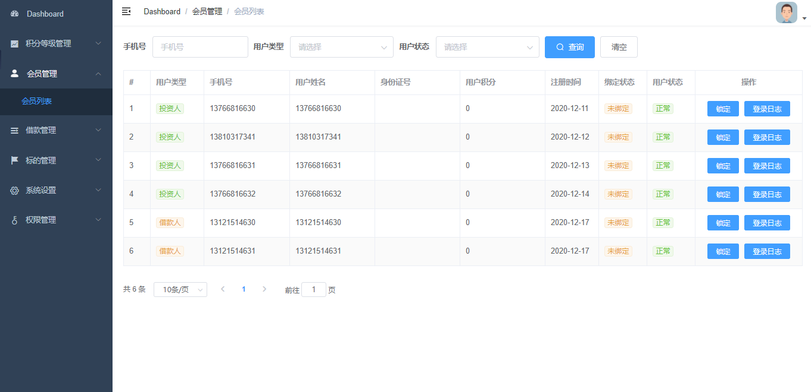
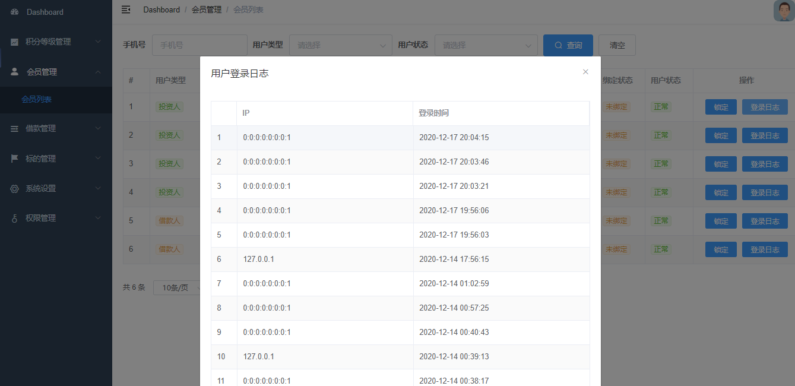

# 需求



# 一、后端接口实现
## 1、创建查询对象
UserInfoQuery
```java
package com.atguigu.srb.core.pojo.query;
@Data
@ApiModel(description="会员搜索对象")
public class UserInfoQuery {
    @ApiModelProperty(value = "手机号")
    private String mobile;
    @ApiModelProperty(value = "状态")
    private Integer status;
    @ApiModelProperty(value = "1：出借人 2：借款人")
    private Integer userType;
}
```

## 2、Service
接口：UserInfoService
```java
IPage<UserInfo> listPage(Page<UserInfo> pageParam, UserInfoQuery userInfoQuery);
```

实现：UserInfoServiceImpl
```java
@Override
public IPage<UserInfo> listPage(Page<UserInfo> pageParam, UserInfoQuery userInfoQuery) {
    String mobile = userInfoQuery.getMobile();
    Integer status = userInfoQuery.getStatus();
    Integer userType = userInfoQuery.getUserType();
    QueryWrapper<UserInfo> userInfoQueryWrapper = new QueryWrapper<>();
    if(userInfoQuery == null){
        return baseMapper.selectPage(pageParam, null);
    }
    userInfoQueryWrapper
        .eq(StringUtils.isNotBlank(mobile), "mobile", mobile)
        .eq(status != null, "status", userInfoQuery.getStatus())
        .eq(userType != null, "user_type", userType);
    return baseMapper.selectPage(pageParam, userInfoQueryWrapper);
}
```

## 3、Controller
AdminUserInfoController
```java
package com.atguigu.srb.core.controller.admin;
@Api(tags = "会员管理")
@RestController
@RequestMapping("/admin/core/userInfo")
@Slf4j
@CrossOrigin
public class AdminUserInfoController {
    @Resource
    private UserInfoService userInfoService;
    @ApiOperation("获取会员分页列表")
    @GetMapping("/list/{page}/{limit}")
    public R listPage(
            @ApiParam(value = "当前页码", required = true)
            @PathVariable Long page,
            @ApiParam(value = "每页记录数", required = true)
            @PathVariable Long limit,
            @ApiParam(value = "查询对象", required = false)
            UserInfoQuery userInfoQuery) {
        Page<UserInfo> pageParam = new Page<>(page, limit);
        IPage<UserInfo> pageModel = userInfoService.listPage(pageParam, userInfoQuery);
        return R.ok().data("pageModel", pageModel);
    }
}
```

## 4、LocalDateTime的json格式化问题
service-base中添加json格式化配置文件
```java
package com.atguigu.srb.base.config;
import com.fasterxml.jackson.datatype.jsr310.ser.LocalDateTimeSerializer;
import org.springframework.beans.factory.annotation.Value;
import org.springframework.boot.autoconfigure.jackson.Jackson2ObjectMapperBuilderCustomizer;
import org.springframework.context.annotation.Bean;
import org.springframework.context.annotation.Configuration;
import java.time.LocalDateTime;
import java.time.format.DateTimeFormatter;
@Configuration
public class LocalDateTimeSerializerConfig {
    @Value("${spring.jackson.date-format:yyyy-MM-dd HH:mm:ss}")
    private String pattern;
    public LocalDateTimeSerializer localDateTimeDeserializer() {
        return new LocalDateTimeSerializer(DateTimeFormatter.ofPattern(pattern));
    }
    @Bean
    public Jackson2ObjectMapperBuilderCustomizer jackson2ObjectMapperBuilderCustomizer() {
        return builder -> builder.serializerByType(LocalDateTime.class, localDateTimeDeserializer());
    }
}
```

上面的方案全局生效，当全局的格式化方式无法满足我们需求时，我们对日期格式要做特殊的处理：在类的属性上添加注解
```java
@JsonFormat(pattern = "yyyy-MM-dd")
@ApiModelProperty(value = "创建时间")
private LocalDateTime createTime;
```

# 二、前端整合
## 1、创建vue组件
core/user-info/list.vue
```vue
<template>
  <div class="app-container">
    user list
  </div>
</template>
```

## 2、配置路由
```js
  {
    path: '/core/user-info',
    component: Layout,
    redirect: '/core/user-info/list',
    name: 'coreUserInfo',
    meta: { title: '会员管理', icon: 'user' },
    alwaysShow: true,
    children: [
      {
        path: 'list',
        name: 'coreUserInfoList',
        component: () => import('@/views/core/user-info/list'),
        meta: { title: '会员列表' }
      }
    ]
  },
```

## 3、定义api模块
创建文件 src/api/core/user-info.js
```js
import request from '@/utils/request'
export default {
  getPageList(page, limit, searchObj) {
    return request({
      url: `/admin/core/userInfo/list/${page}/${limit}`,
      method: 'get',
      params: searchObj
    })
  }
}
```

## 4、定义页面组件脚本
src/views/core/user-info/list.vue
```js
<script>
import userInfoApi from '@/api/core/user-info'
export default {
  data() {
    return {
      list: null, // 数据列表
      total: 0, // 数据库中的总记录数
      page: 1, // 默认页码
      limit: 10, // 每页记录数
      searchObj: {}, // 查询条件
      loginRecordList: [], //会员登录日志
      dialogTableVisible: false //对话框是否显示
    }
  },
  created() {
    // 当页面加载时获取数据
    this.fetchData()
  },
  methods: {
    fetchData() {
      userInfoApi
        .getPageList(this.page, this.limit, this.searchObj)
        .then(response => {
          this.list = response.data.pageModel.records
          this.total = response.data.pageModel.total
        })
    },
    // 每页记录数改变，size：回调参数，表示当前选中的“每页条数”
    changePageSize(size) {
      this.limit = size
      this.fetchData()
    },
    // 改变页码，page：回调参数，表示当前选中的“页码”
    changeCurrentPage(page) {
      this.page = page
      this.fetchData()
    },
    // 重置表单
    resetData() {
      this.searchObj = {}
      this.fetchData()
    }
  }
}
</script>
```

## 5、定义页面组件模板
src/views/core/user-info/list.vue
```vue
<template>
  <div class="app-container">
    <!--查询表单-->
    <el-form :inline="true" class="demo-form-inline">
      <el-form-item label="手机号">
        <el-input v-model="searchObj.mobile" placeholder="手机号" />
      </el-form-item>
      <el-form-item label="用户类型">
        <el-select v-model="searchObj.userType" placeholder="请选择" clearable>
          <el-option label="投资人" value="1" />
          <el-option label="借款人" value="2" />
        </el-select>
      </el-form-item>
      <el-form-item label="用户状态">
        <el-select v-model="searchObj.status" placeholder="请选择" clearable>
          <el-option label="正常" value="1" />
          <el-option label="锁定" value="0" />
        </el-select>
      </el-form-item>
      <el-button type="primary" icon="el-icon-search" @click="fetchData()">
        查询
      </el-button>
      <el-button type="default" @click="resetData()">清空</el-button>
    </el-form>
    <!-- 列表 -->
    <el-table :data="list" border stripe>
      <el-table-column label="#" width="50">
        <template slot-scope="scope">
          {{ (page - 1) * limit + scope.$index + 1 }}
        </template>
      </el-table-column>
      <el-table-column label="用户类型" width="100">
        <template slot-scope="scope">
          <el-tag v-if="scope.row.userType === 1" type="success" size="mini">
            投资人
          </el-tag>
          <el-tag
            v-else-if="scope.row.userType === 2"
            type="warning"
            size="mini"
          >
            借款人
          </el-tag>
        </template>
      </el-table-column>
      <el-table-column prop="mobile" label="手机号" />
      <el-table-column prop="name" label="用户姓名" />
      <el-table-column prop="idCard" label="身份证号" />
      <el-table-column prop="integral" label="用户积分" />
      <el-table-column prop="createTime" label="注册时间" width="100" />
      <el-table-column label="绑定状态" width="90">
        <template slot-scope="scope">
          <el-tag v-if="scope.row.bindStatus === 0" type="warning" size="mini">
            未绑定
          </el-tag>
          <el-tag
            v-else-if="scope.row.bindStatus === 1"
            type="success"
            size="mini"
          >
            已绑定
          </el-tag>
          <el-tag v-else type="danger" size="mini">绑定失败</el-tag>
        </template>
      </el-table-column>
      <el-table-column label="用户状态" width="90">
        <template slot-scope="scope">
          <el-tag v-if="scope.row.status === 0" type="danger" size="mini">
            锁定
          </el-tag>
          <el-tag v-else type="success" size="mini">
            正常
          </el-tag>
        </template>
      </el-table-column>
    </el-table>
    <!-- 分页组件 -->
    <el-pagination
      :current-page="page"
      :total="total"
      :page-size="limit"
      :page-sizes="[10, 20]"
      style="padding: 30px 0; "
      layout="total, sizes, prev, pager, next, jumper"
      @size-change="changePageSize"
      @current-change="changeCurrentPage"
    />
  </div>
</template>
```