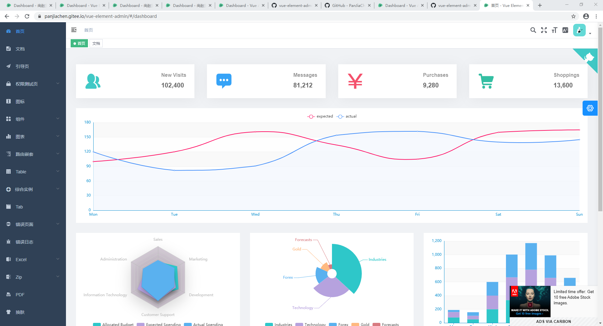
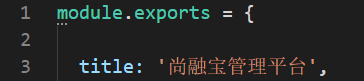
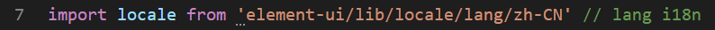
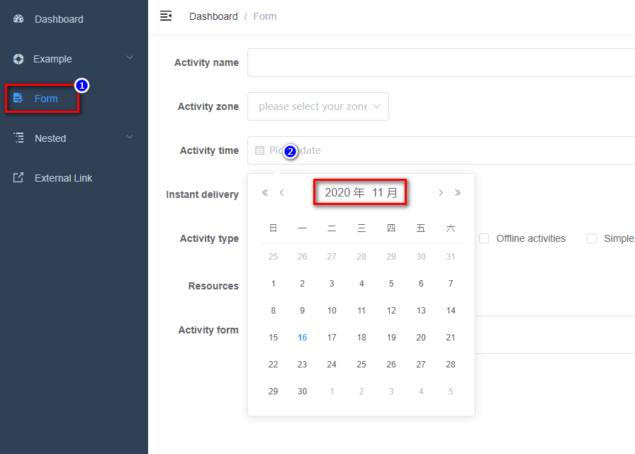
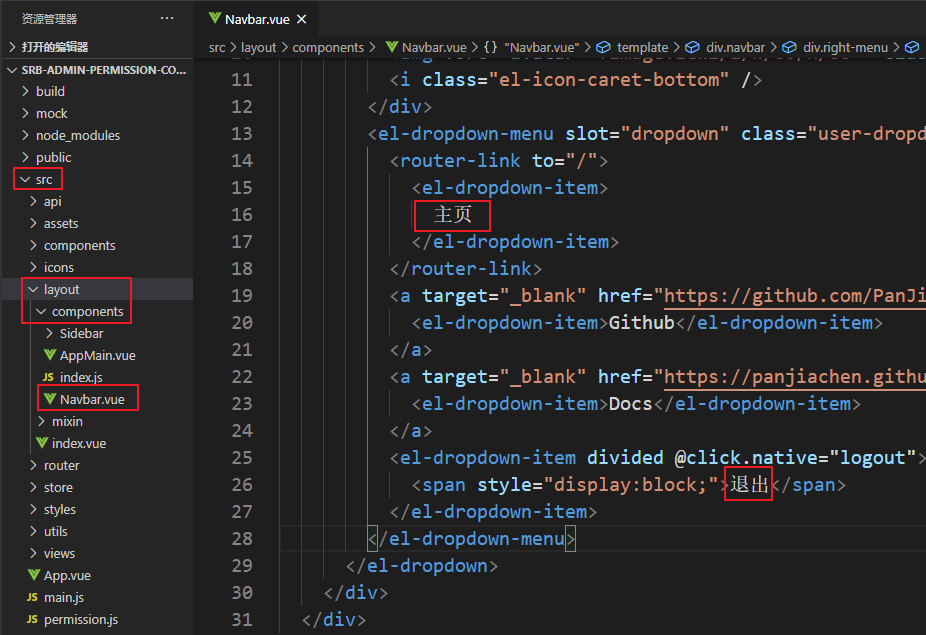

# 一、vue-element-admin

vue-element-admin是基于element-ui 的一套后台管理系统集成方案。

**GitHub地址：**https://github.com/PanJiaChen/vue-element-admin

**项目在线预览：**[https://panjiachen.gitee.io/vue-element-admin](https://panjiachen.gitee.io/vue-element-admin/#/login?redirect=%2Fdashboard)




# 二、vue-admin-template

## 1、简介

vueAdmin-template是基于vue-element-admin的一套后台管理系统基础模板（最少精简版），可作为模板进行二次开发。

**GitHub地址：**https://github.com/PanJiaChen/vue-admin-template

**根据用户角色来动态生成侧边栏的分支：**https://github.com/PanJiaChen/vue-admin-template/tree/permission-control 


## 2、安装和运行

```shell
# 解压压缩包vue-admin-template-permission-control.zip
# 重命名为srb-admin
# 进入目录
cd srb-admin
# 安装依赖
npm install
# 启动。执行后，浏览器自动弹出并访问http://localhost:9528/
npm run dev
```


# 三、前端配置

## 1、禁用ESLint语法检查

vue.config.js 第30行处禁用ESLint语法检查

```js
lintOnSave: false, 
```

## 2、添加prettier格式化配置

在vue项目根目录下新建一个文件.prettierrc

```json
{
  "semi": false,
  "singleQuote": true,
  "htmlWhitespaceSensitivity": "ignore"
}
```

## 3、修改页面标题 

src/settings.js 第3行处修改页面标题



## 4、国际化设置

src/main.js 第7行处修改语言



测试平台语言的修改



## 5、下拉菜单修改



## 6、登录页修改

src/views/login/index.vue

修改页面标题、登录按钮等