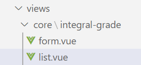

# 一、组件定义

## 1、创建vue组件

在src/views文件夹下创建以下文件夹和文件



## 2、core/integral-grade/list.vue
```vue
<template>
  <div class="app-container">
    积分等级列表
  </div>
</template>
```

## 3、core/integral-grade/form.vue
```vue
<template>
  <div class="app-container">
    积分等级表单
  </div>
</template>
```

# 二、路由定义

修改 src/router/index.js 文件，重新定义constantRoutes，拷贝到 dashboard路由节点 下面

**注意：**每个路由的name不能相同
```js
{
    path: '/core/integral-grade',
    component: Layout,
    redirect: '/core/integral-grade/list',
    name: 'coreIntegralGrade',
    meta: { title: '积分等级管理', icon: 'el-icon-s-marketing' },
    alwaysShow: true,
    children: [
      {
        path: 'list',
        name: 'coreIntegralGradeList',
        component: () => import('@/views/core/integral-grade/list'),
        meta: { title: '积分等级列表' }
      },
      {
        path: 'create',
        name: 'coreIntegralGradeCreate',
        component: () => import('@/views/core/integral-grade/form'),
        meta: { title: '新增积分等级' }
      },
      {
        path: 'edit/:id',
        name: 'coreIntegralGradeEdit',
        component: () => import('@/views/core/integral-grade/form'),
        meta: { title: '编辑积分等级' },
        hidden: true
      }
    ]
},
```