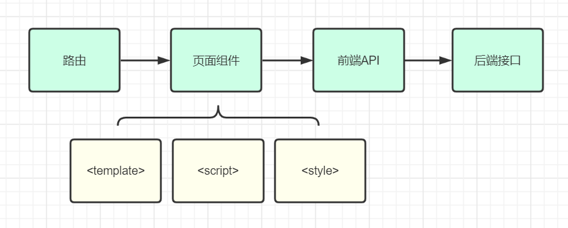
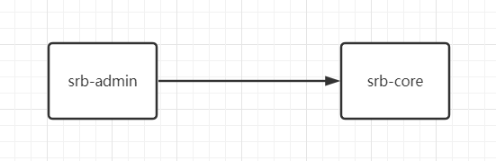
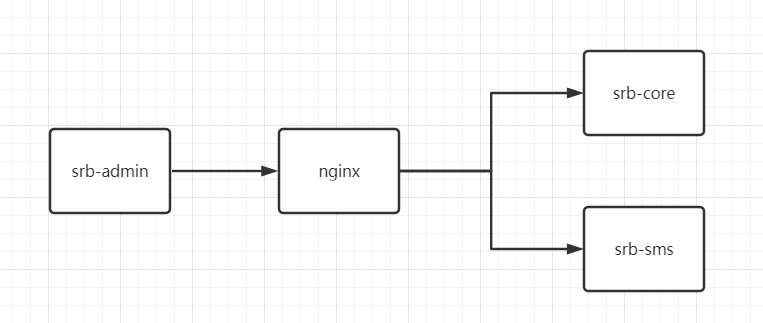

# 一、全栈开发流程

## 1、前端调用流程

下图是开发过程中涉及到和几个核心的模块，我们已经完成了路由的配置和页面组件的创建，接下来我们需要进一步完善页面组件的模板<template>部分，以及脚本<script>等部分的开发，然后创建前后端对接需要的api模块，最后通过api模块向后端接口发起调用。



## 2、nginx反向代理配置

目前，应用程序的前后端基本架构如下：srb-admin是前端程序，直接调用后端的srb-core微服务



为了能够让前端程序能够同时对接多个后端服务，我们可以使用多种解决方案，例如nginx反向代理、微服务网关等。这里我们先使用nginx作为前后端中间的反向代理层，架构如下



nginx的配置
```nginx
server {
    listen       80;
    server_name  localhost;
    location ~ /core/ {           
        proxy_pass http://localhost:8110;
    }
    location ~ /sms/ {           
        proxy_pass http://localhost:8120;
    }
    location ~ /oss/ {           
            proxy_pass http://localhost:8130;
    }
}
```

nginx的命令
```shell
start nginx #启动
nginx -s stop #停止
nginx -s reload #重新加载配置
```

前端的配置： .env.development
```properties
# base api：连接到nginx
VUE_APP_BASE_API = 'http://localhost'
```

## 3、mock-server

VUE_APP_BASE_API的修改会影响到平台模拟登录功能的mock数据，因此需要修改mock-server的地址

修改 mock/mock-server.js 文件 第37行

```js
url: new RegExp(`/dev-api${url}`),
```

修改 src/api/user.js中的接口调用，为每一个远程调用添加配置

```
baseURL: '/dev-api',
```

# 二、前端组件开发

## 1、定义api模块

创建文件 src/api/core/integral-grade.js

```js
// @ 符号在vue.config.js 中配置， 表示 'src' 路径的别名
import request from '@/utils/request'
export default {
  list() {
    return request({
      url: '/admin/core/integralGrade/list',
      method: 'get'
    })
  }
}
```

## 2、定义页面组件脚本

src/views/core/integral-grade/list.vue

```js
<script>
import integralGradeApi from '@/api/core/integral-grade'
export default {
  // 定义数据模型
  data() {
    return {
      list: [] // 数据列表
    }
  },
  // 页面渲染成功后获取数据
  created() {
    this.fetchData()
  },
  // 定义方法
  methods: {
    fetchData() {
      // 调用api
      integralGradeApi.list().then(response => {
        this.list = response.data.list
      })
    }
  }
}
</script>
```

## 3、定义页面组件模板

```vue
<template>
  <div class="app-container">
    <!-- 表格 -->
    <el-table :data="list" border stripe>
      <el-table-column type="index" width="50" />
      <el-table-column prop="borrowAmount" label="借款额度" />
      <el-table-column prop="integralStart" label="积分区间开始" />
      <el-table-column prop="integralEnd" label="积分区间结束" />
    </el-table>
  </div>
</template>
```

## 4、axios响应拦截器修改

src/utils/request.js 中 将第49行的 

```js
if (res.code !== 20000) {
```

修改成

```js
if (res.code !== 0 && res.code !== 20000) {
```

因为我们的后端接口统一结果判断0为成功的响应结果，而mock数据判断20000位正确的结果
