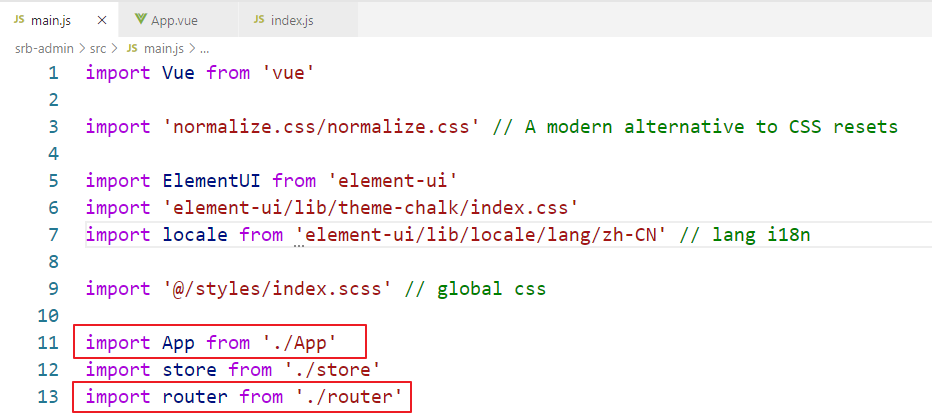
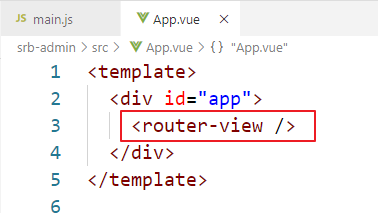
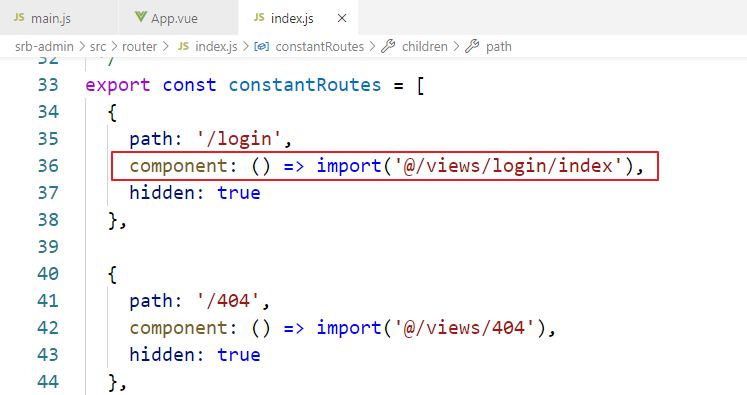
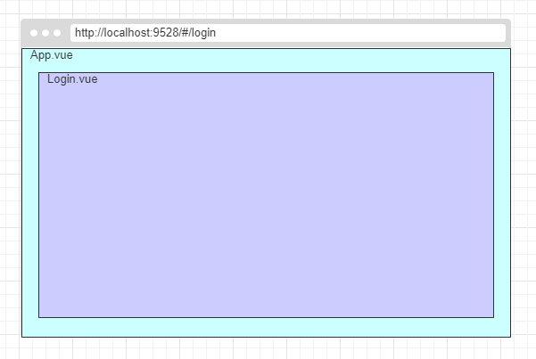
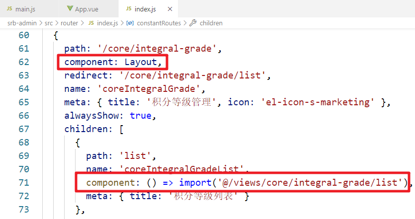
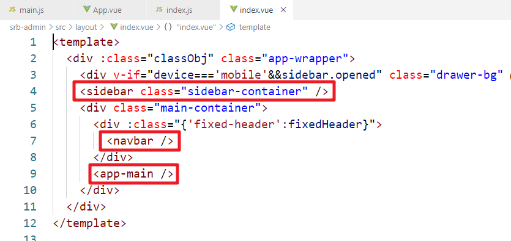
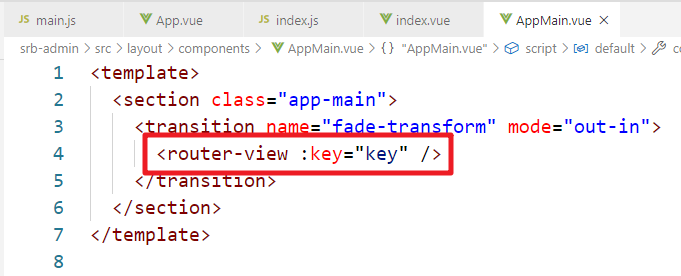
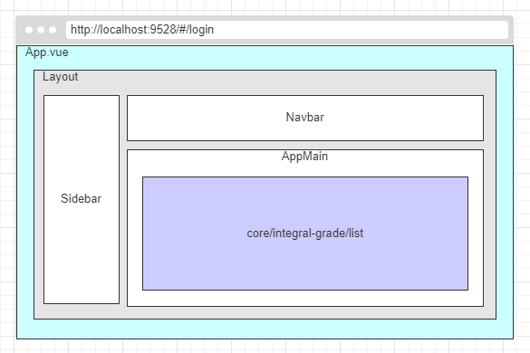

# 一、什么是组件

组件（Component）是 Vue.js 最强大的功能之一。

组件可以扩展 HTML 元素，封装可重用的代码。

组件系统让我们可以用独立可复用的小组件来构建大型应用，几乎任意类型的应用界面都可以抽象为一个组件树：

# 二、项目组件分析

## 1、程序入口
- 入口html：public/index.html
- 入口js脚本：src/main.js
- 顶层组件：src/App.vue
- 路由：src/router/index.js

main.js 中引入了App.vue和 router/index.js，根据路由配置，App.vue中的路由出口会显示相应的页面组件的内容

### 入口脚本
引入顶层组件模块和路由模块

### 顶层组件
路由出口的位置

### 路由配置
路由出口的位置显示的页面组件

## 2、登录页组件关系

# 三、Layout
## 1、路由
src/router/index.js：这个组件应用了Layout布局文件

## 2、布局
src/layout/index.vue：侧边栏、导航栏、主内容区

## 3、主内容区
src/layout/components/AppMain.vue：Layout的路由出口（主内容区）

## 4、积分区间列表页面组件
