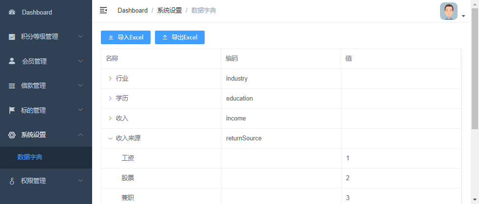
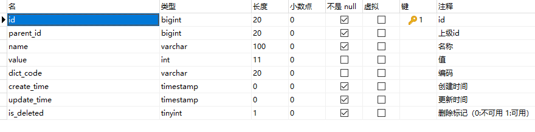

# 需求

# 一、什么是数据字典

何为数据字典？数据字典负责管理系统常用的分类数据或者一些固定数据，例如：省市区三级联动数据、民族数据、行业数据、学历数据等，数据字典帮助我们方便的获取和适用这些通用数据。

# 二、数据字典的设计

- parent_id：上级id，通过id与parent_id构建上下级关系，例如：我们要获取所有行业数据，那么只需要查询parent_id=20000的数据
- name：名称，例如：填写用户信息，我们要select标签选择民族，“汉族”就是数据字典的名称
- value：值，例如：填写用户信息，我们要select标签选择民族，“1”（汉族的标识）就是数据字典的值
- dict_code：编码，编码是我们自定义的，全局唯一，例如：我们要获取行业数据，我们可以通过parent_id获取，但是parent_id是不确定的，所以我们可以根据编码来获取行业数据