# 一、使用RAM子用户 

## 1、进入子用户管理页面

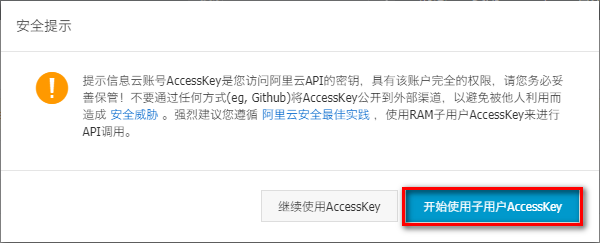

## 2、添加用户

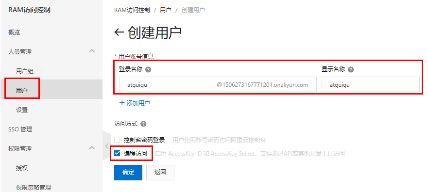

## 3、获取子用户key

AccessKeyId, AccessKeySecret

## 4、设置用户权限

授权：AliyunDysmsFullAccess

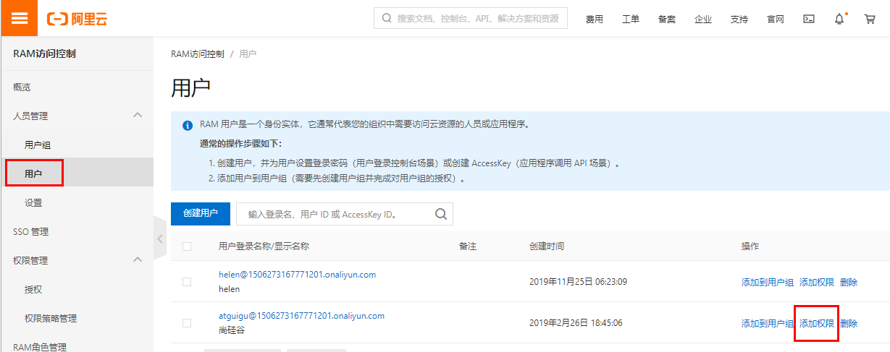

# 二、开通短信服务

## 1、开通

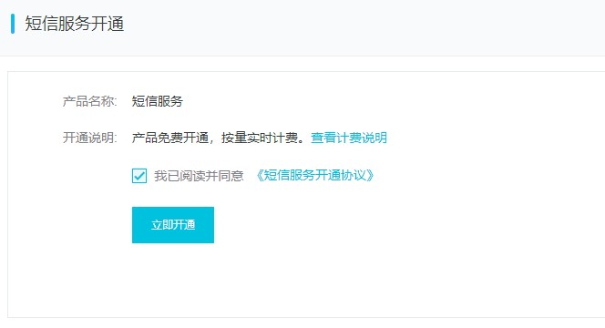

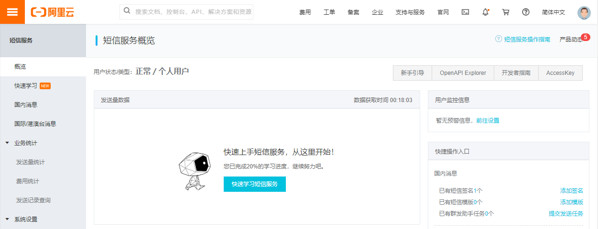

## 2、添加签名

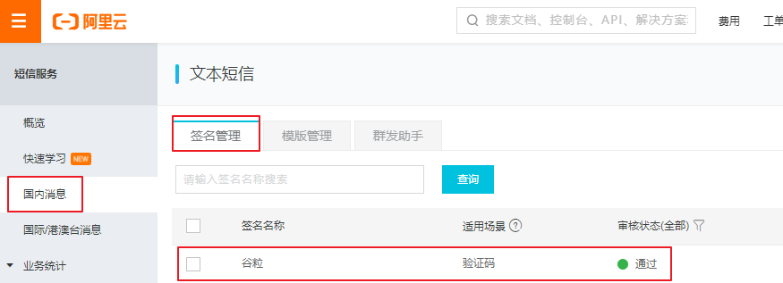

## 3、添加模板

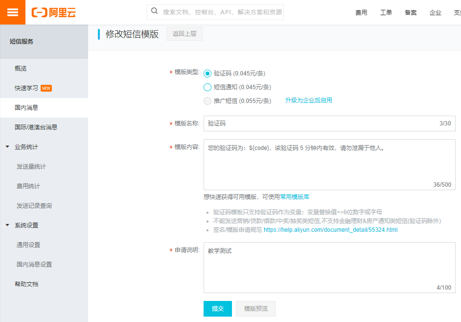

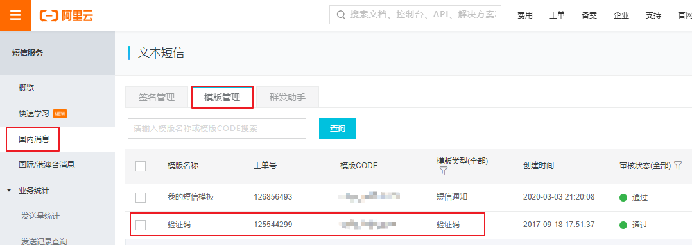

## 4、套餐 

free.aliyun.com

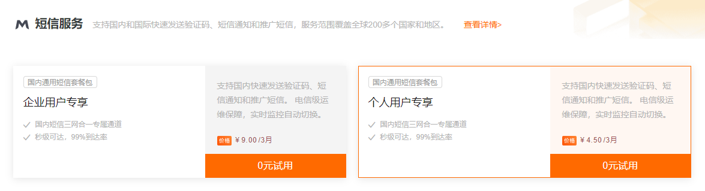

## 5、快速学习

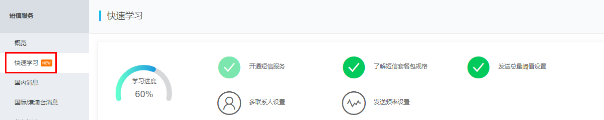

# 三、测试短信发送

## 1、查找使用示例

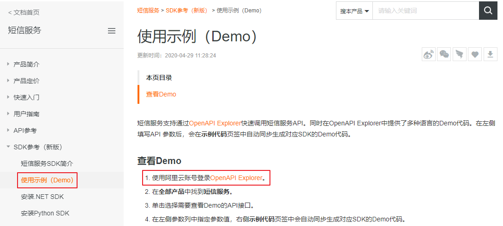

## 2、测试短信发送

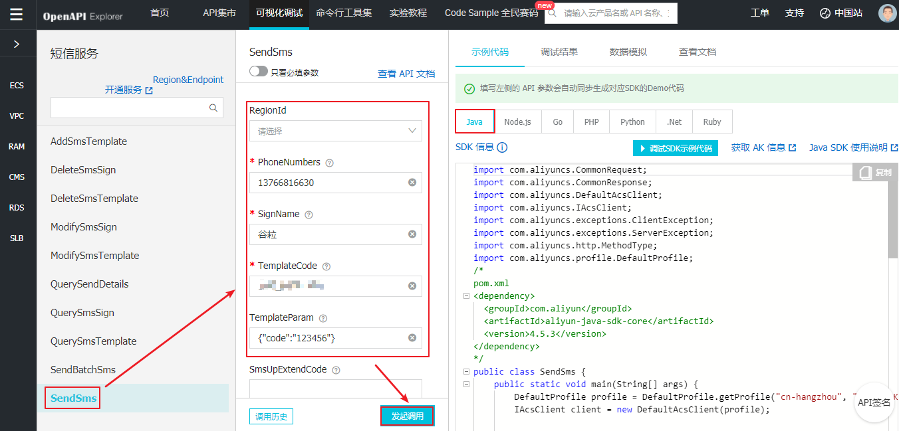

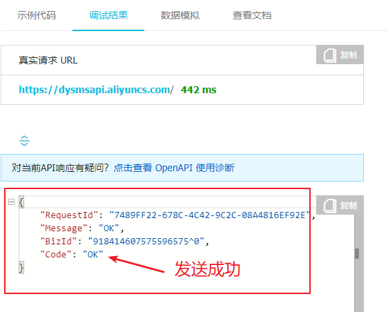

## 3、查看发送结果

短信服务->业务统计->发送记录查询