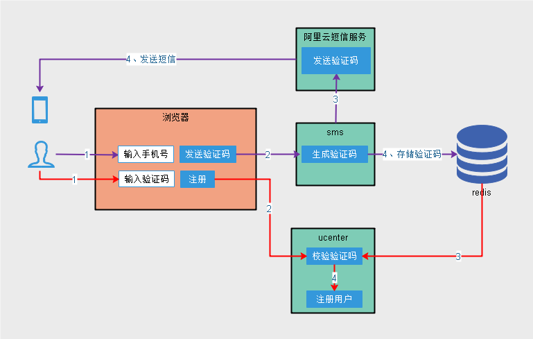
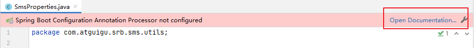
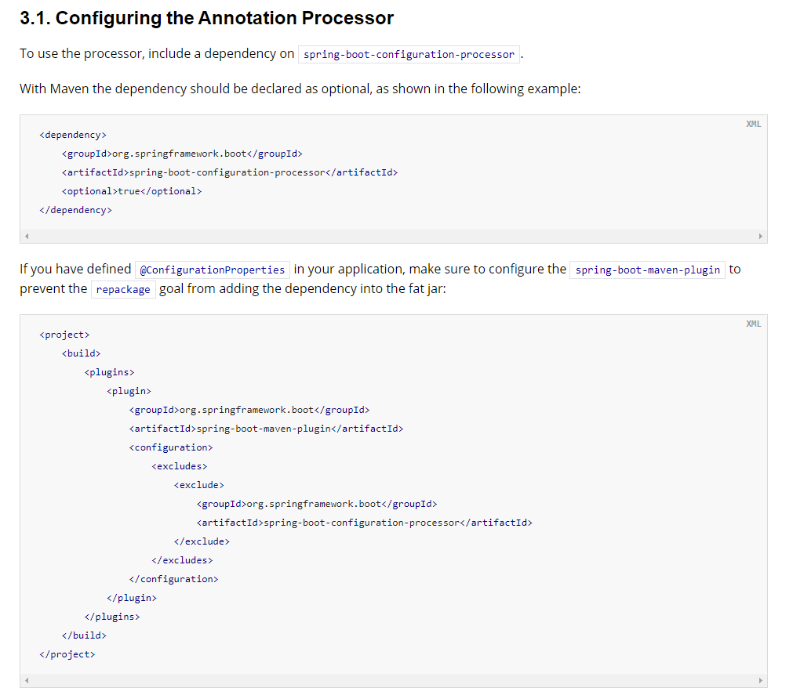

# 需求




# 一、创建项目

## 1、创建模块

service-sms

## 2、配置 pom.xml

```xml
<dependencies>
    <dependency>
        <groupId>com.atguigu</groupId>
        <artifactId>service-base</artifactId>
        <version>0.0.1-SNAPSHOT</version>
    </dependency>
    <dependency>
        <groupId>org.springframework.boot</groupId>
        <artifactId>spring-boot-starter-web</artifactId>
    </dependency>
    <!--lombok用来简化实体类：需要安装lombok插件-->
    <dependency>
        <groupId>org.projectlombok</groupId>
        <artifactId>lombok</artifactId>
    </dependency>
    <!--阿里云短信-->
    <dependency>
        <groupId>com.aliyun</groupId>
        <artifactId>aliyun-java-sdk-core</artifactId>
    </dependency>
</dependencies>
```

## 3、application.yml

resources目录下创建文件

```yaml
server:
  port: 8120 # 服务端口
spring:
  profiles:
    active: dev # 环境设置
  application:
    name: service-sms # 服务名
  #spring:
  redis:
    host: 192.168.100.100
    port: 6379
    database: 0
    password: 123456 #默认为空
    timeout: 3000ms #最大等待时间，超时则抛出异常，否则请求一直等待
    lettuce:
      pool:
        max-active: 20  #最大连接数，负值表示没有限制，默认8
        max-wait: -1    #最大阻塞等待时间，负值表示没限制，默认-1
        max-idle: 8     #最大空闲连接，默认8
        min-idle: 0     #最小空闲连接，默认0
#阿里云短信
aliyun:
  sms:
    region-id: cn-hangzhou
    key-id: 你的keyid
    key-secret: 你的keysecret
    template-code: 你的短信模板code
    sign-name: 你的短信模板签名
```

## 4、logback-spring.xml 

## 5、创建SpringBoot启动类

```java
package com.atguigu.srb.sms;
@SpringBootApplication
@ComponentScan({"com.atguigu.srb", "com.atguigu.common"})
public class ServiceSmsApplication {
    
    public static void main(String[] args) {
        SpringApplication.run(ServiceSmsApplication.class, args);
    }
}
```

# 二、自定义配置

## 1、从配置文件读取常量

创建常量读取工具类：SmsProperties.java

```java
package com.atguigu.srb.sms.util;
@Setter
@Getter //idea2020.2.3版配置文件自动提示需要这个
@Component
//注意prefix要写到最后一个 "." 符号之前
//调用setter为成员赋值
@ConfigurationProperties(prefix = "aliyun.sms")
public class SmsProperties implements InitializingBean {
    private String regionId;
    private String keyId;
    private String keySecret;
    private String templateCode;
    private String signName;
    public static String REGION_Id;
    public static String KEY_ID;
    public static String KEY_SECRET;
    public static String TEMPLATE_CODE;
    public static String SIGN_NAME;
    //当私有成员被赋值后，此方法自动被调用，从而初始化常量
    @Override
    public void afterPropertiesSet() throws Exception {
        REGION_Id = regionId;
        KEY_ID = keyId;
        KEY_SECRET = keySecret;
        TEMPLATE_CODE = templateCode;
        SIGN_NAME = signName;
    }
}
```

**Idea报告如下错误信息**（不影响程序的编译和运行）：
**解决方案参考文档：****解决步骤：**

step1：添加依赖


```xml
<!--  配置文件处理器  -->
<!--让自定义的配置在application.yaml进行自动提示-->
<dependency>
    <groupId>org.springframework.boot</groupId>
    <artifactId>spring-boot-configuration-processor</artifactId>
    <optional>true</optional>
</dependency>
```
step2：启动processor

step3：重新编译模块step4：这样就可以在yml文件中有自定义配置的提示信息啦


## 2、测试工具类

创建测试类 UtilsTests，测试配置信息是否能正常获取
```java
package com.atguigu.srb.sms;
@SpringBootTest
@RunWith(SpringRunner.class)
public class UtilsTests {
    @Test
    public void testProperties(){
        System.out.println(SmsProperties.KEY_ID);
        System.out.println(SmsProperties.KEY_SECRET);
        System.out.println(SmsProperties.REGION_Id);
    }
}
```

# 三、发送短信 

## 1、短信发送业务 

接口：创建 SmsService
```java
package com.atguigu.srb.sms.service;
public interface SmsService {
    void send(String mobile, String templateCode, Map<String,Object> param);
}
```

实现：创建 SmsServiceImpl
```java
package com.atguigu.srb.sms.service.impl;
@Service
@Slf4j
public class SmsServiceImpl implements SmsService {
    @Override
    public void send(String mobile, String templateCode, Map<String,Object> param) {
        //创建远程连接客户端对象
        DefaultProfile profile = DefaultProfile.getProfile(
                SmsProperties.REGION_Id,
                SmsProperties.KEY_ID,
                SmsProperties.KEY_SECRET);
        IAcsClient client = new DefaultAcsClient(profile);
        //创建远程连接的请求参数
        CommonRequest request = new CommonRequest();
        request.setSysMethod(MethodType.POST);
        request.setSysDomain("dysmsapi.aliyuncs.com");
        request.setSysVersion("2017-05-25");
        request.setSysAction("SendSms");
        request.putQueryParameter("RegionId", SmsProperties.REGION_Id);
        request.putQueryParameter("PhoneNumbers", mobile);
        request.putQueryParameter("SignName", SmsProperties.SIGN_NAME);
        request.putQueryParameter("TemplateCode", templateCode);
        Gson gson = new Gson();
        String json = gson.toJson(param);
        request.putQueryParameter("TemplateParam", json);
        try {
            //使用客户端对象携带请求对象发送请求并得到响应结果
            CommonResponse response = client.getCommonResponse(request);
            boolean success = response.getHttpResponse().isSuccess();
            //ALIYUN_RESPONSE_FAIL(-501, "阿里云响应失败"),
            Assert.isTrue(success, ResponseEnum.ALIYUN_RESPONSE_FAIL);
            String data = response.getData();
            HashMap<String, String> resultMap = gson.fromJson(data, HashMap.class);
            String code = resultMap.get("Code");
            String message = resultMap.get("Message");
            log.info("阿里云短信发送响应结果：");
            log.info("code：" + code);
            log.info("message：" + message);
            //ALIYUN_SMS_LIMIT_CONTROL_ERROR(-502, "短信发送过于频繁"),//业务限流
            Assert.notEquals("isv.BUSINESS_LIMIT_CONTROL", code, ResponseEnum.ALIYUN_SMS_LIMIT_CONTROL_ERROR);
            //ALIYUN_SMS_ERROR(-503, "短信发送失败"),//其他失败
            Assert.equals("OK", code, ResponseEnum.ALIYUN_SMS_ERROR);
        } catch (ServerException e) {
            log.error("阿里云短信发送SDK调用失败：");
            log.error("ErrorCode=" + e.getErrCode());
            log.error("ErrorMessage=" + e.getErrMsg());
            throw new BusinessException(ResponseEnum.ALIYUN_SMS_ERROR , e);
        } catch (ClientException e) {
            log.error("阿里云短信发送SDK调用失败：");
            log.error("ErrorCode=" + e.getErrCode());
            log.error("ErrorMessage=" + e.getErrMsg());
            throw new BusinessException(ResponseEnum.ALIYUN_SMS_ERROR , e);
        }
    }
}
```

## 2、引入工具类 
```java
guigu-common中创建util包，引入工具类：
RandomUtils.java：生成四位或六位的验证码
RegexValidateUtils.java：常用正则表达式验证，这里提供了手机号码验证
```

## 3、创建controller
创建controller.api包，创建类ApiSmsController
```java
package com.atguigu.srb.sms.controller.api;
@RestController
@RequestMapping("/api/sms")
@Api(tags = "短信管理")
@CrossOrigin //跨域
@Slf4j
public class ApiSmsController {
    @Resource
    private SmsService smsService;
    @Resource
    private RedisTemplate redisTemplate;
    @ApiOperation("获取验证码")
    @GetMapping("/send/{mobile}")
    public R send(
            @ApiParam(value = "手机号", required = true)
            @PathVariable String mobile){
        //MOBILE_NULL_ERROR(-202, "手机号不能为空"),
        Assert.notEmpty(mobile, ResponseEnum.MOBILE_NULL_ERROR);
        //MOBILE_ERROR(-203, "手机号不正确"),
        Assert.isTrue(RegexValidateUtils.checkCellphone(mobile), ResponseEnum.MOBILE_ERROR);
        //生成验证码
        String code = RandomUtils.getFourBitRandom();
        //组装短信模板参数
        Map<String,Object> param = new HashMap<>();
        param.put("code", code);
        //发送短信
        smsService.send(mobile, SmsProperties.TEMPLATE_CODE, param);
        //将验证码存入redis
        redisTemplate.opsForValue().set("srb:sms:code:" + mobile, code, 5, TimeUnit.MINUTES);
        return R.ok().message("短信发送成功");
    }
}
```

# 四、配置Swagger
## 1、添加配置
service-base中添加网站端api的配置
```java
    @Bean
    public Docket apiConfig(){
        return new Docket(DocumentationType.SWAGGER_2)
                .groupName("api")
                .apiInfo(apiInfo())
                .select()
                //只显示admin路径下的页面
                .paths(Predicates.and(PathSelectors.regex("/api/.*")))
                .build();
    }
    private ApiInfo apiInfo(){
        return new ApiInfoBuilder()
                .title("尚融宝-API文档")
                .description("本文档描述了尚融宝接口")
                .version("1.0")
                .contact(new Contact("Helen", "http://atguigu.com", "55317332@qq.com"))
                .build();
    }
```

## 2、测试
测试正确发送
测试手机号码不正确
测试业务限流