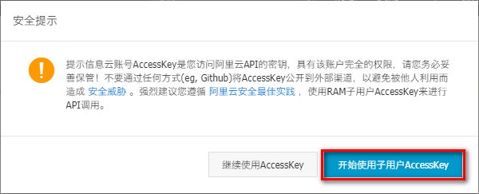
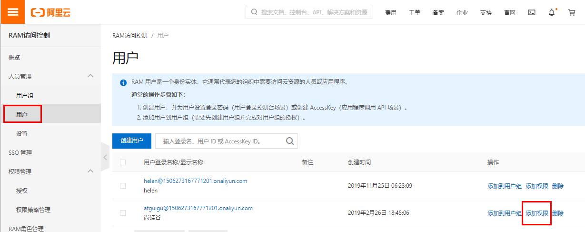

# 一、开通“对象存储OSS”服务

为了解决海量数据存储与弹性扩容，项目中我们采用云存储的解决方案- 阿里云OSS。 

## 1、开通“对象存储OSS”服务

## 2、进入管理控制台

# 二、控制台使用

## 1、创建Bucket

命名：srb-file

读写权限：公共读

## 2、上传默认头像

创建文件夹avatar，上传默认的用户头像

# 三、使用RAM子用户

## 1、进入子用户管理页面

## 2、添加用户

## 3、获取子用户key

AccessKeyId, AccessKeySecret

## 4、设置用户权限

AliyunOSSFullAccess

