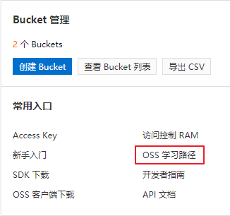
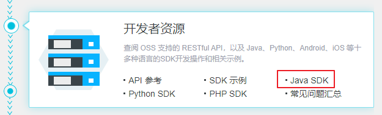
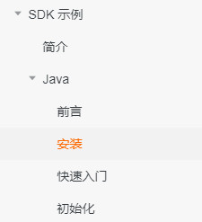
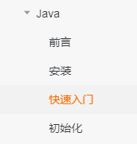

# 一、使用SDK

在OSS的概览页右下角找到“Bucket管理”，点击“OSS学习路径”



点击“Java SDK”进入SDK开发文档



# 二、创建测试项目

## 1、创建Maven项目

com.atguigu

aliyun-oss

## 2、配置pom



```xml
<dependencies>
    <!--aliyunOSS-->
    <dependency>
        <groupId>com.aliyun.oss</groupId>
        <artifactId>aliyun-sdk-oss</artifactId>
        <version>3.10.2</version>
    </dependency>
    <dependency>
        <groupId>junit</groupId>
        <artifactId>junit</artifactId>
        <version>4.12</version>
    </dependency>
</dependencies>
```

# 三、测试用例

## 1、创建Bucket



```java
package com.atguigu.aliyunoss;
public class OSSTest {
    // Endpoint以杭州为例，其它Region请按实际情况填写。
    String endpoint = "your endpoint";
    // 阿里云主账号AccessKey拥有所有API的访问权限，风险很高。强烈建议您创建并使用RAM账号进行API访问或日常运维，请登录 https://ram.console.aliyun.com 创建RAM账号。
    String accessKeyId = "your accessKeyId";
    String accessKeySecret = "your accessKeySecret";
    String bucketName = "srb-file";
    @Test
    public void testCreateBucket() {
        
        // 创建OSSClient实例。
        OSS ossClient = new OSSClientBuilder().build(endpoint, accessKeyId, accessKeySecret);
        // 创建存储空间。
        ossClient.createBucket(bucketName);
        // 关闭OSSClient。
        ossClient.shutdown();
    }
}
```

## 2、判断bucket是否存在

```java
@Test
public void testExist() {
    // 创建OSSClient实例。
    OSS ossClient = new OSSClientBuilder().build(endpoint, accessKeyId, accessKeySecret);
    boolean exists = ossClient.doesBucketExist(bucketName);
    System.out.println(exists);
    // 关闭OSSClient。
    ossClient.shutdown();
}
```

## 3、设置bucket访问权限

```java
@Test
public void testAccessControl() {
    // 创建OSSClient实例。
    OSS ossClient = new OSSClientBuilder().build(endpoint, accessKeyId, accessKeySecret);
    // 设置存储空间的访问权限为：公共读。
    ossClient.setBucketAcl(bucketName, CannedAccessControlList.PublicRead);
    // 关闭OSSClient。
    ossClient.shutdown();
}
```