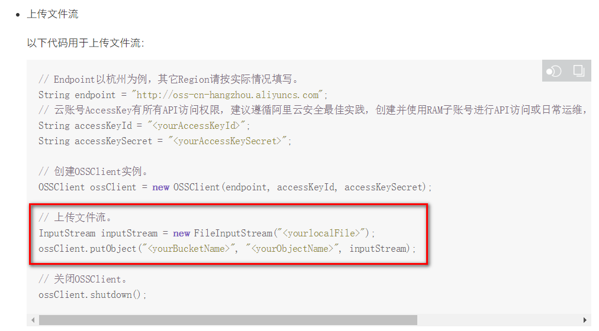

# 一、新建云存储微服务
## 1、创建模块
service-oss

## 2、配置pom.xml
```xml
<dependencies>
    <dependency>
        <groupId>com.atguigu</groupId>
        <artifactId>service-base</artifactId>
        <version>0.0.1-SNAPSHOT</version>
    </dependency>
    <dependency>
        <groupId>org.springframework.boot</groupId>
        <artifactId>spring-boot-starter-web</artifactId>
    </dependency>
    
    <!--lombok用来简化实体类：需要安装lombok插件-->
    <dependency>
        <groupId>org.projectlombok</groupId>
        <artifactId>lombok</artifactId>
    </dependency>
    <!--aliyunOSS-->
    <dependency>
        <groupId>com.aliyun.oss</groupId>
        <artifactId>aliyun-sdk-oss</artifactId>
    </dependency>
    <!-- 日期工具栏依赖 -->
    <dependency>
        <groupId>joda-time</groupId>
        <artifactId>joda-time</artifactId>
    </dependency>
    <!--让自定义的配置在application.yaml进行自动提示-->
    <dependency>
        <groupId>org.springframework.boot</groupId>
        <artifactId>spring-boot-configuration-processor</artifactId>
        <optional>true</optional>
    </dependency>
</dependencies>
```

## 3、配置application.yml
```yaml
server:
  port: 8130 # 服务端口
spring:
  profiles:
    active: dev # 环境设置
  application:
    name: service-oss # 服务名
aliyun:
  oss:
    endpoint: 你的endponit
    keyId: 你的阿里云keyid
    keySecret: 你的阿里云keysecret
    bucketName: srb-file
```

## 4、logback-spring.xml

修改日志路径为 srb_log/oss

## 5、创建启动类
创建ServiceOssApplication.java
```java
package com.atguigu.srb.oss;
@SpringBootApplication
@ComponentScan({"com.atguigu.srb", "com.atguigu.common"})
public class ServiceOssApplication {
    public static void main(String[] args) {
        SpringApplication.run(ServiceOssApplication.class, args);
    }
}
```

## 6、启动项目


# 二、实现文件上传

## 1、从配置文件读取常量
创建常量读取工具类：OssProperties.java
```java
package com.atguigu.srb.oss.util;
@Setter
@Getter
@Component
@ConfigurationProperties(prefix = "aliyun.oss")
public class OssProperties implements InitializingBean {
    private String endpoint;
    private String keyId;
    private String keySecret;
    private String bucketName;
    public static String ENDPOINT;
    public static String KEY_ID;
    public static String KEY_SECRET;
    public static String BUCKET_NAME;
    //当私有成员被赋值后，此方法自动被调用，从而初始化常量
    @Override
    public void afterPropertiesSet() throws Exception {
        ENDPOINT = endpoint;
        KEY_ID = keyId;
        KEY_SECRET = keySecret;
        BUCKET_NAME = bucketName;
    }
}
```

## 2、文件上传业务
创建Service接口：FileService.java
```java
package com.atguigu.srb.oss.service;
public interface FileService {
    /**
     * 文件上传至阿里云
     */
    String upload(InputStream inputStream, String module, String fileName);
}
```

实现：FileServiceImpl.java
参考SDK中的：Java->上传文件->简单上传->流式上传->上传文件流

```java
package com.atguigu.srb.oss.service.impl;
@Service
public class FileServiceImpl implements FileService {
    /**
     * 文件上传至阿里云
     */
    @Override
    public String upload(InputStream inputStream, String module, String fileName) {
        // 创建OSSClient实例。
        OSS ossClient = new OSSClientBuilder().build(
                OssProperties.ENDPOINT,
                OssProperties.KEY_ID,
                OssProperties.KEY_SECRET);
        //判断oss实例是否存在：如果不存在则创建，如果存在则获取
        if(!ossClient.doesBucketExist(OssProperties.BUCKET_NAME)){
            //创建bucket
            ossClient.createBucket(OssProperties.BUCKET_NAME);
            //设置oss实例的访问权限：公共读
            ossClient.setBucketAcl(OssProperties.BUCKET_NAME, CannedAccessControlList.PublicRead);
        }
        //构建日期路径：avatar/2019/02/26/文件名
        String folder = new DateTime().toString("yyyy/MM/dd");
        //文件名：uuid.扩展名
        fileName = UUID.randomUUID().toString() + fileName.substring(fileName.lastIndexOf("."));
        //文件根路径
        String key = module + "/" + folder + "/" + fileName;
        //文件上传至阿里云
        ossClient.putObject(OssProperties.BUCKET_NAME, key, inputStream);
        // 关闭OSSClient。
        ossClient.shutdown();
        //阿里云文件绝对路径
        return "https://" + OssProperties.BUCKET_NAME + "." + OssProperties.ENDPOINT + "/" + key;
    }
}
```

## 3、控制层
创建controller.admin：FileController.java 
```java
package com.atguigu.srb.oss.controller.api;
@Api(tags = "阿里云文件管理")
@CrossOrigin //跨域
@RestController
@RequestMapping("/api/oss/file")
public class FileController {
    @Resource
    private FileService fileService;
    /**
     * 文件上传
     */
    @ApiOperation("文件上传")
    @PostMapping("/upload")
    public R upload(
            @ApiParam(value = "文件", required = true)
            @RequestParam("file") MultipartFile file,
            @ApiParam(value = "模块", required = true)
            @RequestParam("module") String module)  {
        try {
            InputStream inputStream = file.getInputStream();
            String originalFilename = file.getOriginalFilename();
            String uploadUrl = fileService.upload(inputStream, module, originalFilename);
            //返回r对象
            return R.ok().message("文件上传成功").data("url", uploadUrl);
        } catch (IOException e) {
            throw new BusinessException(ResponseEnum.UPLOAD_ERROR, e);
        }
    }
}
```

## 4、Swagger测试


# 三、实现文件删除

## 1、业务层
Service接口：FileService.java
```java
/**
     * 根据路径删除文件
     * @param url
     */
void removeFile(String url);
```

实现：FileServiceImpl.java
```java
/**
     * 根据路径删除文件
     * @param url
     */
@Override
public void removeFile(String url) {
    // 创建OSSClient实例。
    OSS ossClient = new OSSClientBuilder().build(
        OssProperties.ENDPOINT,
        OssProperties.KEY_ID,
        OssProperties.KEY_SECRET);
    //文件名（服务器上的文件路径）
    String host = "https://" + OssProperties.BUCKET_NAME + "." + OssProperties.ENDPOINT + "/";
    String objectName = url.substring(host.length());
    // 删除文件。
    ossClient.deleteObject(OssProperties.BUCKET_NAME, objectName);
    // 关闭OSSClient。
    ossClient.shutdown();
}
```

## 2、控制层 
```java
@ApiOperation("删除OSS文件")
@DeleteMapping("/remove")
public R remove(
    @ApiParam(value = "要删除的文件路径", required = true)
    @RequestParam("url") String url) {
    fileService.removeFile(url);
    return R.ok().message("删除成功");
}
```