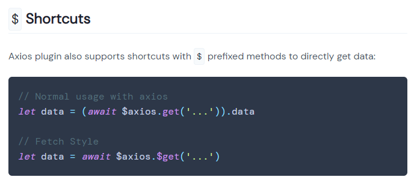

# 一、整合axios 

我们可以引入Nuxt中封装的axios组件，功能更多，编程更简单

参考：https://axios.nuxtjs.org/

## 1、配置

nuxt.config.js

```js
module.exports = {
  modules: [
    '@nuxtjs/axios', //引入axios模块
  ]
}
```

## 2、客户端渲染

在pages/index.vue中添加如下代码

```vue
<script>
export default {
  data() {
    return {
      ip: null,
    }
  },
  created() {
    this.$axios.$get('http://icanhazip.com').then((response) => {
      console.log(response)
      this.ip = response
    })
  },
}
</script>
```

template中显示ip 

```vue
{{ ip }}
```

## 3、服务器端渲染

```js
asyncData({ $axios }) {
    console.log('asyncData')
    $axios.$get('http://icanhazip.com').then((response) => {
        console.log('asyncData', response)
    })
    return {
        ip: response,  //这种写法的问题是：前面的远程调用是异步的，无法在这获取到response
    }
},
```

可以将异步调用改为同步调用，可以使用async 和 await关键字使远程调用变为同步，同时让程序更简洁

```js
async asyncData({ $axios }) {
    console.log('asyncData')
    let response = await $axios.$get('http://icanhazip.com')
    return {
        message1: response,
    }
},
```

## 4、axios全局选项
在nuxt.config.js中添加如下配置 
```js
axios: {
    // Axios options here
    baseURL: 'http://icanhazip.com',
},
```

asyncData中直接写相对路径
```js
let response = await $axios.$get('/')
```

## 5、拦截器

创建拦截器插件 plugins/axios.js
```js
export default function({ $axios, redirect }) {
  $axios.onRequest((config) => {
    console.log('Making request to ' + config.url)
  })
  $axios.onResponse((response) => {
    console.log('Making resposne')
    return response
  })
  $axios.onError((error) => {
    console.log(error) // for debug
  })
}
```

nuxt.config.js中配置插件
```js
plugins: [
    '~/plugins/axios'
]
```

## 6、$axios.$get和$axios.get
注意以下$axios访问data的快捷方式问题：
参考地址 https://axios.nuxtjs.org/usage
