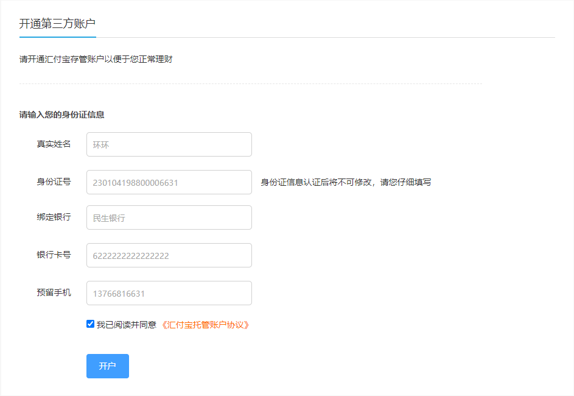
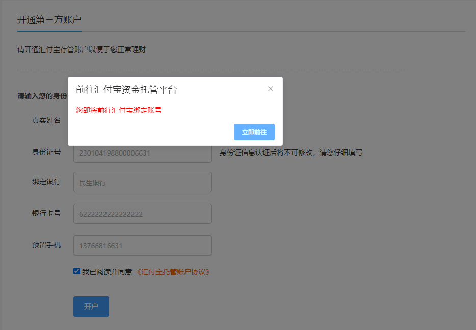
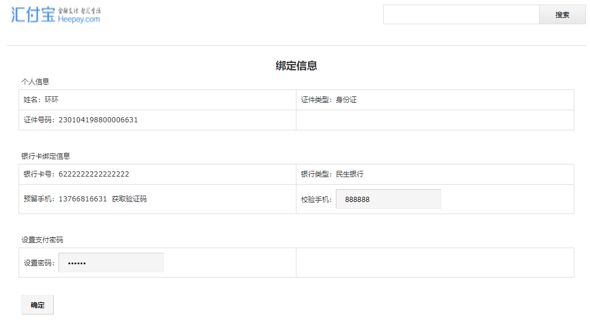
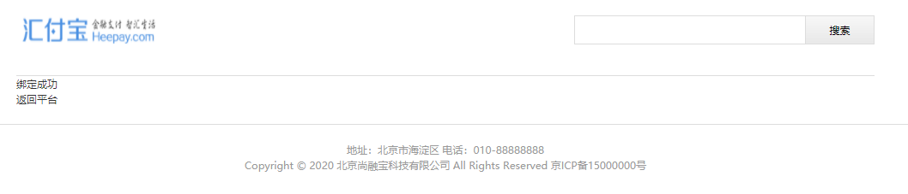

# 一、绑定步骤总结

step1：用户在个人中心点击 “立即开通” (http://localhost:3000/user/bind)

step2：尚融宝展示账户绑定页面



step3：用户填写基本信息（注意：身份证必须是尚未开户），点击“开户”按钮

step4：尚融宝后台创建用户绑定信息（新建user_bind记录）

step5：跳转到汇付宝页面（资金托管接口调用）



step6：汇付宝验证用户身份、用户设置交易密码



step7：汇付宝创建绑定账号（新建user_bind和user_account记录）

step8：异步回调：

尚融宝user_bind表更新bind_code字段、status字段

尚融宝user_info表更新 bind_code字段、name字段、idCard字段、bind_status字段

step9：用户点击“返回平台”，返回尚融宝



# 二、尚融宝回调接口

## 1、controller

UserBindController中创建回调方法

```java
@ApiOperation("账户绑定异步回调")
@PostMapping("/notify")
public String notify(HttpServletRequest request) {
    Map<String, Object> paramMap = RequestHelper.switchMap(request.getParameterMap());
    log.info("用户账号绑定异步回调：" + JSON.toJSONString(paramMap));
    //校验签名
    if(!RequestHelper.isSignEquals(paramMap)) {
        log.error("用户账号绑定异步回调签名错误：" + JSON.toJSONString(paramMap));
        return "fail";
    }
    //修改绑定状态
    userBindService.notify(paramMap);
    return "success";
}
```

## 2、service

接口：UserBindService

```java
void notify(Map<String, Object> paramMap);
```

实现：UserBindServiceImpl

```java
@Resource
private UserInfoMapper userInfoMapper;
@Override
@Transactional(rollbackFor = Exception.class)
public void notify(Map<String, Object> paramMap) {
    String bindCode = (String)paramMap.get("bindCode");
    //会员id
    String agentUserId = (String)paramMap.get("agentUserId");
    //根据user_id查询user_bind记录
    QueryWrapper<UserBind> userBindQueryWrapper = new QueryWrapper<>();
    userBindQueryWrapper.eq("user_id", agentUserId);
    //更新用户绑定表
    UserBind userBind = baseMapper.selectOne(userBindQueryWrapper);
    userBind.setBindCode(bindCode);
    userBind.setStatus(UserBindEnum.BIND_OK.getStatus());
    baseMapper.updateById(userBind);
    //更新用户表
    UserInfo userInfo = userInfoMapper.selectById(agentUserId);
    userInfo.setBindCode(bindCode);
    userInfo.setName(userBind.getName());
    userInfo.setIdCard(userBind.getIdCard());
    userInfo.setBindStatus(UserBindEnum.BIND_OK.getStatus());
    userInfoMapper.updateById(userInfo);
}
```