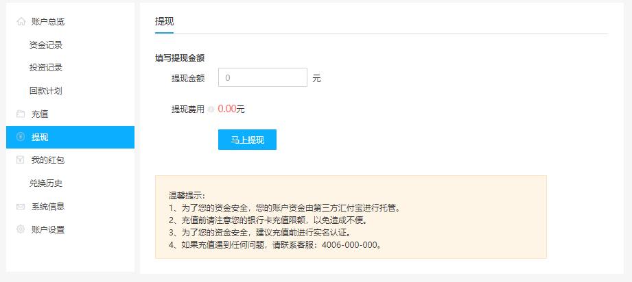
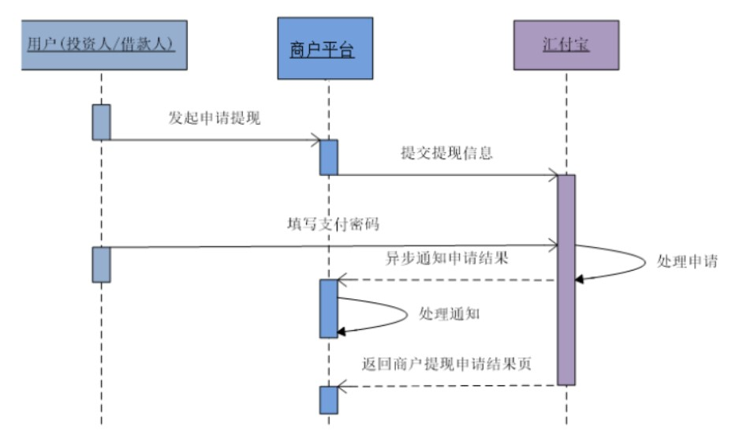

# 需求

放款成功后，借款人可以申请提现。
参考《汇付宝商户账户技术文档》3.15用户申请提现


# 一、前端整合
pages/user/withdraw.vue
```js
<script>
export default {
  data() {
    return {
      fetchAmt: 0,
    }
  },
  methods: {
    commitWithdraw() {
      this.$alert(
        '<div style="size: 18px;color: red;">您即将前往汇付宝提现</div>',
        '前往汇付宝资金托管平台',
        {
          dangerouslyUseHTMLString: true,
          confirmButtonText: '立即前往',
          callback: (action) => {
            if (action === 'confirm') {
              this.$axios
                .$post(
                  '/api/core/userAccount/auth/commitWithdraw/' + this.fetchAmt
                )
                .then((response) => {
                  document.write(response.data.formStr)
                })
            }
          },
        }
      )
    },
  },
}
</script>
```

# 二、提现接口
## 1、Controller
UserAccountController 
```java
@ApiOperation("用户提现")
@PostMapping("/auth/commitWithdraw/{fetchAmt}")
public R commitWithdraw(
    @ApiParam(value = "金额", required = true)
    @PathVariable BigDecimal fetchAmt, HttpServletRequest request) {
    String token = request.getHeader("token");
    Long userId = JwtUtils.getUserId(token);
    String formStr = userAccountService.commitWithdraw(fetchAmt, userId);
    return R.ok().data("formStr", formStr);
}
```

## 2、Service
接口：UserAccountService
```java
String commitWithdraw(BigDecimal fetchAmt, Long userId);
```

实现：UserAccountServiceImpl
```java
@Resource
private UserBindService userBindService;
@Resource
private UserAccountService userAccountService;
@Override
public String commitWithdraw(BigDecimal fetchAmt, Long userId) {
    //账户可用余额充足：当前用户的余额 >= 当前用户的提现金额
    BigDecimal amount = userAccountService.getAccount(userId);//获取当前用户的账户余额
    Assert.isTrue(amount.doubleValue() >= fetchAmt.doubleValue(),
                  ResponseEnum.NOT_SUFFICIENT_FUNDS_ERROR);
    String bindCode = userBindService.getBindCodeByUserId(userId);
    Map<String, Object> paramMap = new HashMap<>();
    paramMap.put("agentId", HfbConst.AGENT_ID);
    paramMap.put("agentBillNo", LendNoUtils.getWithdrawNo());
    paramMap.put("bindCode", bindCode);
    paramMap.put("fetchAmt", fetchAmt);
    paramMap.put("feeAmt", new BigDecimal(0));
    paramMap.put("notifyUrl", HfbConst.WITHDRAW_NOTIFY_URL);
    paramMap.put("returnUrl", HfbConst.WITHDRAW_RETURN_URL);
    paramMap.put("timestamp", RequestHelper.getTimestamp());
    String sign = RequestHelper.getSign(paramMap);
    paramMap.put("sign", sign);
    //构建自动提交表单
    String formStr = FormHelper.buildForm(HfbConst.WITHDRAW_URL, paramMap);
    return formStr;
}
```

# 三、回调接口
## 1、Controller
UserAccountController
```java
@ApiOperation("用户提现异步回调")
@PostMapping("/notifyWithdraw")
public String notifyWithdraw(HttpServletRequest request) {
    Map<String, Object> paramMap = RequestHelper.switchMap(request.getParameterMap());
    log.info("提现异步回调：" + JSON.toJSONString(paramMap));
    //校验签名
    if(RequestHelper.isSignEquals(paramMap)) {
        //提现成功交易
        if("0001".equals(paramMap.get("resultCode"))) {
            userAccountService.notifyWithdraw(paramMap);
        } else {
            log.info("提现异步回调充值失败：" + JSON.toJSONString(paramMap));
            return "fail";
        }
    } else {
        log.info("提现异步回调签名错误：" + JSON.toJSONString(paramMap));
        return "fail";
    }
    return "success";
}
```

## 2、Service
接口：UserAccountService
```java
void notifyWithdraw(Map<String, Object> paramMap);
```

实现：UserAccountServiceImpl
```java
@Transactional(rollbackFor = Exception.class)
@Override
public void notifyWithdraw(Map<String, Object> paramMap) {
    log.info("提现成功");
    String agentBillNo = (String)paramMap.get("agentBillNo");
    boolean result = transFlowService.isSaveTransFlow(agentBillNo);
    if(result){
        log.warn("幂等性返回");
        return;
    }
    String bindCode = (String)paramMap.get("bindCode");
    String fetchAmt = (String)paramMap.get("fetchAmt");
    //根据用户账户修改账户金额
    baseMapper.updateAccount(bindCode, new BigDecimal("-" + fetchAmt), new BigDecimal(0));
    //增加交易流水
    TransFlowBO transFlowBO = new TransFlowBO(
        agentBillNo,
        bindCode,
        new BigDecimal(fetchAmt),
        TransTypeEnum.WITHDRAW,
        "提现");
    transFlowService.saveTransFlow(transFlowBO);
}
```