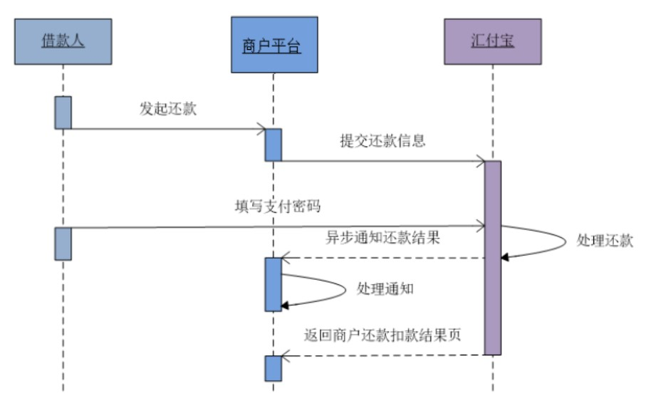

# 需求
放款成功后，会生成借款人的还款计划与出借人的回款计划，然后借款人按照还款计划日期操作还款即可。
参考《汇付宝商户账户技术文档》3.14还款扣款，处理业务即可


# 一、前端整合
## 1、还款按钮
pages/lend/_id.vue
```vue
<td>
    <a href="javascript:" @click="commitReturn(lendReturn.id)">
        {{ lendReturn.status === 0 ? '还款' : '' }}
    </a>
</td>
```

## 2、脚本
pages/lend/_id.vue
```vue
commitReturn(lendReturnId) {
  this.$alert(
    '<div style="size: 18px;color: red;">您即将前往汇付宝确认还款</div>',
    '前往汇付宝资金托管平台',
    {
      dangerouslyUseHTMLString: true,
      confirmButtonText: '立即前往',
      callback: (action) => {
        if (action === 'confirm') {
          this.$axios
            .$post('/api/core/lendReturn/auth/commitReturn/' + lendReturnId)
            .then((response) => {
              document.write(response.data.formStr)
            })
        }
      },
    }
  )
}
```

# 二、还款接口
## 1、Controller
LendReturnController
```java
@ApiOperation("用户还款")
@PostMapping("/auth/commitReturn/{lendReturnId}")
public R commitReturn(
    @ApiParam(value = "还款计划id", required = true)
    @PathVariable Long lendReturnId, HttpServletRequest request) {
    String token = request.getHeader("token");
    Long userId = JwtUtils.getUserId(token);
    String formStr = lendReturnService.commitReturn(lendReturnId, userId);
    return R.ok().data("formStr", formStr);
}
```

## 2、Service
接口：LendReturnService
```java
String commitReturn(Long lendReturnId, Long userId);
```

实现：LendReturnServiceImpl
```java
@Resource
private UserAccountService userAccountService;
@Resource
private LendMapper lendMapper;
@Resource
private UserBindService userBindService;
@Resource
private LendItemReturnService lendItemReturnService;
@Transactional(rollbackFor = Exception.class)
@Override
public String commitReturn(Long lendReturnId, Long userId) {
    //获取还款记录
    LendReturn lendReturn = baseMapper.selectById(lendReturnId);
    //判断账号余额是否充足
    BigDecimal amount = userAccountService.getAccount(userId);
    Assert.isTrue(amount.doubleValue() >= lendReturn.getTotal().doubleValue(),
                  ResponseEnum.NOT_SUFFICIENT_FUNDS_ERROR);
    //获取借款人code
    String bindCode = userBindService.getBindCodeByUserId(userId);
    //获取lend
    Long lendId = lendReturn.getLendId();
    Lend lend = lendMapper.selectById(lendId);
    Map<String, Object> paramMap = new HashMap<>();
    paramMap.put("agentId", HfbConst.AGENT_ID);
    //商户商品名称
    paramMap.put("agentGoodsName", lend.getTitle());
    //批次号
    paramMap.put("agentBatchNo",lendReturn.getReturnNo());
    //还款人绑定协议号
    paramMap.put("fromBindCode", bindCode);
    //还款总额
    paramMap.put("totalAmt", lendReturn.getTotal());
    paramMap.put("note", "");
    //还款明细
    List<Map<String, Object>> lendItemReturnDetailList = lendItemReturnService.addReturnDetail(lendReturnId);
    paramMap.put("data", JSONObject.toJSONString(lendItemReturnDetailList));
    paramMap.put("voteFeeAmt", new BigDecimal(0));
    paramMap.put("notifyUrl", HfbConst.BORROW_RETURN_NOTIFY_URL);
    paramMap.put("returnUrl", HfbConst.BORROW_RETURN_RETURN_URL);
    paramMap.put("timestamp", RequestHelper.getTimestamp());
    String sign = RequestHelper.getSign(paramMap);
    paramMap.put("sign", sign);
    //构建自动提交表单
    String formStr = FormHelper.buildForm(HfbConst.BORROW_RETURN_URL, paramMap);
    return formStr;
}
```

## 3、还款明细Service
根据还款id获取回款列表
LendReturnService接口：
```java
List<Map<String, Object>> addReturnDetail(Long lendReturnId);
```

LendReturnServiceImpl实现：
```java
@Resource
private UserBindService userBindService;
@Resource
private LendItemMapper lendItemMapper;
@Resource
private LendMapper lendMapper;
@Resource
private LendReturnMapper lendReturnMapper;
/**
* 添加还款明细
* @param lendReturnId
*/
@Override
public List<Map<String, Object>> addReturnDetail(Long lendReturnId) {
    //获取还款记录
    LendReturn lendReturn = lendReturnMapper.selectById(lendReturnId);
    //获取标的信息
    Lend lend = lendMapper.selectById(lendReturn.getLendId());
    //根据还款id获取回款列表
    List<LendItemReturn> lendItemReturnList = this.selectLendItemReturnList(lendReturnId);
    List<Map<String, Object>> lendItemReturnDetailList = new ArrayList<>();
    for(LendItemReturn lendItemReturn : lendItemReturnList) {
        LendItem lendItem = lendItemMapper.selectById(lendItemReturn.getLendItemId());
        String bindCode = userBindService.getBindCodeByUserId(lendItem.getInvestUserId());
        Map<String, Object> map = new HashMap<>();
        //项目编号
        map.put("agentProjectCode", lend.getLendNo());
        //出借编号
        map.put("voteBillNo", lendItem.getLendItemNo());
        //收款人（出借人）
        map.put("toBindCode", bindCode);
        //还款金额
        map.put("transitAmt", lendItemReturn.getTotal());
        //还款本金
        map.put("baseAmt", lendItemReturn.getPrincipal());
        //还款利息
        map.put("benifitAmt", lendItemReturn.getInterest());
        //商户手续费
        map.put("feeAmt", new BigDecimal("0"));
        lendItemReturnDetailList.add(map);
    }
    return lendItemReturnDetailList;
}
```

根据还款计划id获取对应的回款计划列表
接口：
```java
List<LendItemReturn> selectLendItemReturnList(Long lendReturnId);
```

实现：
```java
@Override
public List<LendItemReturn> selectLendItemReturnList(Long lendReturnId) {
    QueryWrapper<LendItemReturn> queryWrapper = new QueryWrapper<>();
    queryWrapper.eq("lend_return_id", lendReturnId);
    List<LendItemReturn> lendItemReturnList = baseMapper.selectList(queryWrapper);
    return lendItemReturnList;
}
```

# 三、回调接口
## 1、Controller
LendReturnController
```java
@ApiOperation("还款异步回调")
@PostMapping("/notifyUrl")
public String notifyUrl(HttpServletRequest request) {
    Map<String, Object> paramMap = RequestHelper.switchMap(request.getParameterMap());
    log.info("还款异步回调：" + JSON.toJSONString(paramMap));
    //校验签名
    if(RequestHelper.isSignEquals(paramMap)) {
        if("0001".equals(paramMap.get("resultCode"))) {
            lendReturnService.notify(paramMap);
        } else {
            log.info("还款异步回调失败：" + JSON.toJSONString(paramMap));
            return "fail";
        }
    } else {
        log.info("还款异步回调签名错误：" + JSON.toJSONString(paramMap));
        return "fail";
    }
    return "success";
}
```

## 2、Service
接口：LendReturnService
```java
void notify(Map<String, Object> paramMap);
```

实现：LendReturnServiceImpl
```java
@Resource
private TransFlowService transFlowService;
@Resource
private UserAccountMapper userAccountMapper;
@Resource
private LendItemReturnMapper lendItemReturnMapper;
@Resource
private LendItemMapper lendItemMapper;
@Transactional(rollbackFor = Exception.class)
@Override
public void notify(Map<String, Object> paramMap) {
    log.info("还款成功");
    //还款编号
    String agentBatchNo = (String)paramMap.get("agentBatchNo");
    boolean result = transFlowService.isSaveTransFlow(agentBatchNo);
    if(result){
        log.warn("幂等性返回");
        return;
    }
    //获取还款数据
    String voteFeeAmt = (String)paramMap.get("voteFeeAmt");
    QueryWrapper lendReturnQueryWrapper = new QueryWrapper<LendReturn>();
    lendReturnQueryWrapper.eq("return_no", agentBatchNo);
    LendReturn lendReturn = baseMapper.selectOne(lendReturnQueryWrapper);;
    //更新还款状态
    lendReturn.setStatus(1);
    lendReturn.setFee(new BigDecimal(voteFeeAmt));
    lendReturn.setRealReturnTime(LocalDateTime.now());
    baseMapper.updateById(lendReturn);
    //更新标的信息
    Lend lend = lendMapper.selectById(lendReturn.getLendId());
    //最后一次还款更新标的状态
    if(lendReturn.getLast()) {
        lend.setStatus(LendStatusEnum.PAY_OK.getStatus());
        lendMapper.updateById(lend);
    }
    //借款账号转出金额
    BigDecimal totalAmt = new BigDecimal((String)paramMap.get("totalAmt"));//还款金额
    String bindCode = userBindService.getBindCodeByUserId(lend.getUserId());
    userAccountMapper.updateAccount(bindCode, totalAmt.negate(), new BigDecimal(0));
    //借款人交易流水
    TransFlowBO transFlowBO = new TransFlowBO(
        agentBatchNo,
        bindCode,
        totalAmt,
        TransTypeEnum.RETURN_DOWN,
        "借款人还款扣减，项目编号：" + lend.getLendNo() + "，项目名称：" + lend.getTitle());
    transFlowService.saveTransFlow(transFlowBO);
    //获取回款明细
    List<LendItemReturn> lendItemReturnList = lendItemReturnService.selectLendItemReturnList(lendReturn.getId());
    lendItemReturnList.forEach(item -> {
        //更新回款状态
        item.setStatus(1);
        item.setRealReturnTime(LocalDateTime.now());
        lendItemReturnMapper.updateById(item);
        //更新出借信息
        LendItem lendItem = lendItemMapper.selectById(item.getLendItemId());
        lendItem.setRealAmount(item.getInterest());
        lendItemMapper.updateById(lendItem);
        //投资账号转入金额
        String investBindCode = userBindService.getBindCodeByUserId(item.getInvestUserId());
        userAccountMapper.updateAccount(investBindCode, item.getTotal(), new BigDecimal(0));
        //投资账号交易流水
        TransFlowBO investTransFlowBO = new TransFlowBO(
            LendNoUtils.getReturnItemNo(),
            investBindCode,
            item.getTotal(),
            TransTypeEnum.INVEST_BACK,
            "还款到账，项目编号：" + lend.getLendNo() + "，项目名称：" + lend.getTitle());
        transFlowService.saveTransFlow(investTransFlowBO);
    });
}
```