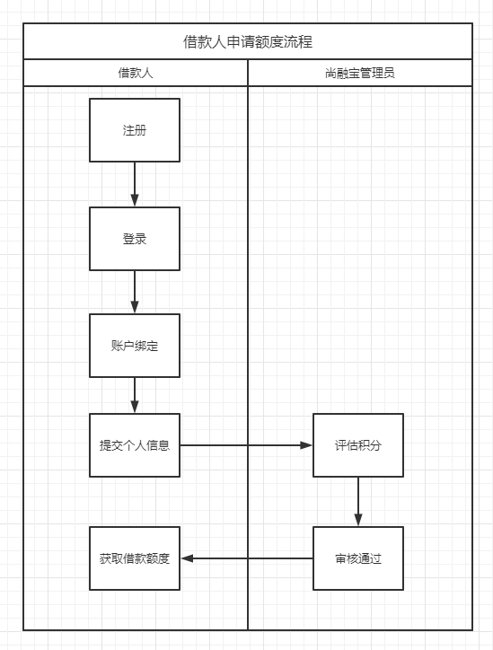
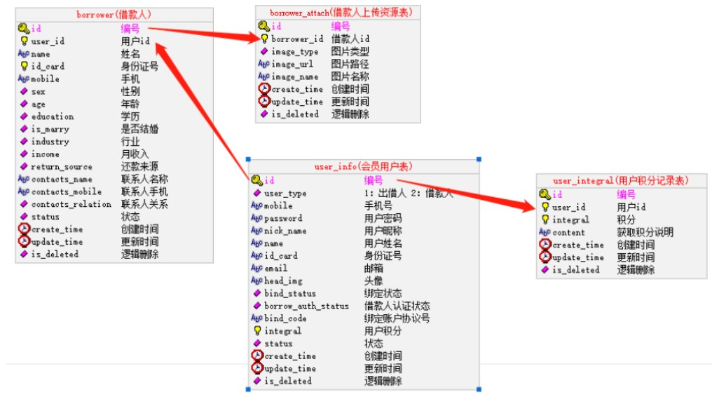
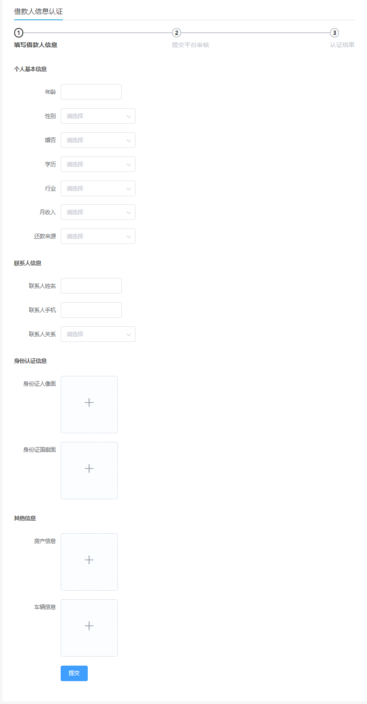
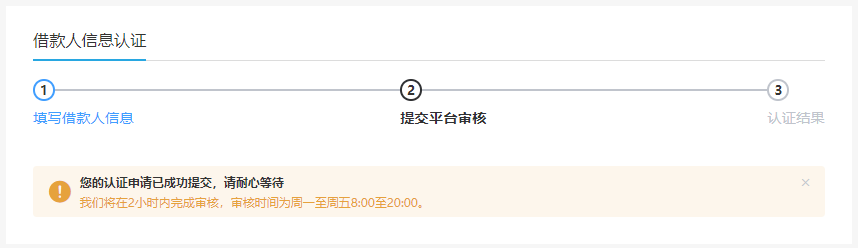
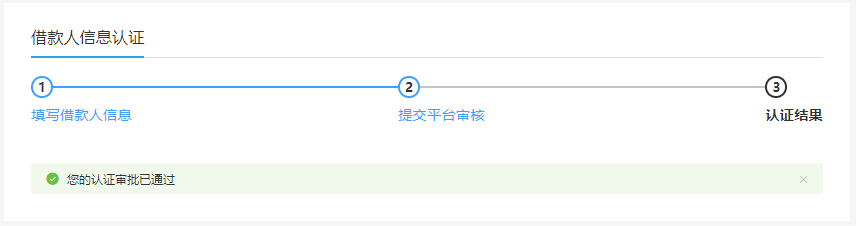
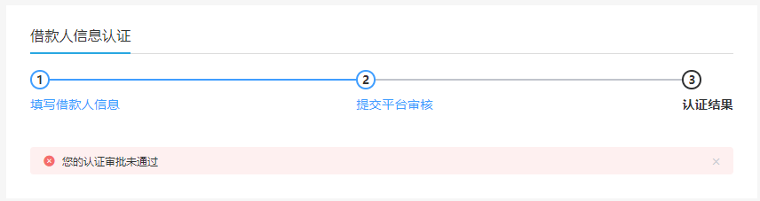

# 一、借款人申请额度

## 1、需求描述

平台管理员根据借款人个人信息设置积分，通过积分规则借款人可以获取额度。

## 2、相关数据库表

# 二、具体步骤

step1：用户在个人中心点击 “立即借款” ([http://localhost:3000/user/borrower](http://localhost:3000/user/bind))

step2：展示借款人信息认证页面

step3：借款人填写信息并提交

step4：展示等待审核页面

step5：平台审核

step6：显示审批结果

