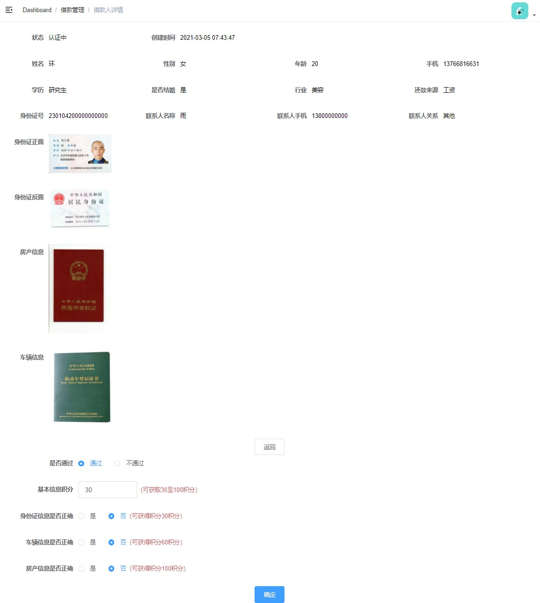

# 需求

**借款人列表**


**额度审批**



额度审批的目标：

(1)在user_integral表中添加积分明细

(2)在user_info表中添加总积分（user_info表中的原始积分 + user_integral表中的积分明细之和 ）

(3)修改borrower表的借款申请审核状态

(4)修改user_info表中的借款申请审核状态

# 一、后端实现 

## 1、创建接口

创建 AdminBorrowerController

```java
package com.atguigu.srb.core.controller.admin;
@Api(tags = "借款人管理")
@RestController
@RequestMapping("/admin/core/borrower")
@Slf4j
public class AdminBorrowerController {
    @Resource
    private BorrowerService borrowerService;
    @ApiOperation("获取借款人分页列表")
    @GetMapping("/list/{page}/{limit}")
    public R listPage(
            @ApiParam(value = "当前页码", required = true)
            @PathVariable Long page,
            @ApiParam(value = "每页记录数", required = true)
            @PathVariable Long limit,
            @ApiParam(value = "查询关键字", required = false)
            @RequestParam String keyword) { 
        //这里的@RequestParam其实是可以省略的，但是在目前的swagger版本中（2.9.2）不能省略，
        //否则默认将没有注解的参数解析为body中的传递的数据
        Page<Borrower> pageParam = new Page<>(page, limit);
        IPage<Borrower> pageModel = borrowerService.listPage(pageParam, keyword);
        return R.ok().data("pageModel", pageModel);
    }
}
```

## 2、创建Service方法

接口：BorrowerService

```java
IPage<Borrower> listPage(Page<Borrower> pageParam, String keyword);
```

实现：BorrowerServiceImpl

```java
@Override
public IPage<Borrower> listPage(Page<Borrower> pageParam, String keyword) {
    QueryWrapper<Borrower> borrowerQueryWrapper = new QueryWrapper<>();
    if(StringUtils.isEmpty(keyword)){
        return baseMapper.selectPage(pageParam, null);
    }
    borrowerQueryWrapper.like("name", keyword)
        .or().like("id_card", keyword)
        .or().like("mobile", keyword)
        .orderByDesc("id");
    return baseMapper.selectPage(pageParam, borrowerQueryWrapper);
}
```

# 二、前端实现

## 1、创建页面组件

创建 src/views/core/borrower/list.vue

```vue
<template>
  <div class="app-container">
    借款用户列表
  </div>
</template>
<script>
export default {
  
}
</script>
```

创建 src/views/core/borrower/detail.vue

```vue
<template>
  <div class="app-container">
    借款用户详情
  </div>
</template>
<script>
export default {
  
}
</script>
```

## 2、配置路由

src/router/index.js

```js
 {
    path: '/core/borrower',
    component: Layout,
    name: 'coreBorrower',
    meta: { title: '借款管理', icon: 'el-icon-s-unfold' },
    alwaysShow: true,
    children: [
      {
        path: 'list',
        name: 'coreBorrowerList',
        component: () => import('@/views/core/borrower/list'),
        meta: { title: '借款人列表' }
      },
      {
        path: 'detail/:id',
        name: 'coreBorrowerDetail',
        component: () => import('@/views/core/borrower/detail'),
        meta: { title: '借款人详情' },
        hidden: true
      }
    ]
 },
```

## 3、定义api

创建 src/api/core/borrower.js

 

```
import request from '@/utils/request'
export default {
  getPageList(page, limit, keyword) {
    return request({
      url: `/admin/core/borrower/list/${page}/${limit}`,
      method: 'get',
      params: {keyword}
    })
  }
}
```

## 4、页面模板

src/views/core/borrower/list.vue 

```vue
<template>
  <div class="app-container">
    <!--查询表单-->
    <el-form :inline="true">
      <el-form-item label="关键字">
        <el-input v-model="keyword" placeholder="姓名/手机/身份证" />
      </el-form-item>
      <el-button type="primary" icon="el-icon-search" @click="fetchData()">
        查询
      </el-button>
      <el-button type="default" @click="resetData()">
        清空
      </el-button>
    </el-form>
    <!-- 列表 -->
    <el-table :data="list" stripe>
      <el-table-column label="序号" width="70" align="center">
        <template slot-scope="scope">
          {{ (page - 1) * limit + scope.$index + 1 }}
        </template>
      </el-table-column>
      <el-table-column prop="name" label="姓名" />
      <el-table-column prop="mobile" label="手机" />
      <el-table-column prop="idCard" label="身份证号" width="200" />
      <el-table-column label="性别" width="80">
        <template slot-scope="scope">
          {{ scope.row.sex === 1 ? '男' : '女' }}
        </template>
      </el-table-column>
      <el-table-column prop="age" label="年龄" width="80" />
      <el-table-column label="是否结婚" width="120">
        <template slot-scope="scope">
          {{ scope.row.marry ? '是' : '否' }}
        </template>
      </el-table-column>
      <el-table-column label="状态" width="100">
        <template slot-scope="scope">
          <el-tag v-if="scope.row.status === 0" type="info" size="mini">
            未认证
          </el-tag>
          <el-tag v-if="scope.row.status === 1" type="warning" size="mini">
            认证中
          </el-tag>
          <el-tag v-if="scope.row.status === 2" type="success" size="mini">
            认证通过
          </el-tag>
          <el-tag v-if="scope.row.status === -1" type="danger" size="mini">
            认证失败
          </el-tag>
        </template>
      </el-table-column>
      <el-table-column prop="createTime" label="申请时间" width="160" />
      <el-table-column label="操作" width="200" align="center">
        <template slot-scope="scope">
          <router-link :to="'/core/borrower/detail/' + scope.row.id">
            <el-button v-if="scope.row.status === 1" type="warning" size="mini">
              审批
            </el-button>
            <el-button v-else type="primary" size="mini">
              查看
            </el-button>
          </router-link>
        </template>
      </el-table-column>
    </el-table>
    <!-- 分页组件 -->
    <el-pagination
      :current-page="page"
      :total="total"
      :page-size="limit"
      :page-sizes="[2, 10, 20]"
      style="padding: 30px 0; "
      layout="total, sizes, prev, pager, next, jumper"
      @size-change="changePageSize"
      @current-change="changeCurrentPage"
    />
  </div>
</template>
```

## 5、页面脚本

src/views/core/borrower/list.vue


```vue
<script>
import borrowerApi from '@/api/core/borrower'
export default {
  data() {
    return {
      list: null, // banner列表
      total: 0, // 数据库中的总记录数
      page: 1, // 默认页码
      limit: 10, // 每页记录数
      keyword: '' // 查询表单对象
    }
  },
  // 生命周期函数：内存准备完毕，页面尚未渲染
  created() {
    this.fetchData()
  },
  methods: {
    // 加载banner列表数据
    fetchData() {
      borrowerApi
        .getPageList(this.page, this.limit, this.keyword)
        .then(response => {
          this.list = response.data.pageModel.records
          this.total = response.data.pageModel.total
        })
    },
    // 每页记录数改变，size：回调参数，表示当前选中的“每页条数”
    changePageSize(size) {
      this.limit = size
      this.fetchData()
    },
    // 改变页码，page：回调参数，表示当前选中的“页码”
    changeCurrentPage(page) {
      this.page = page
      this.fetchData()
    },
    // 重置表单
    resetData() {
      this.keyword = ''
      this.fetchData()
    }
  }
}
</script>
```