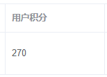

# 一、后端实现

## 1、创建VO

BorrowerApprovalVO

```java
package com.atguigu.srb.core.pojo.vo;
@Data
@ApiModel(description = "借款人审批")
public class BorrowerApprovalVO {
    @ApiModelProperty(value = "id")
    private Long borrowerId;
    @ApiModelProperty(value = "状态")
    private Integer status;
    @ApiModelProperty(value = "身份证信息是否正确")
    private Boolean isIdCardOk;
    @ApiModelProperty(value = "房产信息是否正确")
    private Boolean isHouseOk;
    @ApiModelProperty(value = "车辆信息是否正确")
    private Boolean isCarOk;
    @ApiModelProperty(value = "基本信息积分")
    private Integer infoIntegral;
}
```

## 2、controller

AdminBorrowerController

```java
@ApiOperation("借款额度审批")
@PostMapping("/approval")
public R approval(@RequestBody BorrowerApprovalVO borrowerApprovalVO) {
    borrowerService.approval(borrowerApprovalVO);
    return R.ok().message("审批完成");
}
```

## 3、BorrowerService 

接口

```java
void approval(BorrowerApprovalVO borrowerApprovalVO);
```

实现

```java
@Resource
private UserIntegralMapper userIntegralMapper;
@Override
public void approval(BorrowerApprovalVO borrowerApprovalVO) {
    //借款人认证状态
    Long borrowerId = borrowerApprovalVO.getBorrowerId();
    Borrower borrower = baseMapper.selectById(borrowerId);
    borrower.setStatus(borrowerApprovalVO.getStatus());
    baseMapper.updateById(borrower);
    Long userId = borrower.getUserId();
    UserInfo userInfo = userInfoMapper.selectById(userId);
    //添加积分
    UserIntegral userIntegral = new UserIntegral();
    userIntegral.setUserId(userId);
    userIntegral.setIntegral(borrowerApprovalVO.getInfoIntegral());
    userIntegral.setContent("借款人基本信息");
    userIntegralMapper.insert(userIntegral);
    int curIntegral = userInfo.getIntegral() + borrowerApprovalVO.getInfoIntegral();
    if(borrowerApprovalVO.getIsIdCardOk()) {
        curIntegral += IntegralEnum.BORROWER_IDCARD.getIntegral();
        userIntegral = new UserIntegral();
        userIntegral.setUserId(userId);
        userIntegral.setIntegral(IntegralEnum.BORROWER_IDCARD.getIntegral());
        userIntegral.setContent(IntegralEnum.BORROWER_IDCARD.getMsg());
        userIntegralMapper.insert(userIntegral);
    }
    if(borrowerApprovalVO.getIsHouseOk()) {
        curIntegral += IntegralEnum.BORROWER_HOUSE.getIntegral();
        userIntegral = new UserIntegral();
        userIntegral.setUserId(userId);
        userIntegral.setIntegral(IntegralEnum.BORROWER_HOUSE.getIntegral());
        userIntegral.setContent(IntegralEnum.BORROWER_HOUSE.getMsg());
        userIntegralMapper.insert(userIntegral);
    }
    if(borrowerApprovalVO.getIsCarOk()) {
        curIntegral += IntegralEnum.BORROWER_CAR.getIntegral();
        userIntegral = new UserIntegral();
        userIntegral.setUserId(userId);
        userIntegral.setIntegral(IntegralEnum.BORROWER_CAR.getIntegral());
        userIntegral.setContent(IntegralEnum.BORROWER_CAR.getMsg());
        userIntegralMapper.insert(userIntegral);
    }
    userInfo.setIntegral(curIntegral);
    //修改审核状态
    userInfo.setBorrowAuthStatus(borrowerApprovalVO.getStatus());
    userInfoMapper.updateById(userInfo);
}
```

# 二、前端实现

## 1、定义api

api/borrower.js中添加方法

```js
  approval(borrowerApproval) {
    return request({
      url: '/admin/core/borrower/approval',
      method: 'post',
      data: borrowerApproval
    })
  }
```

## 2、页面模板

src/views/core/borrower/detail.vue

```vue
<el-form label-width="170px" v-if="borrower.status === '认证中'">
      <el-form-item label="是否通过">
        <el-radio-group v-model="approvalForm.status">
          <el-radio :label="2">
            通过
          </el-radio>
          <el-radio :label="-1">
            不通过
          </el-radio>
        </el-radio-group>
      </el-form-item>
      <el-form-item v-if="approvalForm.status == 2" label="基本信息积分">
        <el-input v-model="approvalForm.infoIntegral" style="width: 140px;" />
        <span style="color: indianred">（可获取30至100积分）</span>
      </el-form-item>
      <el-form-item v-if="approvalForm.status == 2" label="身份证信息是否正确">
        <el-radio-group v-model="approvalForm.isIdCardOk">
          <el-radio :label="true">
            是
          </el-radio>
          <el-radio :label="false">
            否
          </el-radio>
        </el-radio-group>
        <span style="color: indianred">（可获得积分30积分）</span>
      </el-form-item>
      <el-form-item v-if="approvalForm.status == 2" label="车辆信息是否正确">
        <el-radio-group v-model="approvalForm.isCarOk">
          <el-radio :label="true">
            是
          </el-radio>
          <el-radio :label="false">
            否
          </el-radio>
        </el-radio-group>
        <span style="color: indianred">（可获得积分60积分）</span>
      </el-form-item>
      <el-form-item v-if="approvalForm.status == 2" label="房产信息是否正确">
        <el-radio-group v-model="approvalForm.isHouseOk">
          <el-radio :label="true">
            是
          </el-radio>
          <el-radio :label="false">
            否
          </el-radio>
        </el-radio-group>
        <span style="color: indianred">（可获得积分100积分）</span>
      </el-form-item>
      <el-row style="text-align:center">
        <el-button type="primary" @click="approvalSubmit()">
          确定
        </el-button>
      </el-row>
    </el-form>
```

## 3、页面脚本

src/views/core/borrower/detail.vue

```js
    approvalSubmit() {
      this.saveBtnDisabled = true
      this.approvalForm.borrowerId = this.$route.params.id
      borrowerApi.approval(this.approvalForm).then(response => {
        this.$message.success(response.message)
        this.$router.push({ path: '/core/borrower/list' })
      })
    }
```

## 4、查看用户积分

审批后可以在会员列表查看用户积分 

