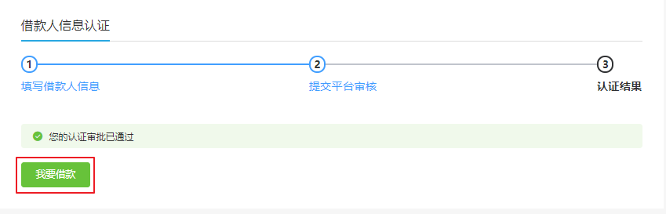

# 一、获取借款额度

## 1、实现思路

（1）获取借款人积分 

（2）根据积分获取借款额度，借款人每次借款不能超过借款额度

## 2、Controller

BorrowInfoController

```java
package com.atguigu.srb.core.controller.api;
@Api(tags = "借款信息")
@RestController
@RequestMapping("/api/core/borrowInfo")
@Slf4j
public class BorrowInfoController {
    @Resource
    private BorrowInfoService borrowInfoService;
    @ApiOperation("获取借款额度")
    @GetMapping("/auth/getBorrowAmount")
    public R getBorrowAmount(HttpServletRequest request) {
        String token = request.getHeader("token");
        Long userId = JwtUtils.getUserId(token);
        BigDecimal borrowAmount = borrowInfoService.getBorrowAmount(userId);
        return R.ok().data("borrowAmount", borrowAmount);
    }
}
```

## 2、Service

接口：BorrowInfoService

```java
BigDecimal getBorrowAmount(Long userId);
```

实现：BorrowInfoServiceImpl 

```java
package com.atguigu.srb.core.service.impl;
@Service
public class BorrowInfoServiceImpl extends ServiceImpl<BorrowInfoMapper, BorrowInfo> implements BorrowInfoService {
    @Resource
    private UserInfoMapper userInfoMapper;
    @Resource
    private IntegralGradeMapper integralGradeMapper;
    @Override
    public BigDecimal getBorrowAmount(Long userId) {
        //获取用户积分
        UserInfo userInfo = userInfoMapper.selectById(userId);
        Assert.notNull(userInfo, ResponseEnum.LOGIN_MOBILE_ERROR);
        Integer integral = userInfo.getIntegral();
        //根据积分查询借款额度
        QueryWrapper<IntegralGrade> queryWrapper = new QueryWrapper<>();
        queryWrapper.le("integral_start", integral);
        queryWrapper.ge("integral_end", integral);
        IntegralGrade integralGradeConfig = integralGradeMapper.selectOne(queryWrapper);
        if(integralGradeConfig == null){
            return new BigDecimal("0");
        }
        return integralGradeConfig.getBorrowAmount();
    }
}
```

# 二、借款入口前端

pages/user/borrower.vue

 

```vue
<NuxtLink to="/user/apply" v-if="borrowerStatus === 2">
  <el-button style="margin-top:20px;" type="success">
    我要借款
  </el-button>
</NuxtLink>
```

# 三、借款申请

## 1、页面

pages/user/apply.vue

## 2、获取下拉列表

methods中定义

```js
    //初始化下拉列表的数据
    initSelected() {
      //还款方式列表
      this.$axios
        .$get('/api/core/dict/findByDictCode/returnMethod')
        .then((response) => {
          this.returnMethodList = response.data.dictList
        })
      //资金用途列表
      this.$axios
        .$get('/api/core/dict/findByDictCode/moneyUse')
        .then((response) => {
          this.moneyUseList = response.data.dictList
        })
    },
```

created中调用

```js
  created() {
    
    //初始化下拉列表
    this.initSelected()
  },
```

## 3、获取借款额度

methods中定义

```js
    //获取借款额度
    getBorrowAmount() {
      this.$axios
        .$get('/api/core/borrowInfo/auth/getBorrowAmount')
        .then((response) => {
          this.borrowAmount = response.data.borrowAmount
        })
    },
```

created中调用

```
  created() {
    //获取借款额度
    this.getBorrowAmount()
      
    //初始化下拉列表
    ......
  },
```

## 4、判断借款额度

借款人每次借款不能超过借款额度

```js
  watch: {
    'borrowInfo.amount'(value) {
      if (value > this.borrowAmount) {
        let _this = this
        this.$alert('您的借款额度不足！', {
          type: 'error',
          callback() {
            _this.borrowInfo.amount = _this.borrowAmount
          },
        })
      }
    },
  },
```