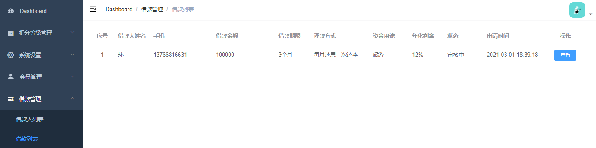

# 需求



# 一、后端实现

## 1、扩展实体对象

列表的结果需要关联查询，数据字典的数据也需要展示对应的文本内容而不是值，除了定义VO的方式，我们也可以使用扩展实体类的方式 

在BorrowInfo类中扩展以下字段

```java
//扩展字段
@ApiModelProperty(value = "姓名")
@TableField(exist = false)
private String name;
@ApiModelProperty(value = "手机")
@TableField(exist = false)
private String mobile;
@ApiModelProperty(value = "其他参数")
@TableField(exist = false)
private Map<String,Object> param = new HashMap<>();
```

## 2、Controller

添加 AdminBorrowInfoController

```java
package com.atguigu.srb.core.controller.admin;
@Api(tags = "借款管理")
@RestController
@RequestMapping("/admin/core/borrowInfo")
@Slf4j
public class AdminBorrowInfoController {
    @Resource
    private BorrowInfoService borrowInfoService;
    @ApiOperation("借款信息列表")
    @GetMapping("/list")
    public R list() {
        List<BorrowInfo>  borrowInfoList = borrowInfoService.selectList();
        return R.ok().data("list", borrowInfoList);
    }
}
```

## 3、Service

接口：BorrowInfoService

```java
List<BorrowInfo> selectList();
```

实现：BorrowInfoServiceImpl

```java
@Resource
private DictService dictService;
@Override
public List<BorrowInfo> selectList() {
    List<BorrowInfo> borrowInfoList = baseMapper.selectBorrowInfoList();
    borrowInfoList.forEach(borrowInfo -> {
        String returnMethod = dictService.getNameByParentDictCodeAndValue("returnMethod", borrowInfo.getReturnMethod());
        String moneyUse = dictService.getNameByParentDictCodeAndValue("moneyUse", borrowInfo.getMoneyUse());
        String status = BorrowInfoStatusEnum.getMsgByStatus(borrowInfo.getStatus());
        borrowInfo.getParam().put("returnMethod", returnMethod);
        borrowInfo.getParam().put("moneyUse", moneyUse);
        borrowInfo.getParam().put("status", status);
    });
    return borrowInfoList;
}
```

## 4、Mapper

接口：BorrowInfoMapper 

```java
List<BorrowInfo> selectBorrowInfoList();
```

xml：BorrowInfoMapper.xml

```xml
<select id="selectBorrowInfoList" resultType="com.atguigu.srb.core.pojo.entity.BorrowInfo">
    SELECT
    bi.*,
    b.name,
    b.mobile
    FROM
    borrow_info AS bi
    LEFT JOIN borrower AS b ON bi.user_id = b.user_id
    WHERE bi.is_deleted = 0
</select>
```

# 二、前端

## 1、创建页面组件

创建 src/views/core/borrow-info/list.vue 

```vue
<template>
  <div class="app-container">
    借款列表
  </div>
</template>
<script>
export default {
  
}
</script>
```

创建 src/views/core/borrow-info/detail.vue

```vue
<template>
  <div class="app-container">
    借款详情
  </div>
</template>
<script>
export default {
  
}
</script>
```

## 2、配置路由

src/router/index.js

在“借款管理”下添加子路由

```js
      {
        path: 'info-list',
        name: 'coreBorrowInfoList',
        component: () => import('@/views/core/borrow-info/list'),
        meta: { title: '借款列表' }
      },
      {
        path: 'info-detail/:id',
        name: 'coreBorrowInfoDetail',
        component: () => import('@/views/core/borrow-info/detail'),
        meta: { title: '借款详情' },
        hidden: true
      }
```

## 3、定义api

创建 src/api/core/borrow-info.js

```js
import request from '@/utils/request'
export default {
  getList() {
    return request({
      url: `/admin/core/borrowInfo/list`,
      method: 'get'
    })
  }
}
```

## 4、页面脚本

src/views/core/borrow-info/list.vue

```js
<script>
import borrowInfoApi from '@/api/core/borrow-info'
export default {
  data() {
    return {
      list: null // 列表
    }
  },
  created() {
    this.fetchData()
  },
  methods: {
    // 加载列表数据
    fetchData() {
      borrowInfoApi.getList().then(response => {
        this.list = response.data.list
      })
    }
  }
}
</script>
```

## 5、页面模板

src/views/core/borrow-info/list.vue 

```vue
<template>
  <div class="app-container">
    <!-- 列表 -->
    <el-table :data="list" stripe>
      <el-table-column type="index" label="序号" width="60" align="center" />
      <el-table-column prop="name" label="借款人姓名" width="90" />
      <el-table-column prop="mobile" label="手机" />
      <el-table-column prop="amount" label="借款金额" />
      <el-table-column label="借款期限" width="90">
        <template slot-scope="scope">{{ scope.row.period }}个月</template>
      </el-table-column>
      <el-table-column prop="param.returnMethod" label="还款方式" width="150" />
      <el-table-column prop="param.moneyUse" label="资金用途" width="100" />
      <el-table-column label="年化利率" width="90">
        <template slot-scope="scope">
          {{ scope.row.borrowYearRate * 100 }}%
        </template>
      </el-table-column>
      <el-table-column prop="param.status" label="状态" width="100" />
      <el-table-column prop="createTime" label="申请时间" width="150" />
      <el-table-column label="操作" width="150" align="center">
        <template slot-scope="scope">
          <el-button type="primary" size="mini">
            <router-link :to="'/core/borrower/info-detail/' + scope.row.id">
              查看
            </router-link>
          </el-button>
          <el-button
            v-if="scope.row.status === 1"
            type="warning"
            size="mini"
            @click="approvalShow(scope.row)"
          >
            审批
          </el-button>
        </template>
      </el-table-column>
    </el-table>
  </div>
</template>
```