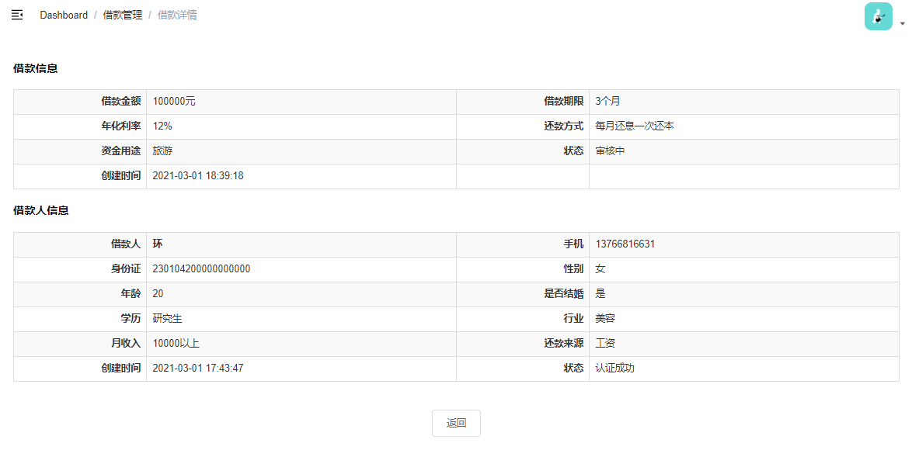

# 需求

借款详情展示借款信息与借款人信息



# 一、后端实现

## 1、Controller

AdminBorrowInfoController

```java
@ApiOperation("获取借款信息")
@GetMapping("/show/{id}")
public R show(
    @ApiParam(value = "借款id", required = true)
    @PathVariable Long id) {
    Map<String, Object> borrowInfoDetail = borrowInfoService.getBorrowInfoDetail(id);
    return R.ok().data("borrowInfoDetail", borrowInfoDetail);
}
```

## 2、Service

接口：BorrowInfoService

```java
Map<String, Object> getBorrowInfoDetail(Long id);
```

实现：BorrowInfoServiceImpl

```java
@Resource
private BorrowerMapper borrowerMapper;
@Resource
private BorrowerService borrowerService;
@Override
public Map<String, Object> getBorrowInfoDetail(Long id) {
    //查询借款对象
    BorrowInfo borrowInfo = baseMapper.selectById(id);
    //组装数据
    String returnMethod = dictService.getNameByParentDictCodeAndValue("returnMethod", borrowInfo.getReturnMethod());
    String moneyUse = dictService.getNameByParentDictCodeAndValue("moneyUse", borrowInfo.getMoneyUse());
    String status = BorrowInfoStatusEnum.getMsgByStatus(borrowInfo.getStatus());
    borrowInfo.getParam().put("returnMethod", returnMethod);
    borrowInfo.getParam().put("moneyUse", moneyUse);
    borrowInfo.getParam().put("status", status);
    //根据user_id获取借款人对象
    QueryWrapper<Borrower> borrowerQueryWrapper = new QueryWrapper<Borrower>();
    borrowerQueryWrapper.eq("user_id", borrowInfo.getUserId());
    Borrower borrower = borrowerMapper.selectOne(borrowerQueryWrapper);
    //组装借款人对象
    BorrowerDetailVO borrowerDetailVO = borrowerService.getBorrowerDetailVOById(borrower.getId());
    //组装数据
    Map<String, Object> result = new HashMap<>();
    result.put("borrowInfo", borrowInfo);
    result.put("borrower", borrowerDetailVO);
    return result;
}
```

# 二、前端

## 1、定义api

 src/api/core/borrow-info.js

```js
  show(id) {
    return request({
      url: `/admin/core/borrowInfo/show/${id}`,
      method: 'get'
    })
  }
```

## 2、添加自定义css

src/styles/show.css

## 3、页面脚本

src/views/core/borrow-info/detail.vue

```html
<script>
import borrowInfoApi from '@/api/core/borrow-info'
import '@/styles/show.css'
export default {
  data() {
    return {
      borrowInfoDetail: {
        borrowInfo: {
          param: {}
        },
        borrower: {}
      }
    }
  },
  created() {
    if (this.$route.params.id) {
      this.fetchDataById()
    }
  },
  methods: {
    fetchDataById() {
      borrowInfoApi.show(this.$route.params.id).then(response => {
        this.borrowInfoDetail = response.data.borrowInfoDetail
      })
    },
    back() {
      this.$router.push({ path: '/core/borrower/info-list' })
    }
  }
}
</script>
```

## 4、页面模板

src/views/core/borrow-info/detail.vue

```html
<template>
  <div class="app-container">
    <h4>借款信息</h4>
    <table
      class="table table-striped table-condenseda table-bordered"
      width="100%"
    >
      <tbody>
        <tr>
          <th width="15%">借款金额</th>
          <td width="35%">{{ borrowInfoDetail.borrowInfo.amount }}元</td>
          <th width="15%">借款期限</th>
          <td width="35%">{{ borrowInfoDetail.borrowInfo.period }}个月</td>
        </tr>
        <tr>
          <th>年化利率</th>
          <td>{{ borrowInfoDetail.borrowInfo.borrowYearRate * 100 }}%</td>
          <th>还款方式</th>
          <td>{{ borrowInfoDetail.borrowInfo.param.returnMethod }}</td>
        </tr>
        <tr>
          <th>资金用途</th>
          <td>{{ borrowInfoDetail.borrowInfo.param.moneyUse }}</td>
          <th>状态</th>
          <td>{{ borrowInfoDetail.borrowInfo.param.status }}</td>
        </tr>
        <tr>
          <th>创建时间</th>
          <td>{{ borrowInfoDetail.borrowInfo.createTime }}</td>
          <th></th>
          <td></td>
        </tr>
      </tbody>
    </table>
    <h4>借款人信息</h4>
    <table
      class="table table-striped table-condenseda table-bordered"
      width="100%"
    >
      <tbody>
        <tr>
          <th width="15%">借款人</th>
          <td width="35%">
            <b>{{ borrowInfoDetail.borrower.name }}</b>
          </td>
          <th width="15%">手机</th>
          <td width="35%">{{ borrowInfoDetail.borrower.mobile }}</td>
        </tr>
        <tr>
          <th>身份证</th>
          <td>{{ borrowInfoDetail.borrower.idCard }}</td>
          <th>性别</th>
          <td>{{ borrowInfoDetail.borrower.sex }}</td>
        </tr>
        <tr>
          <th>年龄</th>
          <td>{{ borrowInfoDetail.borrower.age }}</td>
          <th>是否结婚</th>
          <td>{{ borrowInfoDetail.borrower.marry }}</td>
        </tr>
        <tr>
          <th>学历</th>
          <td>{{ borrowInfoDetail.borrower.education }}</td>
          <th>行业</th>
          <td>{{ borrowInfoDetail.borrower.industry }}</td>
        </tr>
        <tr>
          <th>月收入</th>
          <td>{{ borrowInfoDetail.borrower.income }}</td>
          <th>还款来源</th>
          <td>{{ borrowInfoDetail.borrower.returnSource }}</td>
        </tr>
        <tr>
          <th>创建时间</th>
          <td>{{ borrowInfoDetail.borrower.createTime }}</td>
          <th>状态</th>
          <td>{{ borrowInfoDetail.borrower.status }}</td>
        </tr>
      </tbody>
    </table>
    <el-row style="text-align:center;margin-top: 40px;">
      <el-button @click="back">
        返回
      </el-button>
    </el-row>
  </div>
</template>
```