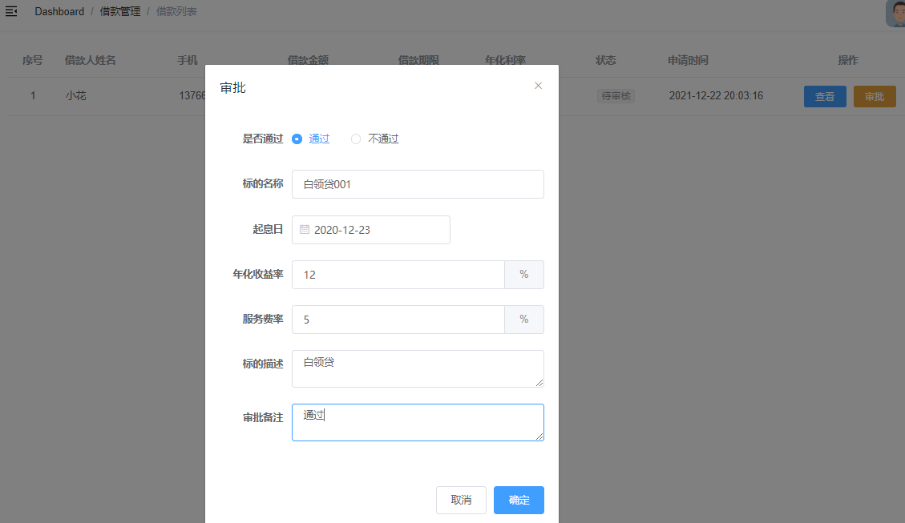

# 需求

管理平台借款审批，审批通过后产生标的，审批前我们需要跟借款人进行电话沟通，确定借款年化和平台服务费率（平台收益），借款年化可能根据实际情况调高或调低；起息日通常我们把它确定为募集结束时间（或放款时间）



# 一、后端实现

## 1、定义VO对象 

```java
package com.atguigu.srb.core.pojo.vo;
@Data
@ApiModel(description = "借款信息审批")
public class BorrowInfoApprovalVO {
    @ApiModelProperty(value = "id")
    private Long id;
    @ApiModelProperty(value = "状态")
    private Integer status;
    @ApiModelProperty(value = "审批内容")
    private String content;
    @ApiModelProperty(value = "标题")
    private String title;
    @ApiModelProperty(value = "年化利率")
    private BigDecimal lendYearRate;
    @ApiModelProperty(value = "平台服务费率")
    private BigDecimal serviceRate;
    @ApiModelProperty(value = "开始日期")
    private String lendStartDate;
    @ApiModelProperty(value = "描述信息")
    private String lendInfo;
}
```

## 2、Controller

AdminBorrowInfoController

```java
@ApiOperation("审批借款信息")
@PostMapping("/approval")
public R approval(@RequestBody BorrowInfoApprovalVO borrowInfoApprovalVO) {
    borrowInfoService.approval(borrowInfoApprovalVO);
    return R.ok().message("审批完成");
}
```

## 3、Service

接口：BorrowInfoService

```java
void approval(BorrowInfoApprovalVO borrowInfoApprovalVO);
```

实现：BorrowInfoServiceImpl

```java
@Transactional(rollbackFor = Exception.class)
@Override
public void approval(BorrowInfoApprovalVO borrowInfoApprovalVO) {
    //修改借款信息状态
    Long borrowInfoId = borrowInfoApprovalVO.getId();
    BorrowInfo borrowInfo = baseMapper.selectById(borrowInfoId);
    borrowInfo.setStatus(borrowInfoApprovalVO.getStatus());
    baseMapper.updateById(borrowInfo);
    //审核通过则创建标的
    if (borrowInfoApprovalVO.getStatus().intValue() == BorrowInfoStatusEnum.CHECK_OK.getStatus().intValue()) {
        //创建标的
        //TODO
    }
}
```

# 二、前端实现

## 1、定义api

 src/api/core/borrow-info.js

```js
  approval(borrowInfoApproval) {
    return request({
      url: '/admin/core/borrowInfo/approval',
      method: 'post',
      data: borrowInfoApproval
    })
  }
```

## 2、页面脚本

src/views/core/borrow-info/list.vue

data：

```js
dialogVisible: false, //审批对话框
borrowInfoApproval: {
  status: 2,
  serviceRate: 5,
  lendYearRate: 0 //初始化，解决表单中数据修改时无法及时渲染的问题
} //审批对象
```

methods：

```js
    approvalShow(row) {
      this.dialogVisible = true
      this.borrowInfoApproval.id = row.id
      this.borrowInfoApproval.lendYearRate = row.borrowYearRate * 100
    },
    approvalSubmit() {
      borrowInfoApi.approval(this.borrowInfoApproval).then(response => {
        this.dialogVisible = false
        this.$message.success(response.message)
        this.fetchData()
      })
    }
```

## 3、页面模板

src/views/core/borrow-info/list.vue

```html
<!-- 审批对话框 -->
<el-dialog title="审批" :visible.sync="dialogVisible" width="490px">
    <el-form label-position="right" label-width="100px">
        <el-form-item label="是否通过">
            <el-radio-group v-model="borrowInfoApproval.status">
                <el-radio :label="2">通过</el-radio>
                <el-radio :label="-1">不通过</el-radio>
            </el-radio-group>
        </el-form-item>
        <el-form-item v-if="borrowInfoApproval.status == 2" label="标的名称">
            <el-input v-model="borrowInfoApproval.title" />
        </el-form-item>
        <el-form-item v-if="borrowInfoApproval.status == 2" label="起息日">
            <el-date-picker
                            v-model="borrowInfoApproval.lendStartDate"
                            type="date"
                            placeholder="选择开始时间"
                            value-format="yyyy-MM-dd"
                            />
        </el-form-item>
        <el-form-item v-if="borrowInfoApproval.status == 2" label="年化收益率">
            <el-input v-model="borrowInfoApproval.lendYearRate">
                <template slot="append">%</template>
            </el-input>
        </el-form-item>
        <el-form-item v-if="borrowInfoApproval.status == 2" label="服务费率">
            <el-input v-model="borrowInfoApproval.serviceRate">
                <template slot="append">%</template>
            </el-input>
        </el-form-item>
        <el-form-item v-if="borrowInfoApproval.status == 2" label="标的描述">
            <el-input v-model="borrowInfoApproval.lendInfo" type="textarea" />
        </el-form-item>
    </el-form>
    <div slot="footer" class="dialog-footer">
        <el-button @click="dialogVisible = false">
            取消
        </el-button>
        <el-button type="primary" @click="approvalSubmit">
            确定
        </el-button>
    </div>
</el-dialog>
```