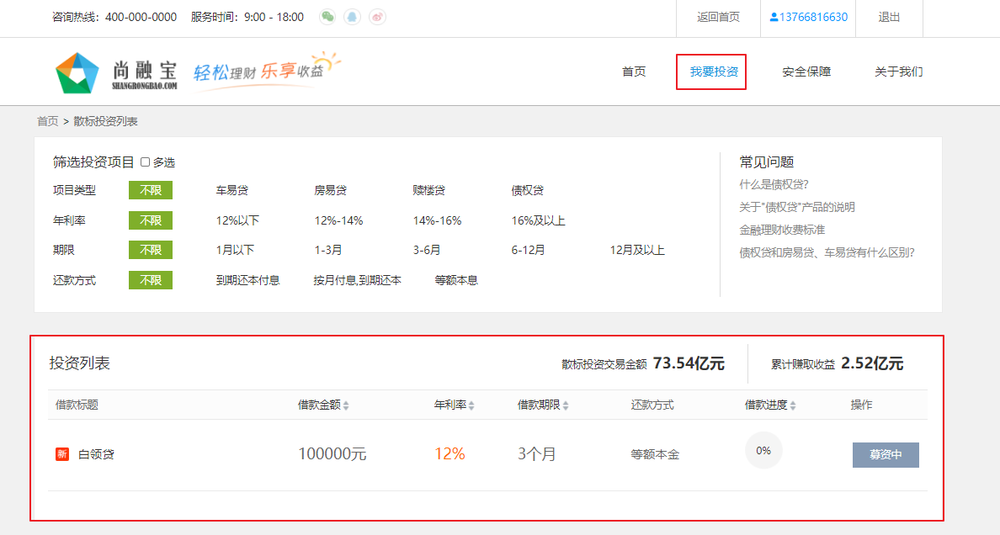

# 需求 


# 一、后端实现
## Controller
LendController中创建list方法
```java
package com.atguigu.srb.core.controller.api;
@Api(tags = "标的")
@RestController
@RequestMapping("/api/core/lend")
@Slf4j
public class LendController {
    @Resource
    private LendService lendService;
    @ApiOperation("获取标的列表")
    @GetMapping("/list")
    public R list() {
        List<Lend> lendList = lendService.selectList();
        return R.ok().data("lendList", lendList);
    }
}
```

# 二、前端整合
pages/lend/index.vue
## 脚本
此处使用了服务器端渲染
```js
async asyncData({ $axios }) {
    let response = await $axios.$get('/api/core/lend/list')
    return {
      lendList: response.data.lendList,
    }
},
```