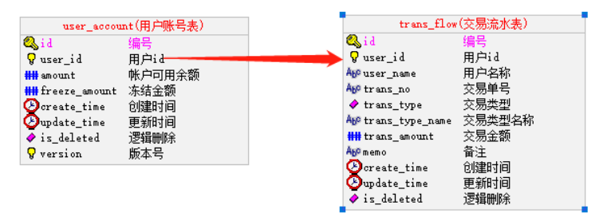
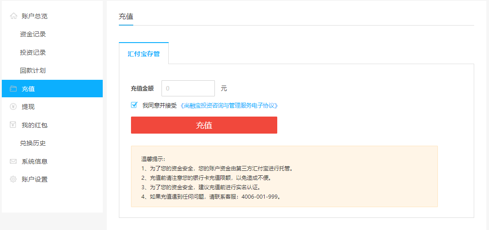
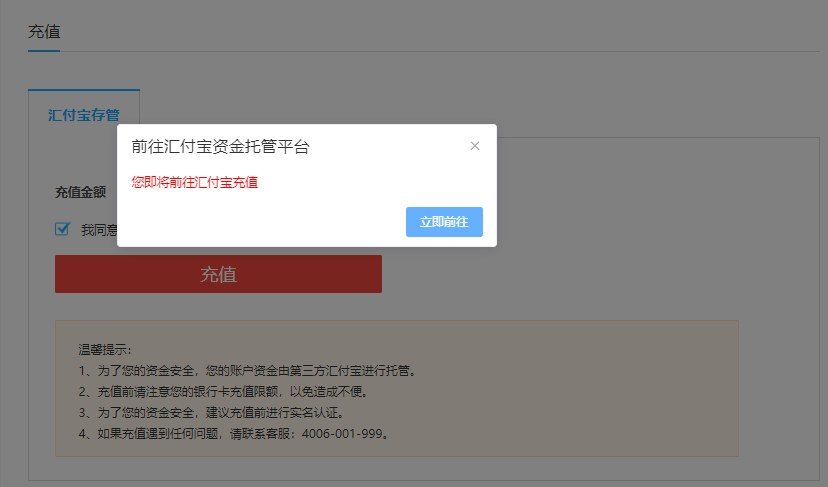
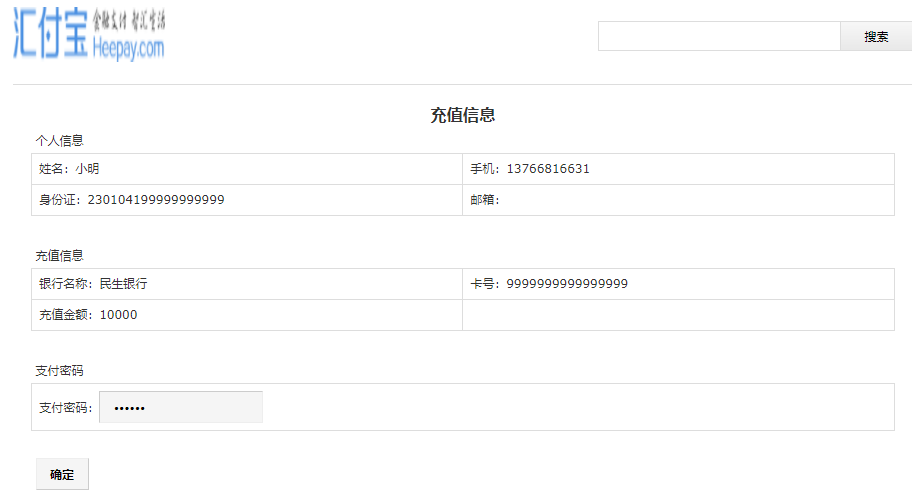
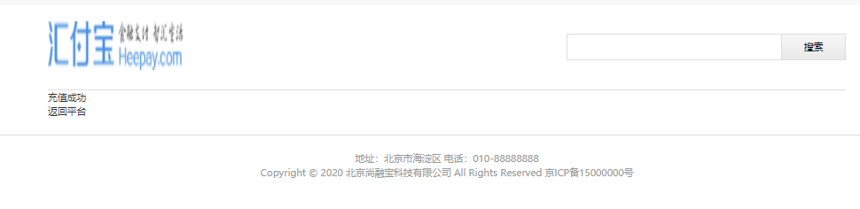

# 一、投资人充值
## 1、需求描述 
标的产生后，平台展示标的，投资人就可以在平台投资标的，获取收益；投资人投资标的必须满足以下条件：

充值过程与绑定过程一致，也是在平台发送充值请求，跳转到资金托管平台，在资金托管平台完成充值，然后同步或异步返回或通知平台

## 2、相关数据库表

## 3、参考文档
参考《汇付宝商户账户技术文档》3.9用户充值

# 二、具体步骤
step1：用户在个人中心点击 “充值” 

step2：尚融宝展示账户充值页面

step3：用户填写充值金额，点击“充值”按钮

step4：跳转到汇付宝页面（资金托管接口调用）

step5：汇付宝验证用户交易密码

step6：汇付修改账号资金余额（更新user_account记录中的amount的值）

step7：异步回调（1）账户金额更改（2）添加交易流水

step8：用户点击“返回平台”，返回尚融宝
