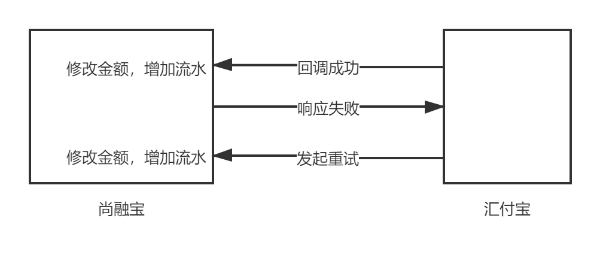
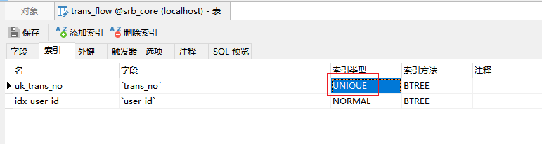

# 一、接口幂等性原则

## 1、什么是接口幂等性

接口幂等性就是用户对于同一操作发起的一次请求或者多次请求的结果是一致的，不会因为多次调用而产生了副作用。

举个最简单的例子，那就是支付，用户购买商品后支付，支付扣款成功，但是返回结果的时候网络异常，此时钱已经扣了，用户再次点击按钮，此时会进行第二次扣款，返回结果成功，用户查询余额返发现多扣钱了，流水记录也变成了两条．．．这就没有保证接口的幂等性

## 2、回调重试

汇付宝向尚融宝发起回调，如果没有收到正确的响应 "success"，则尚融宝会发起重试

汇付宝中的相关代码如下：
```java
package com.heepay.config;
@Slf4j
public class NotifyThread implements Runnable {
    private int count = 1;
    private String notifyUrl;
    private Map<String, Object> paramMap;
    public NotifyThread(){}
    public NotifyThread(String notifyUrl, Map<String, Object> paramMap) {
        this.notifyUrl = notifyUrl;
        this.paramMap = paramMap;
    }
    @Override
    public void run() {
        task();
    }
    private void task() {
        String result = SignUtil.sendRequest(paramMap,notifyUrl);
        log.info(notifyUrl + "：" + result + " count：" + count);
        if(!"success".equals(result)) {
            try {
                Thread.sleep(1000);
            } catch (InterruptedException e) {
                e.printStackTrace();
            }
            //ScheduledTask.queue.offer(new NotifyVo(notifyUrl, paramMap));
            count++;
            if(count <= 5) {
                task();
                log.info("失败重试：" + JSON.toJSONString(this));
            }
        }
    }
}
```

## 3、存在的问题

当回调重试时，金额和流水会重复增加



# 二、解决方案

## 1、设置唯一索引

设置了唯一索引后，即使回调重复执行，遇到唯一索引，就会抛出异常，从而使事务回滚。



## 2、判断流水是否存在

判断流水如果存在，则从业务方法中直接退出

接口：TransFlowService
```java
boolean isSaveTransFlow(String agentBillNo);
```

实现：TransFlowServiceImpl
```java
@Override
public boolean isSaveTransFlow(String agentBillNo) {
    QueryWrapper<TransFlow> queryWrapper = new QueryWrapper();
    queryWrapper.eq("trans_no", agentBillNo);
    int count = baseMapper.selectCount(queryWrapper);
    if(count > 0) {
        return true;
    }
    return false;
}
```

调用 ：UserAccountServiceImpl
```java
@Transactional(rollbackFor = Exception.class)
@Override
public void notify(Map<String, Object> paramMap) {
    log.info("充值成功：" + JSONObject.toJSONString(paramMap));
    //判断交易流水是否存在
    String agentBillNo = (String)paramMap.get("agentBillNo"); //商户充值订单号
    boolean isSave = transFlowService.isSaveTransFlow(agentBillNo);
    if(isSave){
        log.warn("幂等性返回");
        return;
    }
   ......
       
    //增加交易流水
    //agentBillNo = (String)paramMap.get("agentBillNo"); //商户充值订单号
}
```