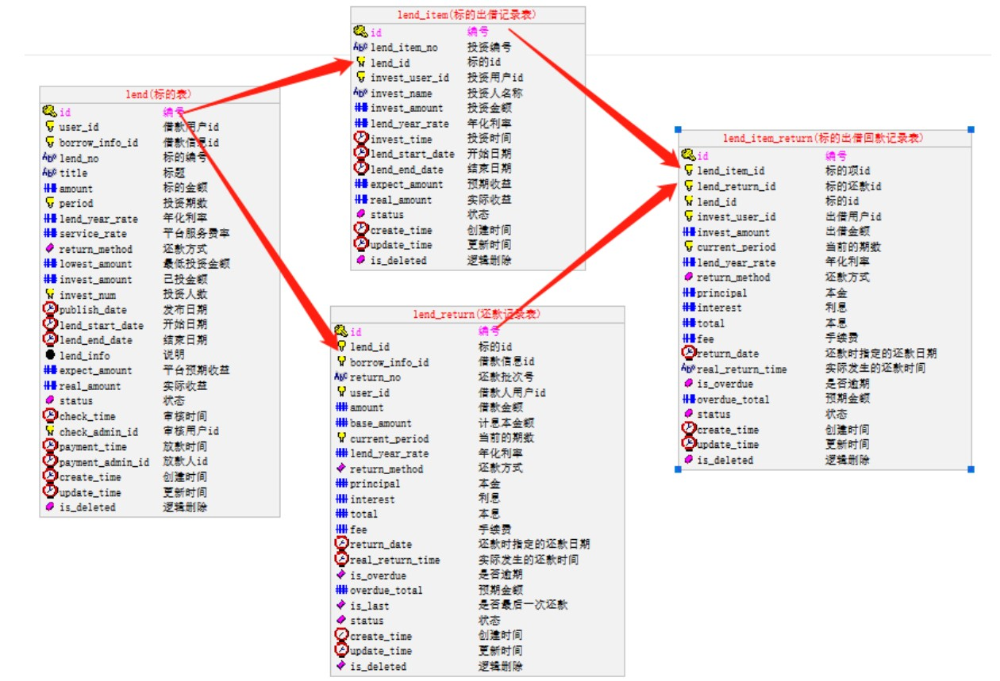
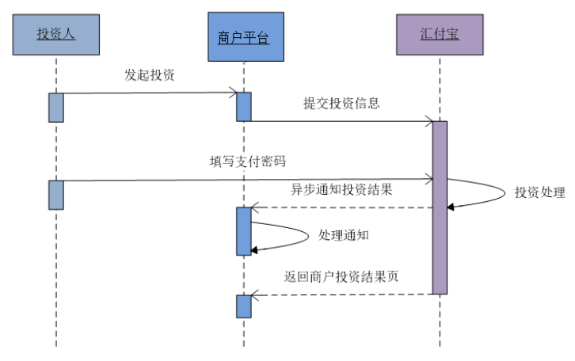
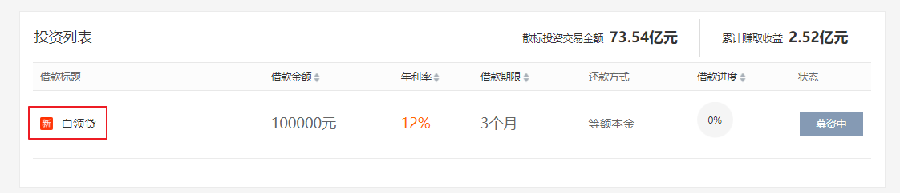

# 一、投资人投标

## 1、需求描述

平台发布标的，出借人充值就可以投资标的 

## 2、相关数据库表

## 3、参考文档

参考《汇付宝商户账户技术文档》3.10满标投资，投资过程与账户绑定、用户充值过程一致

# 二、具体步骤

step1：点击标的，进入标的详情页面

step2：输入投资金额，计算获得收益

step3：同意协议，点击立即投资

step4：跳转到汇付宝页面（资金托管接口调用）

step5：汇付宝验证用户交易密码

step6：汇付宝修改账号资金余额（更新user_account记录中的amount的值和freeze_amount的值）

​      汇付宝新增投资记录（新增user_invest记录）

step7：异步回调

（1）账户金额更改（剩余金额和冻结金额）

（2）修改投资状态（lend_item表中的status）

（3）更新标的信息（lend表中的投资人数和已投金额）

（4）添加交易流水step8：用户点击“返回平台”，返回尚融宝