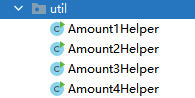

# 一、还款方式

## 1、等额本息

等额本息法最重要的一个特点是每月的还款额相同，从本质上来说是本金所占比例逐月递增，利息所占比例逐月递减，月还款数不变。

即在月供“本金与利息”的分配比例中，前半段时期所还的利息比例大、本金比例小，还款期限过半后逐步转为本金比例大、利息比例小。

**计算公式为：**

每月利息 = 剩余本金 x 贷款月利率

每月还本付息金额 = 还款总额 / 贷款月数

每月本金 = 每月还本付息金额 - 每月利息

**注意：**在等额本息法中，银行一般先收剩余本金利息，后收本金，所以利息在月供款中的比例会随本金的减少而降低，本金在月供款中的比例因而升高，但月供总额保持不变。

## 2、等额本金

等额本金法最大的特点是每月的还款额不同，呈现逐月递减的状态；它是将贷款本金按还款的总月数均分，再加上上期剩余本金的利息，这样就形成月还款额，所以等额本金法第一个月的还款额最多 ，然后逐月减少，越还越少。

**计算公式为：**

每月利息 = 剩余本金 x 贷款月利率

每月本金 = 贷款额 / 贷款月数

每月还本付息金额 = 每月本金 + 每月利息

**注意：**在等额本金法中，人们每月归还的本金额始终不变，利息随剩余本金的减少而减少，因而其每月还款额逐渐减少。

## 3、按期付息到期还本

按期付息到期还本是借款人在贷款到期日一次性归还贷款本金，利息按期归还

**计算公式为：**

每月利息 = 贷款额 x 贷款月利率

总利息 = 每月利息 x 贷款月数

## 4、一次还本付息

一次还本付息是贷款到期后一次性归还本金和利息

**计算公式为：**

还款金额 = 贷款额 + 贷款额 x 月利率 x 贷款月数

# 一、后端接口

## 1、还款方式工具类

根据我们的表设计，出借人要能知道每月回款的本金与利息，借款人也一样，他也要知道每月的还款本金与利息，还有我们需要计算投资人的投资收益等数据。

因此我们将四种还款方式工具类设计如下：



**说明：**还款方式计算复杂，尽做了解，有兴趣的同学可以深入理解，这里不做详细介绍

## 2、定义枚举

ReturnMethodEnum

```java
ONE(1, "等额本息"),
TWO(2, "等额本金"),
THREE(3, "每月还息一次还本"),
FOUR(4, "一次还本还息"),
;
```

## 3、Controller

LendController

```java
@ApiOperation("计算投资收益")
@GetMapping("/getInterestCount/{invest}/{yearRate}/{totalmonth}/{returnMethod}")
public R getInterestCount(
    @ApiParam(value = "投资金额", required = true)
    @PathVariable("invest") BigDecimal invest,
    @ApiParam(value = "年化收益", required = true)
    @PathVariable("yearRate")BigDecimal yearRate,
    @ApiParam(value = "期数", required = true)
    @PathVariable("totalmonth")Integer totalmonth,
    @ApiParam(value = "还款方式", required = true)
    @PathVariable("returnMethod")Integer returnMethod) {
    BigDecimal  interestCount = lendService.getInterestCount(invest, yearRate, totalmonth, returnMethod);
    return R.ok().data("interestCount", interestCount);
}
```

## 4、Service

接口：LendService

```java
BigDecimal getInterestCount(BigDecimal invest, BigDecimal yearRate, Integer totalmonth, Integer returnMethod);
```

实现：LendServiceImpl

```java
@Override
public BigDecimal getInterestCount(BigDecimal invest, BigDecimal yearRate, Integer totalmonth, Integer returnMethod) {
    BigDecimal interestCount;
    //计算总利息
    if (returnMethod.intValue() == ReturnMethodEnum.ONE.getMethod()) {
        interestCount = Amount1Helper.getInterestCount(invest, yearRate, totalmonth);
    } else if (returnMethod.intValue() == ReturnMethodEnum.TWO.getMethod()) {
        interestCount = Amount2Helper.getInterestCount(invest, yearRate, totalmonth);
    } else if(returnMethod.intValue() == ReturnMethodEnum.THREE.getMethod()) {
        interestCount = Amount3Helper.getInterestCount(invest, yearRate, totalmonth);
    } else {
        interestCount = Amount4Helper.getInterestCount(invest, yearRate, totalmonth);
    }
    return interestCount;
}
```

# 二、前端整合

## 计算收益

pages/lend/_id.vue

```js
//计算收益
getInterestCount() {
    this.$axios
        .$get(
        `/api/core/lend/getInterestCount/${this.invest.investAmount}/${this.lend.lendYearRate}/${this.lend.period}/${this.lend.returnMethod}`
    )
        .then((response) => {
        this.interestCount = response.data.interestCount
    })
},
```